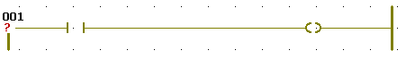
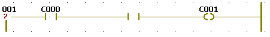
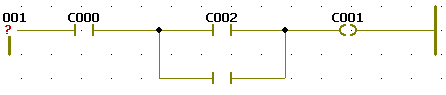
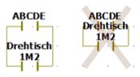

# Networks, Contacts/Coils: Inserting

LD objects are inserted without an assigned variable. Therefore, each newly inserted LD object must be assigned to a variable manually. See the topic ["Inserting variables in a code worksheet"](DeclaringVarsWhileEditingCode.html#DeclaringVarsWhileEditingCode) for details.

If desired, activate the [editor grid](usingagridwheninsertingobjectsinagraphicalworksheet.html#usingagridwheninsertingobjectsinagraphicalworksheet) ('Layout > Grid') to auto-align new objects on insertion.

## How to...

How to insert an LD network

Each LD network has to start with a basic network consisting of one contact, one coil and two power rails. This basic network can be expanded by further parallel/serial contacts/coils or other graphical objects.

FBD/LD networks always have to be inserted below or above existing networks. Inserting a network beside an existing network results in a compiler error.

1. Left-click at a free worksheet position to set an insertion mark.

   If the worksheet already contains networks, click below or above an existing network.
2. Click the 'Network' icon to insert an LD network with one contact, one coil, and two power rails.

   

   The basic network is inserted with the specified default contact/coil width.

   
3. [Assign variables to the new LD objects](DeclaringVarsWhileEditingCode.html#DeclaringVarsWhileEditingCode).

How to insert serial contacts and coils

Contacts can be inserted to the left or right of existing contacts or coils. Coils can only be inserted to the right of a contact or coil. Contacts and coils can also be inserted directly connected to formal parameters of functions and function blocks or unconnected.

1. Left-click an existing contact, coil, or an FU/FB input/output.
2. Click the corresponding icon on the editor toolbar:

   |  |  |
   | --- | --- |
   |  | 'Contact right' inserts a contact on the right of the selected object. |
   |  | 'Contact left' inserts a contact on the left of the selected object. |
   |  | 'Coil right' inserts a coil on the right of the selected object. |

   If an object cannot be inserted at a specific position, the related icon/menu item is inactive. Example: If an input of an FU/FB is marked, the 'Right' icon and the menu items 'Contact Right' and 'Coil Right' are inactive.

   The following figure shows a basic LD network (with already assigned variables) with a new inserted contact:

   
3. [Assign variables to the new LD objects](DeclaringVarsWhileEditingCode.html#DeclaringVarsWhileEditingCode).

How to insert parallel contacts and coils

LD allows parallel branches. A parallel branch results when inserting new LD objects above or below an existing object. The editor automatically inserts the same object type you have selected before: if you select a contact, a new contact will be inserted.

1. Left-click the contact or coil to which you want to add a parallel branch.
2. To insert a new object below the selected one, click the 'Parallel' icon.

   

   The following figure shows an LD network (with already assigned variables) with a new inserted parallel contact:

   
3. [Assign variables to the new LD objects](DeclaringVarsWhileEditingCode.html#DeclaringVarsWhileEditingCode).

**NOTE:**

For easier distinction of standard and safety-related variables, safety-related variables are displayed with a red background in the graphical code. Variables of standard data types are shown without background.

**NOTE:**

Safety-related and standard variables can be mixed in FBD/LD networks. In such mixed networks, leading safety-related signal paths are visually distinguished. Some [rules and restrictions must be observed](MixingSafeAndNonSafeVariables.html#MixingSafeAndNonSafeVariables).

## Ensure the readability of your FBD/LD code

The graphical editor can display LD object names in two lines whereas the first line does not cause collisions with other LD objects. Therefore it is possible to design a safety logic layout with overlapping LD objects (shown crossed-out in the example below).

Avoid overlapping of LD objects. Keep enough space between objects, thus ensuring that each object name is readable.

Example:

EIO0000002147.09