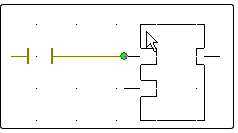
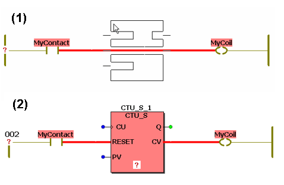
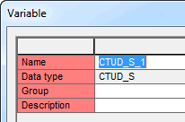

# Functions/Function Blocks: Inserting

If desired, activate the [editor grid](usingagridwheninsertingobjectsinagraphicalworksheet.html#usingagridwheninsertingobjectsinagraphicalworksheet) ('Layout > Grid') to auto-align new objects on insertion.

**NOTE:**

Safety-related and standard variables can be mixed in FBD/LD networks. In such mixed networks, leading safety-related signal paths are visually distinguished. Some [rules and restrictions must be observed](MixingSafeAndNonSafeVariables.html#MixingSafeAndNonSafeVariables).

1. Open or activate the Edit Wizard.

   If the auto-hide function is enabled, hover the cursor over the minimized window.
2. Open the code worksheet into which the object is to be inserted.
3. In the drop-down combo box 'Group' of the Edit Wizard, select the desired group of blocks.
4. In the Edit Wizard selection area, select the desired block.

   The color of a function/function block symbol points to the origin of the respective object (see topic ["Edit Wizard"](editwizard_generaldescription.html#editwizard_generaldescription__groupsintheeditwizardwhenopenedinacodebodyworksheet)).

   To [call the context sensitive help information](editwizard_generaldescription.html#editwizard_generaldescription__CallHelp) for an FU/FB object, right-click it and select 'Help on FB/FU' from the context menu.
5. Drag the block from the Edit Wizard selection area into the code worksheet, left-click to insert the block outline and drop it with another left mouse click at the desired position.

   Blocks can be directly connected on insertion. For that purpose, move the block outline onto a free connection point (see example 1) or on an existing connection line and left click to drop and connect the block at the same time.

   Example 1: New inserted block, connected to contact output.

   

   Example 2: New block inserted into an existing connection line between objects.

   
6. In case of a function block, an instance variable must be declared. For that purpose, the 'Variable' dialog appears.

   Example

   

   1. In the 'Variable' dialog, select the variables 'Group' into which you want to insert the new instance declaration.
   2. An instance name for the inserted FB is proposed in the 'Name' combo box. Either accept the proposed name, or enter a new instance name, or select an already existing instance name from the 'Name' combo box.
   3. If desired, enter a comment in the 'Description' field.

      The data type ('Type') of the FB cannot be modified as it is automatically derived from the FB type.
   4. Finally, confirm the 'Variable' dialog with 'OK'.

Click here for related topics

EIO0000002147.09