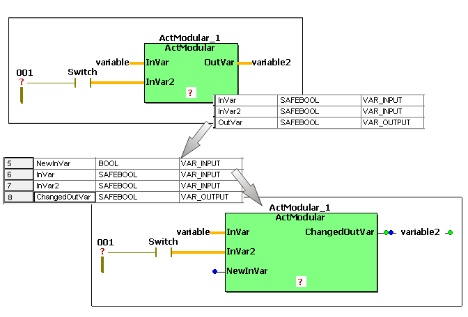

# Function Blocks: Updating instances

After editing formal parameters in a user-defined function block, each code worksheet where the function block concerned is called must be updated. This is required, for example, after adding or deleting an input or output variable of the function block or after modifying the name of at least one formal parameter.

Update every instance of a modified FB as follows:

1. In the FBD/LD code worksheet, right-click the function block to be updated and select 'Object Properties...' from the context menu.

   The ['Function/Function Block' dialog](dialog_function_functionblock.html#dialog_function_functionblock) appears. The combo boxes 'Group' and 'Name' are inactive because the object is already created.
2. Activate the 'Replace' checkbox.

   Do **not** edit the instance name or any other setting.
3. Confirm the dialog.

The FB icon is now updated according to the modified FB declaration. The following rules apply:

* In the block icon, new formal parameters are added below existing block inputs or outputs. The declaration order in the variables worksheet is not considered.
* If the block width has been increased, variables that are directly (without line) connected to outputs are automatically moved to the right, provided that there is enough space. The same applies to contacts and coils if the LD network is only connected to one formal parameter. Lines connected to outputs are shortened automatically.
* If the block height has been increased due to new formal parameters but there is not enough free space below the block, all objects below the block are automatically moved downwards.
* If the data type or name of a formal parameter has been modified, an already existing connection line to this formal parameter is deleted. The formal parameter has to be re-connected manually.

EIO0000002147.09