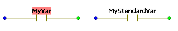
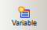
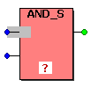
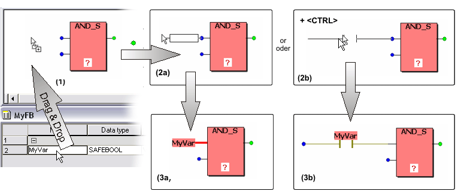

# Variables: Inserting and Declaring

In code worksheets, the following applies to declaring and inserting variables.

You can...

* insert new local variables as well as global symbolic variables and declare them at the same time using the 'Variable' dialog (see [procedure below](DeclaringVarsWhileEditingCode.html#DeclaringVarsWhileEditingCode__HowTo_InsertDeclareVariables)). This way, the declaration is automatically inserted into the related variables worksheet (local or global).

  Global I/O variables cannot be handled this way. They are automatically created when dragging a process data item (device terminal) from the 'Devices' window and dropping it in a code worksheet.
* insert already declared variables into the code (all scopes). This can be done using the ['Variable' dialog](DeclaringVarsWhileEditingCode.html#DeclaringVarsWhileEditingCode__HowTo_InsertDeclareVariables) or via [drag & drop from the variables worksheet](DeclaringVarsWhileEditingCode.html#DeclaringVarsWhileEditingCode__HowTo_InsertDeclareVariables).

Be sure to observe the [declaration rules](DeclaringVarsWhileEditingCode.html#DeclaringVarsWhileEditingCode__VarDeclarationRulesInDialog) when declaring or editing variables.

Click here for related topics

**NOTE:**

For easier distinction of standard and safety-related variables, safety-related variables are displayed with a red background in the graphical code. Variables of standard data types are shown without background.

**NOTE:**

Safety-related and standard variables can be mixed in FBD/LD networks. In such mixed networks, leading safety-related signal paths are visually distinguished. Some [rules and restrictions must be observed](MixingSafeAndNonSafeVariables.html#MixingSafeAndNonSafeVariables).

## How to insert variables into code

How to insert a variable into the code and declare it at the same time

1. You can insert unconnected or connected/assigned variables:

   * To insert a variable not connected to any object, click at a free worksheet position and press <F5> or click the 'Variable' icon on the toolbar:

     
   * To insert a variable and connect it to a function or function block on insertion, double-click the desired formal parameter. Example:

     
   * To insert a new variable for a contact or coil, double-click the particular LD object. Example:

     

   In all cases, the ['Variable' dialog](dialog_variable.html#dialog_variable) opens.
2. Select the 'Scope' of the variable:

   * To declare a new local variable, select the 'Local' radio button.
   * To declare a new global symbolic variable, select the 'Global' radio button.

   Keep in mind that only global **symbolic** variables can be created this way but no global **I/O** variables. I/O variables are created automatically when dragging a process data item (device terminal) from the 'Devices' window and dropping it in a code worksheet.
3. Enter a new variable name in the 'Name' field.

   The remaining dialog fields are then activated and can be edited.

   Naming conventions: Machine Expert – Safety allows to use DIN qualifiers in IEC 61131 variable names.

   Rules for using DIN qualifiers

   According to the IEC 61131 standard, variable names can consist of letters, digits, and underscores. The identifier has to begin with a letter or an underscore. The use of any other character causes the compiler error "Illegal identifier".

   This naming convention has been expanded in Machine Expert – Safety in a way that IEC 61131 variable names may also contain DIN qualifiers:

   * The characters **- + < >** can be used at any position in the name and as last character. However, they cannot be used as first character of a variable name.
   * The DIN qualifiers **/ \* #** and the numbers **0** to **9** can be used at any position in the variable name.

   **Rules** for using DIN qualifiers in IEC 61131 variable names

   * Variable names must at least contain one alphabetical character.
   * Variables must not have the name of an IEC 61131 data type, such as BOOL, INT, WORD, REAL, etc.
   * Variable names must not be defined as they are for literal values. Literals are used in the code by first specifying the literal data type, followed by a hash sign: `<literal_prefix>#<value>`. For example, `SAFEINT#5` and `WORD#32767` are literals. Therefore, a variable declaration such as `safeint#MyVar` would be invalid.

     Literal prefixes are not case-sensitive and include the following keywords:

     BOOL, REAL, LREAL, SINT, USINT, INT, UINT, DINT, UDINT, LINT, ULINT, BYTE, WORD, DWORD, LWORD, TIME, T, DATE, D, TIME\_OF\_DAY, TOD, DATE\_AND\_TIME, DT, STRING, TIMEDATE48, WEIGHT, ANALOG, UNIFRACT, BIFRACT200, FIXED, BOOLEAN2, BCD4, ENUM4, SAFEBOOL, SAFEBYTE, SAFEDWORD, SAFEINT, SAFEDINT, SAFETIME, SAFEWORD
4. In the dialog, specify the variable to be inserted by filling in the dialog fields.

   In the combo box 'Data type' only data types can be selected that are allowed in the present context, i.e., the available entries depend on the selected formal parameter or object.

   When declaring a global symbolic variable, no 'Usage' can be selected because the 'VAR\_GLOBAL' declaration keyword automatically applies to global variables.
5. Finally press 'OK' to insert the variable into the FBD/LD code worksheet and the declaration into the corresponding variables worksheet.

How to insert an already declared variable via 'Variable' dialog

Possibly the declaration of a variable is already available in the variables worksheet and you have to insert this variable into the code or assign it to an LD object.

For global I/O variables, this is the case after you have created such a variable by dragging a process data item (device terminal) from the 'Devices' window and dropping it in a code worksheet.

Proceed as follows:

1. You can insert unconnected or connected/assigned variables:

   * To insert a variable not connected to any object, click at a free worksheet position and press <F5> or click the 'Variable' icon on the toolbar:

     
   * To insert a variable and connect it to a function or function block on insertion, double-click the desired formal parameter. Example:

     
   * To insert a new variable for a contact or coil, double-click the particular LD object. Example:

     

   In all cases, the ['Variable' dialog](dialog_variable.html#dialog_variable) opens.
2. Select the 'Scope', i.e., the variables worksheet where the declaration is contained by marking the corresponding radio button.

   Example: After having set the scope to 'Global', all variables can be selected which are contained in the global variables worksheet.
3. Select the 'Group' where the declaration is located in the variables worksheet (specified by the 'Scope').
4. Open the 'Name' combo box and select the variable to be inserted.
5. Click 'OK' to close the dialog and insert the variable.

**NOTE:**

In order to **modify the declaration** of a variable already used in a code worksheet, right-click on the variable and select the context menu item 'Go to definition of *variable\_name*'. The variables worksheet is then opened and the declaration line is marked.

How to insert an already declared variable via drag & drop

This method is **not** suitable for assigning variables to already inserted LD objects. However, it is possible to insert a Boolean variable as contact by drag & drop (see note below).

1. Arrange the involved code and variables worksheet in a way that both are visible (e.g., using the menu items 'Window > Cascade' or 'Window > Tile ...').
2. In the variables worksheet, left-click into the first column ('Name') of the desired variable (see (1) in the figure below).
3. Drag the variable from the variables worksheet into the code.
4. Release the left mouse button. An outline representation of the variable appears (2a in the figure below).

   **NOTE:**

   Inserting a Boolean variable as contact: Hold the <Ctrl> key down when releasing the mouse button after dragging the variable from the grid into the code worksheet. The variable now appears as contact (2b in the figure below) which can directly be connected to a formal parameter.
5. Move the outline representation of the variable (or contact) to the desired position and left-click to drop it. By dropping the variable/contact on the connection point of another object, the connection is established on insertion as shown below (see 3a with variable/3b with contact).

   

To modify the properties (object type) of a contact inserted this way, proceed as described in the topic ["Contacts/Coils: Modifying properties"](changingthepropertiesofexistingldobjects.html#changingthepropertiesofexistingldobjects).

## Declaration rules for variables

Variables are declared in accordance with the rules defined by the IEC 61131-3 standard. The rules and restrictions defined in the standard are automatically observed when editing with the help of the 'Variable' dialog. The dialog helps preventing syntactical errors, such as nesting errors of declaration blocks or incorrect data types.

When declaring a variable using the 'Variable' dialog as described above, the system automatically enters the declaration into the correct variables worksheet. Therefore, you just have to select a 'Scope' and a variables 'Group' in the dialog and should not be concerned about the correct location for the declaration.

Beyond this, some further [declaration rules](declarationrules.html#declarationrules) have to be observed concerning variables.

**Further Information:**

Further information can be found in the description of the ['Variable' dialog](dialog_variable.html#dialog_variable) and in the topic ["IEC 61131 Implementation - Variables"](VariablesinSafeFox.html#VariablesinSafeFox).

Click here for related topics

EIO0000002147.09