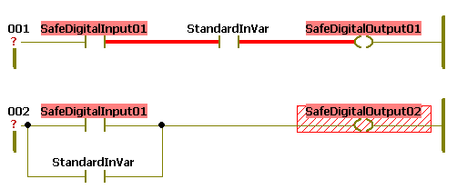
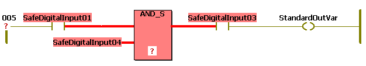

# Mixing Safety-related and Standard Variables in one FBD/LD Network

This topic contains information on the following:

* [Why mixing safety-related and standard variables?](MixingSafeAndNonSafeVariables.html#MixingSafeAndNonSafeVariables__MixedNetworksWhy)
* [Safety rules](MixingSafeAndNonSafeVariables.html#MixingSafeAndNonSafeVariables__Mixing_Rules)
* [Safety-related signal paths emphasized](MixingSafeAndNonSafeVariables.html#MixingSafeAndNonSafeVariables__SafeSignalsEmphasized)
* [Treatment of formal parameters](MixingSafeAndNonSafeVariables.html#MixingSafeAndNonSafeVariables__FPinMixedNetworks)
* [Admissible connections of safety-related and standard variables](MixingSafeAndNonSafeVariables.html#MixingSafeAndNonSafeVariables__MixedNetworks_Admissible)
* [Inadmissible connections of safety-related and standard variables](MixingSafeAndNonSafeVariables.html#MixingSafeAndNonSafeVariables__MixedNetworks_Inadmissible)

**NOTE:**

Term definition: Standard = non-safety-related.

The term "standard" always refers to non-safety-related items/objects. Examples: a standard process data item is only read/written by a non-safety-related I/O device, i.e., a standard device. Standard variables/functions/FBs are non-safety-related data. The term "standard controller" designates the non-safety-related controller.

## Why mixing safety-related and standard variables?

In FBD/LD networks safety-related and standard variables can be mixed.

This way, the **enable principle** can be programmed without using the EN\_OUT function (see topic ["Programming the Enable Principle"](ProgrammingEnablePrinciple.html#ProgrammingEnablePrinciple)).

The easiest way of realizing the enable principle in an FBD/LD network is to program a logical AND connection of a safety-related signal (inserted as LD contact) with a standard signal (also an LD contact). This means that the standard controller (represented by the standard signal in the code network) agrees to the Safety Logic Controller (represented as safety-related signal). This is shown as first example network below.

In such mixed FBD/LD networks, AND connections of safety-related and standard variables as well as type conversions from safety-related to standard data types are allowed. Data type conversions from standard to safety-related as well as wired ORs of safety-related and standard data types writing a safety-related variable are invalid. Refer to the [rules described below](MixingSafeAndNonSafeVariables.html#MixingSafeAndNonSafeVariables__MixedNetworks_Admissible).

## Safety rules

When mixing safety-related and standard variables, the following safety rules must be observed:

| WARNING | |
| --- | --- |
|  | **UNINTENDED EQUIPMENT OPERATION**   * Verify the impact of standard signals which influence safety-related outputs by an AND connection. * Do not use variables that have been converted from a safety-related to a standard data type in any safety-related functions.   **Failure to follow these instructions can result in death, serious injury, or equipment damage.** |

## Safety-related signal paths emphasized

When mixing safety-related and standard variables, Machine Expert – Safety performs a data flow analysis in the FBD/LD code and highlights the leading safety-related signal paths of a network by displaying them as thick red lines.

A safety-related path always ends either at a safety-related output variable or, in case of a standard output variable, at the last object input located before this output. If a standard signal path ends at a safety-related output, this output is shown with a background hatched in red.

Examples:

## Treatment of formal parameters

In code networks, FB/function inputs are treated like output variables of the network. Conversely, each output formal parameter of an FB/function is considered like an input variable of the network. As a consequence, the same rules which are valid for variables apply to FBs/functions when connected in a mixed network.

Example:

## Admissible connections of safety-related and standard variables

The following connections between safety-related and standard variables are allowed:

|  |
| --- |
| Safety-related input variable writes standard output variable (corresponds to type conversion safety-related > standard). |

|  |
| --- |
| Safety-related and standard input variable write safety-related output variable (AND connection). |

|  |
| --- |
| Safety-related and standard input variable write standard output variable (AND connection). |

|  |
| --- |
| Two (or more) parallel safety-related input variables write standard output variable (corresponds to wired OR with following type conversion safety-related > standard). |

|  |
| --- |
| Safety-related input variable and parallel standard input variable write standard output variable. |

|  |
| --- |
| Safety-related input variable writes safety-related output variable with parallel standard output variable. |

## Inadmissible connections of safety-related and standard variables

The following networks contain invalid connections between safety-related and standard variables resulting in a compiler error message:

|  |
| --- |
| Standard input variable writes safety-related output variable (corresponds to invalid type conversion standard > safety-related). |

|  |
| --- |
| Safety-related input variable with parallel standard input variable write safety-related output variable (wired-OR of safety-related and standard data type with following invalid type conversion). |

EIO0000002147.09