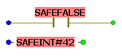

# Constants (Literals): Inserting and Editing

Literals have to be used to enter constant values in the code. They can be used without specifying a declaration.

**Further Information:**

The IEC 61131 standard describes different literal types, according to the standard data types. Refer to the topic ["IEC 61131 Implementation - Constants vs. Literals"](ConstantsLiterals.html#ConstantsLiterals) for further information.

Also observe the section ["Special case: global symbolic variables acting as global constant"](insertConstantsInCodeBody.html#insertConstantsInCodeBody__Constant_GlobalSymVarAsConstant).

How to insert a constant

1. You can insert unconnected or connected/assigned constants:

   * To insert a constant not connected to any object, click at a free worksheet position. Press <F5> or click the 'Variable' icon on the toolbar:

     
   * To insert a constant already connected to a function or function block, double-click the desired formal parameter. Example:

     
   * To insert a constant for a contact, double-click the particular LD object. Example:

     

   In all cases, the 'Variable' dialog opens.
2. Select the 'Scope' 'Constant'.

   In the dialog, only the input fields 'Name' and 'Type' remain visible.
3. Enter the desired literal (constant) in the 'Name' field.

   Observe the following:

   * Literals must always be entered including the data type (e.g., BYTE#1, SAFEINT#1000).

     Exceptions: TRUE and FALSE are always handled as BOOL.
   * The same applies to SAFETRUE and SAFEFALSE which are always handled as SAFEBOOL.
   * Standard INT constants can also be entered without data type (e.g., 1000 means INT#1000) as decimal inputs are automatically interpreted as INT.

     Exception: 0 and 1 if used with Boolean data type.
4. Depending on the entered constant, a suitable data type is proposed in the combo box 'Type'.

   If required, open the combo box and select another type.

   Observe the following:

   * A constant has to fit to the object to which it is connected. For example, only Boolean constants (TRUE, FALSE, SAFETRUE, SAFEFALSE) can be inserted for contacts and coils. When connecting a constant to a FU/FB formal parameter, you also have to verify that the data type is correct. To determine the suitable data type for a particular formal parameter, double-click on the input/output inside the FU/FB symbol to open the 'Formal Parameter' info dialog. Here, the expected data type is shown.
   * When connecting a literal directly to a formal parameter that only allows literals, the expected data type and the name prefix (e.g., INT#) are preset in the 'Variable' dialog.
5. Confirm the 'Variable' dialog.

   The constant is now visible in the code. It is composed of its data type and the entered value. Examples:

   

How to modify a constant

As constants have no declaration in the variables worksheet, they can only be edited using the 'Variable' dialog.

1. Right-click on the constant to be modified and select 'Object Properties...'.
2. In the 'Variable' dialog, edit the constant in the 'Name' field.

   You can overwrite the data type as well as the value of the literal.

   * Literals must always be entered including the data type (e.g., BYTE#1, SAFEINT#1000).

     Exceptions: TRUE and FALSE are always handled as BOOL.
   * The same applies to SAFETRUE and SAFEFALSE which are always handled as SAFEBOOL.
   * Standard INT constants can also be entered without data type (e.g., 1000 means INT#1000) as decimal inputs are automatically interpreted as INT.

     Exception: 0 and 1 if used with Boolean data type.

   Verify that data type and value are correct prior to confirming the dialog.

Instead, you can delete the constant to be modified and insert a new one. This way, it is ensured that data type and value match.

## Special case: global symbolic variable acting as constant

Machine Expert – Safety supports the use of global symbolic variables.

If a global symbolic variable gets an initial value (according to the IEC 61131-3 standard), it can be considered as a global constant with symbolic name. The initialized global symbolic variable is write-protected and the compiler treats it as a constant. As a result, it can be connected, for example, to a function block formal parameter which expects a constant.

By choosing a descriptive name as symbolic variable name, these global constants can easily be distinguished thus facilitating the code development.

How to insert and declare such a global constant

1. Declare a global symbolic variable as usual, either [using the 'Variable' dialog](DeclaringVarsWhileEditingCode.html#DeclaringVarsWhileEditingCode) or by [directly inserting/editing a declaration in the global variables worksheet](declaringvariables.html#declaringvariables).
2. Enter an initial value.

   Rules for initializing variables

   * The initial value is optional. If no initial value is specified, the variable is initialized with the default initial value of the data type as defined by IEC 61131-3.
   * Initial values can be specified for local (symbolic) variables and global output variables.

     Global input variables (global variables which are assigned to a physical input) cannot be initialized.
   * The initial value has to match the selected data type.
   * For Boolean variables, the default initial value is 0 or FALSE.
   * For safety-related variables, initial values must be entered with preceding safety-related data type in the following format: SAFEINT#*value*, SAFEBYTE#*value*, SAFEWORD#*value*, SAFEDWORD#*value*, or SAFETIME#*value*s.

     (*value* represents the proper value, e.g., SAFEINT#13 or SAFETIME#1s.)
   * To initialize a safety-related Boolean variable with FALSE, you can either enter SAFEBOOL#0 or SAFEFALSE. Use accordingly SAFEBOOL#1 or SAFETRUE to preset a safety-related Boolean variable to TRUE.
   * Global variable acts as global constant: if a global symbolic variable has an initial value, it can be considered as a global constant with symbolic name. The initialized global symbolic variable is write-protected and the compiler treats it as a constant. As a result, it can be connected, for example, to a function block formal parameter which expects a constant.

     Refer to the topic ["Inserting Constants"](insertConstantsInCodeBody.html#insertConstantsInCodeBody__Constant_GlobalSymVarAsConstant).

In the 'Variables' dialog: After entering the initial value, the dialog fields except the 'Name' field are write-protected.

The variable is now considered as global constant.

How to modify such a global constant

1. Open the global variables worksheet by clicking the 'Global decl.' icon on the toolbar.

   

   If you are working in a code worksheet, you can also right-click the global constant to be edited and select the 'Go to definition of *variable\_name*' menu item from the context menu. The global variables worksheet is then opened and the declaration line is marked.
2. In the global variables worksheet, edit the related declaration line by modifying the initial value.

EIO0000002147.09