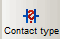
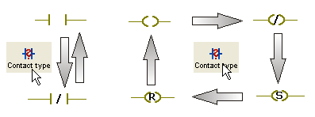

# Contact/Coil: Modifying Properties

The properties of contacts and coils can be modified. For example, it is possible to transform a normally open contact into a negative transition-sensing contact. It is also possible to modify the variable properties of an LD object, for example, by specifying an initial value for a contact.

How to modify the object properties using the 'Variable' dialog

Using the 'Variable' dialog, the assigned variable as well as the object type can be modified.

1. Double-click the LD object to be edited.

   The 'Variable' dialog appears.
2. To modify the object type, use the radio buttons 'Contact' and 'Coil' and the combo box 'Type' in the 'Object Type' area.

   Information on the available object types can be found in the topic ["Contacts and Coils"](contactandcoil.html#contactandcoil).
3. To assign a new variable (and declare it in the same step) or to assign an already declared variable, proceed as described in the topic ["Inserting and declaring variables"](DeclaringVarsWhileEditingCode.html#DeclaringVarsWhileEditingCode).

How to modify the object type using the toolbar icon

If only the object type has to be modified but the assigned variable remains the same, you can use the 'Contact type' icon on the toolbar.

1. Left-click the contact or coil for which you want to modify the properties.
2. Click the 'Contact type' icon on the editor toolbar to toggle the object type.

   

   By clicking this icon repeatedly, a marked contact toggles between a normally open contact and a normally closed contact each time you click the icon and a coil is switched between a normal coil, a negated coil, a set coil and a reset coil.

   

EIO0000002147.09