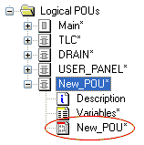

# FBD/LD Code Development

The graphical code editor is used to develop the safety-related application program using the graphical IEC 61131 programming languages FBD (Function Block Diagram) and LD (Ladder Diagram).

**NOTE:**

Code and variables can only be edited if you have [logged-on at 'Development' level using the correct project password](PasswordProtection.html#PasswordProtection) ('Project > Project Log On' menu item).

**NOTE:**

Machine Expert – Safety provides a certification manager for certifying the completed project after successful commissioning. A certified project is protected by password against modifications. (Such modifications would result in a new project acceptance procedure and certification.)

If you can't edit the project although you are logged-on correctly, verify whether the project is already certified. This is indicated in the status bar (rightmost):

Refer to the topic "[Project certification](CertificationManager.html#CertificationManager)" for detailed information.

Machine Expert – Safety allows to mix the programming languages FBD and LD, i.e., you can develop networks which contain functions, function blocks, contacts, coils and variables.

To open a code worksheet, double-click on the desired icon in the project tree:

**Verified user POUs**: After verifying the code of a POU, the particular POU can be marked as verified via context menu. When the verification flag is set, the POU is write-protected and shown with a different tree icon: 

Refer to the topic ["POU Verification"](POUverification.html#POUverification).

**Further Information:**

Observe also the description of

- [basic editor operations (managing code objects)](graphiceditor_generaldescription.html#graphiceditor_generaldescription),

- the [involved dialogs](dialogsforeditingcode.html#dialogsforeditingcode) and

- [available FBD/LD code objects](objectsinthegraphiceditor.html#objectsinthegraphiceditor).

Click here for related topics

EIO0000002147.09