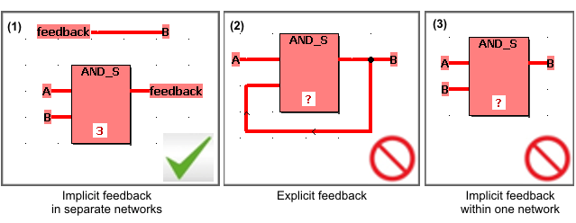
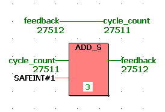

# Implicit Feedbacks in FBD

In FBD, implicit feedbacks can be programmed. For this, the involved variables must be declared as feedback variables and the rules mentioned below have to be observed when programming implicit feedbacks. Implicit feedbacks can, for example, be used to realize a storing behavior of a safety logic (e.g., flip-flop or cycle counter). The storing behavior of the safety logic which results from programming an implicit feedback may lead to a complex timing of the entire application.

| WARNING | |
| --- | --- |
|  | **UNINTENDED EQUIPMENT OPERATION**   * Verify the impact of programmed implicit feedbacks particularly with respect to their effect on the performance of your application. * Make certain that suitable organizational measures (according to applicable sector standards) have been taken to avoid hazardous situations if the safety logic application operates in an unintended or incorrect way. * Do not enter the zone of operation while the machine is operating. * Ensure that no other persons can access the zone of operation while the machine is operating. * Observe the regulations given by relevant sector standards while the machine is running in any other operating mode than "operational". * Use appropriate safety interlocks where personnel and/or equipment hazards exist.   **Failure to follow these instructions can result in death, serious injury, or equipment damage.** |

**Rules for programming implicit feedbacks in FBD**

* Implicit feedbacks in FBD can only be realized using variables but not via connection lines. When using lines, this is considered as forbidden explicit feedback (see figure (2) below).
* Each variable that causes the implicit feedback must be formally declared as feedback variable.

  This is done by selecting the 'Feedback' flag in the ['Variable' dialog](dialog_variable.html#dialog_variable) or in the [variables worksheet](columnsinvariablesgridworksheets.html#columnsinvariablesgridworksheets).

  When using a variable without set flag in an implicit feedback, a compiler error results.
* Only local variables can be declared as feedback variable.
* To ensure a well-defined timing, feedback variables must not be written and read within one network (as shown in figure (3) below). Instead, the feedback logic must be divided in two separate networks as shown in figure (1) below.

  

**Example**

EIO0000002147.09