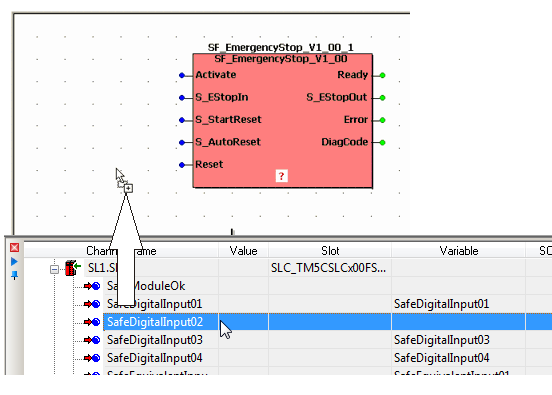
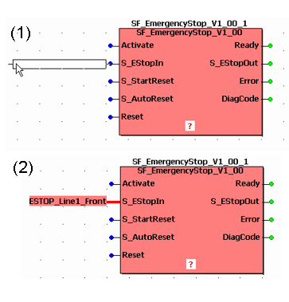
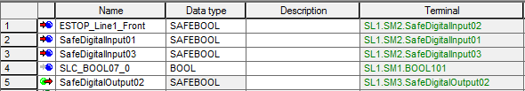
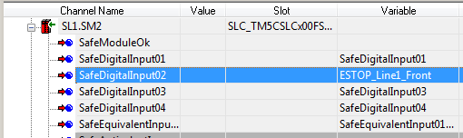
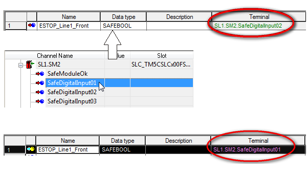
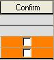

# Connecting/Disconnecting Process Data Items and Global I/O Variables

**NOTE:**

Term definition: The terms "process data item" and "device terminal" are used as synonyms in this context because each physical device terminal is represented by a process data item in the software.

The parameterization of the safety-related devices and the assignment of global I/O variables to device terminals (process data items) are safety-related tasks. Therefore, these steps have to be performed in Machine Expert – Safety and not in Machine Expert (which was used to design the bus structure).

Basically, the assignment of a device terminal to an I/O variable is done by dragging the particular process data item from the 'Devices' window (Bus Navigator) into the desired code worksheet.

This way, the following is performed in one step:

* Declaration of a global I/O variable.
* Insertion of this variable into the code.
* Assignment of the device terminal to this variable.

To connect a device terminal to an already declared global variable, you can also drag it from the 'Devices' window into the global variables worksheet and drop it on the specific existing declaration (see procedure below). This way, already existing assignments are **overwritten**.

**NOTE:**

The assignment of global I/O variables and process data items can only be modified if you have [logged-on at 'Development' level using the correct project password](PasswordProtection.html#PasswordProtection) ('Project > Project Log On' menu item).

**Mandatory assignment validation for the SafeModuleOK data item:**

The verification/validation of the assignment of each process data item to a global I/O variable is mandatory. By means of this verification, it is ensured that the correct I/O terminals are read/written by the safety-related application. This particularly applies to the SafeModuleOK process data item. This process data item is available for each safety-related module. SafeModuleOK indicates the module status. As the SafeModuleOK data item cannot be influenced, e.g., by switching a module input, the module to be verified must be physically removed from the TM5 bus. As a result, SafeModuleOK switches to SAFEFALSE and the assigned global I/O variable must follow. For further information on the steps to remove and reinsert a module refer to the user manual of the module involved.

| WARNING | |
| --- | --- |
|  | **UNINTENDED EQUIPMENT OPERATION**   * Physically remove each safety-related module from the TM5 bus in order to test for SafeModuleOK. * Verify that the global I/O variable assigned to the SafeModuleOK process data item of the removed safety-related module switches to SAFEFALSE.   **Failure to follow these instructions can result in death, serious injury, or equipment damage.** |

## How to...

How to connect a process data item to a newly created variable

1. Open the code worksheet where you want to create and use a global I/O variable.
2. In the 'Devices' window, open the device tree on the left.

   Expand the tree node of the device of which a device terminal is to be used.
3. Drag the device terminal (input/output process data item) to be connected into the desired code worksheet.

   Example:

   

   **NOTE:**

   To insert a Boolean process data item as contact into the FBD/LD code, hold the <Ctrl> key down when releasing the mouse button after dragging the variable from the device terminal grid into the code worksheet. The variable now appears as contact which can directly be connected to a formal parameter.

   When releasing the mouse button, the 'Variable' dialog appears.
4. In the 'Variable' dialog, a default variable name is proposed which is derived from the process data item (device terminal) name.

   Instead of accepting the proposed default name you can continue as follows:

   * Either select an existing global variable by choosing a 'Group' and a 'Name'.
   * Or declare a new global variable by entering a new 'Name', defining the 'Data Type' and selecting a 'Group'.
5. Confirm the 'Variable' dialog by clicking 'OK'.

   The outline of the variable is now added to the cursor (see (1) in figure below). It can be dropped at the desired position with a left mouse click (2). You can directly connect the variable to another object (e.g., a formal parameter as shown in the following example) or free at any position.

   Example: The variable name ESTOP\_Line1\_Front was selected/declared for the process data item.

   

If a new variable name has been entered, the related declaration is automatically inserted in the global variables worksheet. The 'Channel Name' of the connected device terminal (specified in the 'Devices' window) is now visible in the 'Terminal' column of the global declaration in the variables worksheet.

In the 'Devices' window, the name of the connected variable is shown for this device terminal.

| WARNING | |
| --- | --- |
|  | **UNINTENDED EQUIPMENT OPERATION**   * Inspect and correct as necessary the assignment of process data items to global I/O variables. * Validate that the correct process data item is entered for each assigned safety-related variable ('Terminal' column in the global variables worksheet). * Validate that the correct variable is entered for each assigned modified process data item ('Variable' column in the 'Devices' window). * Validate the physical wiring of your safety-related architecture and thoroughly test the application.   **Failure to follow these instructions can result in death, serious injury, or equipment damage.** |

How to disconnect a device terminal from a global variable

Disconnecting terminals from global variables is only possible in the global variables worksheet. Proceed as follows:

1. In the global variables worksheet, right-click on the variable to be disconnected.

   (Multi-selection can be done by pressing the <Ctrl> key or <Shift> key while selecting the desired declarations. The shortcut <Ctrl> + <A> selects all table lines.)
2. Select the 'Disconnect Terminal' item from the context menu.

The 'Channel Name' of the device terminal is removed from the 'Terminal' column and accordingly the variable name is deleted at the device terminal in the 'Devices' window.

When disconnecting process data items from global I/O variables, the following must be observed: After the deletion of the process data assignment, the global I/O variable remains as symbolic global variable. The control of the process may be lost by the disconnection.

| WARNING | |
| --- | --- |
|  | **UNINTENDED EQUIPMENT OPERATION**   * Verify that disconnecting a process data item from a global I/O variable does not result in the loss of the process control. 1 * Whenever you disconnect a process data item from a global I/O variable, validate the physical wiring of your safety-related architecture and thoroughly test the application.   **Failure to follow these instructions can result in death, serious injury, or equipment damage.** |

|  |  |
| --- | --- |
| 1 | As global symbolic variables are allowed, Machine Expert – Safety is not able to recognize that a process data assignment has been removed. |

Alternative: How to assign a device terminal to an existing variable via the variables worksheet

The following steps are only possible if the variable to be connected is already declared in the global variables worksheet. By performing these steps, it is possible to modify the existing assignment of process data items to global I/O variables.

* If a global variable is already assigned to another process data item, this assignment will be overwritten.
* If a process data item is already assigned to a global variable, this assignment will be overwritten.

This may influence the process to be controlled. Make certain that doing so will not endanger any persons or materials.

| WARNING | |
| --- | --- |
|  | **UNINTENDED EQUIPMENT OPERATION**   * Inspect and correct as necessary the assignment of process data items to global I/O variables. * Validate that the correct process data item is entered for each reassigned safety-related variable ('Terminal' column in the global variables worksheet). * Validate that the correct variable is entered for each reassigned modified process data item ('Variable' column in the 'Devices' window). * Whenever you reassign process data items to global I/O variables, validate the physical wiring of your safety-related architecture and thoroughly test the application.   **Failure to follow these instructions can result in death, serious injury, or equipment damage.** |

To assign a device terminal to an already existing global variable, proceed as follows:

1. Open the global variables worksheet by clicking on the 'Global decl.' icon on the toolbar.
2. Select the declaration of the global variable to be connected.
3. In the 'Devices' window, open the device tree on the left.

   Expand the tree node of the device of which a device terminal is to be used.
4. Drag the device terminal (input/output process data item) to be connected into the global variables worksheet and drop it on the desired declaration.

   **NOTE:**

   By dropping the process data item on a variable declaration, you may modify an existing assignment. Observe the safety note at the beginning of this procedure.

The assignment is now completed:

* The 'Channel Name' of the connected device terminal (specified in the 'Devices' window) is now visible in the 'Terminal' column of the global declaration in the variables worksheet.
* The name of the variable has **not** been modified by the new or modified assignment.
* The data type of the global variable has been adapted to the data type of the assigned device terminal.
* If the same device terminal is already connected to another global variable, the respective 'Terminal' fields are highlighted red in the variables worksheet thus indicating the invalid double assignment.
* In the 'Devices' window, the name of the connected variable is shown for this device terminal.

Example: The assignment of the global variable ESTOP\_Line1\_Front was replaced by a new device terminal.

Modified physical address must be confirmed manually

The list of safety-related devices is continuously synchronized between Machine Expert and Machine Expert – Safety. After modifying the bus structure in the Machine Expert 'Devices' window in a way that affects the physical address of a global I/O variable in the safety-related project (e.g., by adding/deleting a bus device), this modification must be confirmed manually in Machine Expert – Safety.

For that purpose, the additional column 'Confirm' is visible in the global variables worksheet.

| WARNING | |
| --- | --- |
|  | **UNINTENDED EQUIPMENT OPERATION**   * Inspect and correct as necessary any global I/O variable addresses related to physical, safety-related I/Os whenever you modify the bus structure after selecting the 'Confirm' checkbox. * Whenever you add, delete, or exchange devices in the bus structure, validate the physical wiring of your safety-related architecture and thoroughly test the application.   **Failure to follow these instructions can result in death, serious injury, or equipment damage.** |

Click here for related topics

EIO0000002147.09