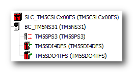
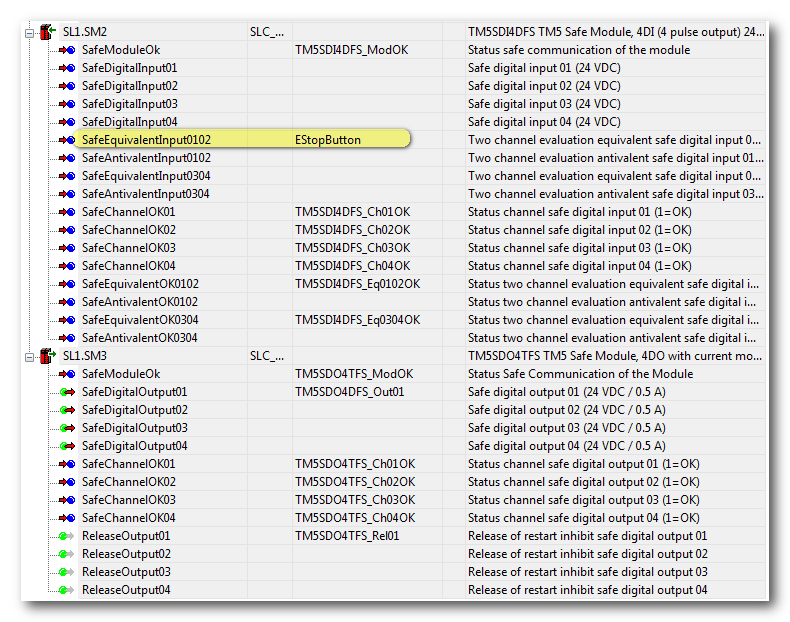
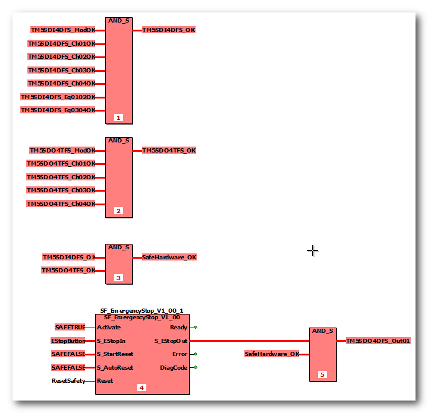
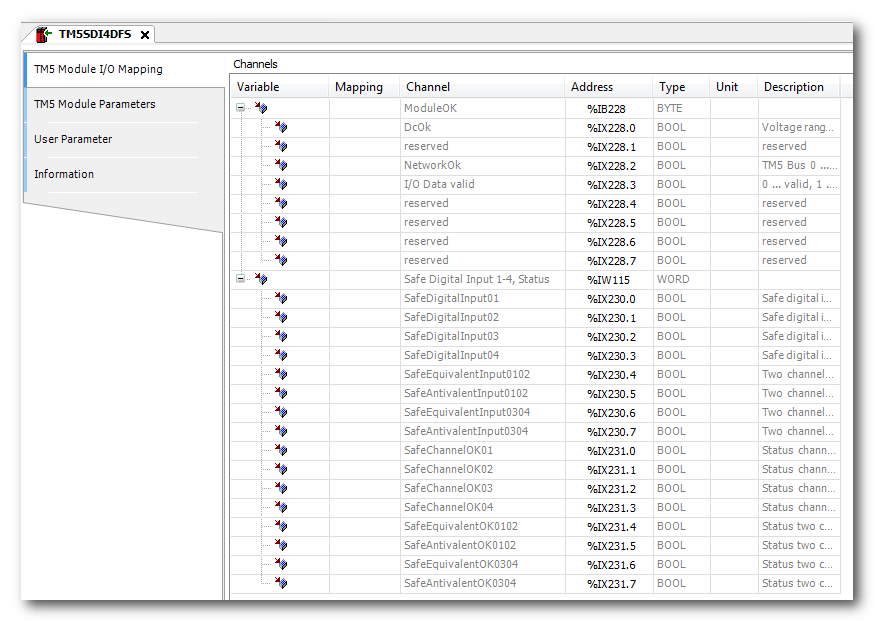
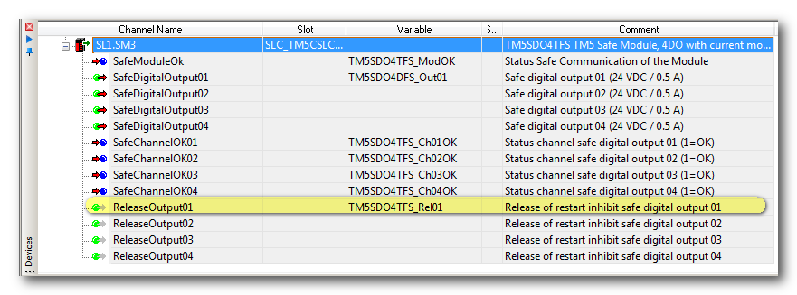
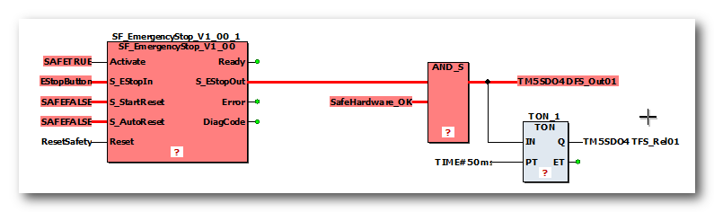

# Monitoring/Evaluating Diagnostic Information of the Machine

The Safety Logic Controller as well as the safety-related I/O modules are able to determine and report their operational state. They can, for example, detect disturbances or irregular module behavior, such as short-circuits or EMC disturbance on their output channels.

Such module conditions may lead to a disabled functional machine component while non-affected components remain in an operational state. If, for example, an actuator cannot function as intended due to such a situation, hazards may result for persons and equipment and the machine must be set to the defined safe-state. Refer to the hazard message below.

Affected modules indicate via the I/O channel LED indicator that an error has been detected by displaying a steady red indication, and by setting the related diagnostic process data item (e.g., SafeChannelOKxx) to SAFEFALSE. To detect such conditions and situations within your application, these process data items must be evaluated as shown in the application programming example below.

The process data items for diagnostic purposes provided by the safety-related I/O modules and the Safety Logic Controller help detect:

* disturbances and exceptions in the safety-related system, such as a short-circuit or EMC disturbances on a safety-related input or output channel,
* inoperable safety-related modules.

By evaluating these process data items provided by the Safety Logic Controller and the I/O modules involved in your safety-related application, i.e., by monitoring and processing the diagnostic controller/module information in the safety-related application, Machine Expert – Safety allows you to:

* determine the state of functional machine components and detect irregular behavior of the modules and,
* set the machine into the application-specific defined safe-state depending on the results of the evaluation. The defined safe-state of the machine results from the risk analysis you have to carry out for your safety-related application.

| WARNING | |
| --- | --- |
|  | **UNINTENDED EQUIPMENT OPERATION**   * Include in your risk analysis the impact of individual disabled functional machine components with regard to the safety of the entire machine. * Verify that the relevant diagnostic process data items provided by the Safety Logic Controller and the I/O modules involved in your safety-related application are monitored and evaluated so that your safety-related application can determine the state of the functional safety-related system. * Validate that the machine is set to the application-specific defined safe-state (according to your risk analysis) depending on the safety-related diagnostic process data evaluation. * Use appropriate safety interlocks where personnel and/or equipment hazards exist. * Validate the overall safety-related function and thoroughly test the application.   **Failure to follow these instructions can result in death, serious injury, or equipment damage.** |

**Further Information:**

Refer to the topic ["Connecting/Disconnecting Process Data Items and Global I/O Variables"](SE_AssignProcessDataItems.html#SE_AssignProcessDataItems) for detailed information on how to insert, connect and use process data items in Machine Expert – Safety.

## Application example

A TM5SDI4DFS safety-related input module is used for evaluating an emergency stop button to control a mains contactor via the first channel of a TM5SDO4TFS safety-related output module.

For this example, the Devices tree in Machine Expert looks as follows:

The two-channel emergency stop button is connected to the first two channels of the input module.

In Machine Expert – Safety, the input channels are parameterized for equivalence monitoring by using the process data item SafeEquivalentInput0102 in the safety-related logic (insertion via drag & drop).

The diagnostic process data items SafeChannelOKxx of both modules are used to detect irregular behavior of input/output channels. In addition, the SafeModuleOk signals indicate the communication status of the modules.

Depending on the safety-related module type, different diagnostic process data items are available. In case of digital I/O modules, the SafeChannelOKxxxx signals are relevant.

In the safety-related code, these process data items are evaluated as follows:

The SafeModuleOK and SafeChannelOKxx process data items are logically AND'd thus writing a resulting SafeHardware\_OK variable. This variable is in turn logically AND'd with the enable signal coming from the safety-related SF\_EmergencyStop function block which evaluates the emergency stop button.

The variable TM5DO4DFS\_Out01 is the logical result of the AND instruction. It is assigned to the physical output address of channel 1 of the output module and controls the mains contactor.

If any of the diagnostic process data items is switched to SAFEFALSE due to an inoperable device or a detected error on an input/output channel, the global I/O variable TM5DO4DFS\_Out01 becomes SAFEFALSE and de-energizes the mains contactor.

Therefore, the running operation of the controlled machine depends on both the deactivated emergency control button and the correct operation of the modules involved.

**Generating diagnostic messages in the non-safety-related application Machine Expert**

The diagnostic process data items of the safety-related modules are mirrored as diagnostic bits in the LMC non-safety-related controller. This way, they are also available in Machine Expert. To display safety-related module states in the HMI, these diagnostic bits have to be processed accordingly in the non-safety-related application in order to generate an HMI message.

The user-defined safety-related variable SafeHardware\_OK used in our example can also be mapped to the non-safety-related LMC controller application. For that purpose, use the I/O mapping functionality IO configuration > SLC2LMS\_NumberOfxxx of the Safety Logic Controller to generate a diagnostic message for, e.g., the HMI or Message Logger.

**Resetting diagnostic states**

There are different possibilities to reset a detected channel-related diagnostic state after eliminating its cause:

* Reset the entire system (mains switch off/on).
* In case of an output: the safety-related output has to be powered again to verify its correct behavior.

Observe the following when setting an output channel:

* Resetting a diagnostic state and setting an output must not result in any hazards. In case of any doubt, reset the entire system instead of the single channel.

  | WARNING | |
  | --- | --- |
  |  | **UNINTENDED EQUIPMENT OPERATION**  + Include in your risk analysis the impact of resetting the diagnostic state of a module or input/output channel and setting an output channel with regard to the safety of the entire machine. + Use appropriate safety interlocks where personnel and/or equipment hazards exist. + Validate the overall safety-related function and thoroughly test the application. **Failure to follow these instructions can result in death, serious injury, or equipment damage.** |
* Eliminate the causes for the diagnostic state before setting the output (e.g., eliminate short-circuits).
* Switch the safety-related signal for the output to SAFETRUE (global I/O variable TM5DO4DFS\_Out01 in this example).
* If the channel-related AutoRestart inhibit function is activated in the SLC parameters, a positive edge is required on the release signal for this output. This release signal is also a process data item provided by the module:

  

  **NOTE:**

  A delay of at least 50 ms must be kept between setting the safety-related signal and the positive edge on the ReleaseOutputxx signal. This can be implemented, for example, by means of a TON function as shown below:

  

EIO0000002147.09