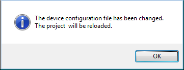
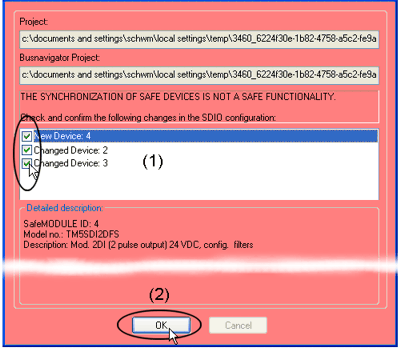

# Device Parameterization

This topic contains the following information

* [General information on the device parameterization editor](DeviceParamEditor.html#DeviceParamEditor__GenInfoSafeParamEditor)
* [Device synchronization when opening a project](DeviceParamEditor.html#DeviceParamEditor__DeviceSynchronization)
* [Device/generation change of the functional safety system](DeviceParamEditor.html#DeviceParamEditor__DeviceParam_SLCchange)
* [Structure of the device parameterization editor](DeviceParamEditor.html#DeviceParamEditor__StructSafeDevParamEditor)
* [How to edit device parameters](DeviceParamEditor.html#DeviceParamEditor__EditSafeParams)
* [Relevant Schneider Electric parameter descriptions](DeviceParamEditor.html#DeviceParamEditor__SE_RelevantParameters)
* [How to export/import device parameters](DeviceParamEditor.html#DeviceParamEditor__ExportImportParameters)
* [How to print safety-related device parameters](DeviceParamEditor.html#DeviceParamEditor__PrintSafeParams)

**NOTE:**

Term definition: The 'Devices' window is also referred to as Bus Navigator.

## General information

The Device Parameterization editor is part of the Bus Navigator. The editor is used to parameterize the safety-related devices contained in the bus project. These parameters are read from the device description file which is provided by each device. The file determines the device functionality during runtime.

For example, the parameters are used to specify module settings relating to the safety response time, signal evaluation, input filters settings, pulse mode, timebase, or units.

When compiling the project in Machine Expert – Safety, a binary parameterization file is generated based on these parameters. This file is transmitted to the Safety Logic Controller when downloading the project. The Safety Logic Controller then transmits the parameter sets to the individual safety-related devices.

The Device Parameterization editor is located on the right of the devices tree in the 'Devices' window. Which parameters are available on which tabs depends on the device that is selected in the device tree.

**NOTE:**

Parameters can only be edited if you have [logged-on](PasswordProtection.html#PasswordProtection) at the appropriate level using the correct project password ('Project > Project Log On' menu item).

## Device synchronization with the safety-related project

Each time when opening an existing project in Machine Expert – Safety (by launching Machine Expert – Safety in Machine Expert), the list of safety-related devices in the bus project is synchronized with the device list contained in the safety-related project. This device synchronization is repeated cyclically as long as the project remains open in Machine Expert – Safety.

In case that devices have been added, deleted, or modified in the Machine Expert 'Devices' tree, these modifications are automatically detected by the synchronization mechanism. First, the message dialog shown below appears. Click 'OK' to confirm the new bus structure and to reload the list of safety-related devices from Machine Expert.

Then, the 'Confirm changed SDIO Devices' dialog appears. Here, each modification must be (1) confirmed separately by marking the appropriate checkbox to be able to open the safety-related project before (2) confirming the dialog with 'OK' as shown in the figure below.

The following figure shows an example:

| WARNING | |
| --- | --- |
|  | **UNINTENDED EQUIPMENT OPERATION**  Whenever you add, delete, or exchange devices in the bus structure, validate the physical wiring of your safety-related architecture and thoroughly test the application.  **Failure to follow these instructions can result in death, serious injury, or equipment damage.** |

This way, the safety-related project is updated accordingly. When applying modifications in the bus configuration to the safety-related project, each modification is entered in the project log file and can be traced afterwards.

If you reject the modifications in the device list, Machine Expert – Safety is closed (for example because a device has been deleted or added unintentionally).

**NOTE:**

Device synchronization is only possible if you are [logged-on](PasswordProtection.html#PasswordProtection) at 'Development' level using the correct project password.

## Device/generation change of the functional safety system

The SLC type must be set in the SLC parameters in Machine Expert. Via the 'SafeLogicType' parameter, the types SLC100, SCL200, SLC300, or SLC400 can be selected.

**NOTE:**

The selectable types belong to different functional safety system generations: SLC100 and SCL200 belong to the SLCv1 generation, SLC300 and SLC400 to SLCv2.

After changing the SLC type, the list of safety-related devices in Machine Expert – Safety must also be confirmed as described above.

After selecting an SLC type of a different functional safety system generation in Machine Expert (e.g. upgrading from SLCv1 to SLCv2), the following applies:

* The SLC device is changed (i.e. replaced), the safety-related SLC parameters are set to default values. Set the SLC parameters according to values delivered by your risk analysis and the calculations or results within the scope of your functional safety system planning.
* Each safety-related device involved is updated with the device description of the newly selected device generation. If a suitable and valid device is available for updating, already set parameters are maintained.

  If, however, no valid device can be found for updating, the affected device is replaced and its parameterization is set to default values. Set the device parameters according to values delivered by your risk analysis.

After the update, the complete safety-related device parameterization must be verified with regard to the correct function and timing of your functional safety application. Observe the following hazard message.

| WARNING | |
| --- | --- |
|  | **NON-CONFORMANCE TO SAFETY FUNCTION REQUIREMENTS**   * Verify, for the SLC and each safety-related device involved in your application, that the values set for the safety-related parameters correspond to your risk analysis. * Be sure that your risk analysis includes an evaluation for incorrectly set parameter values. * Validate the overall safety-related function (in particular with regard to the resulting safety response time) and thoroughly test the application.   **Failure to follow these instructions can result in death, serious injury, or equipment damage.** |

## Structure of the Device Parameterization editor

The editor is grid based. Above the first grid line, the editor shows the device type (reference, description) and the 'SafeModuleID' which represents the unique safety identifier of the safety-related device. Each safety-related device can be clearly identified via this ID. The 'SafeModuleID' was automatically assigned when configuring the bus structure in the 'Devices' tree in Machine Expert. The synchronization of the safety-related device list is based on this information.

The fourth line on this tab shows the name of the import file in case you have imported parameters (see section ["Importing/exporting safety-related device parameters"](DeviceParamEditor.html#DeviceParamEditor__ExportImportParameters)).

The available parameters are then listed line by line. Depending on the device you are editing, the parameters may be summarized in groups. Each parameter (one grid line) consists of a read-only parameter name and an editable value. Refer to the next section.

## How to edit device parameters

**NOTE:**

Modifying safety-related device parameters is only possible if you are [logged-on](PasswordProtection.html#PasswordProtection) at 'Development' or 'Commissioning' level using the correct project password.

Commissioners can only modify parameters which are explicitly defined as [commissioning parameters](AdvancedAndCommissioningParameters.html#AdvancedAndCommissioningParameters).

'Maintenance' users have read-only access to these parameters.

Each modification done in the parameterization is entered in the project log file and can be traced afterwards.

The device parameterization editor provides multiple Undo (<Ctrl> + <Z>) and Redo (<Ctrl> + <Y>) as long as the editor is not closed and no other device is selected.

**Further Information:**

For detailed information about the meaning of the available parameters and values, refer to the hardware documentation of the device to be parameterized.

**NOTE:**

After editing a device parameter and saving the parameter grid by pressing the 'Save' icon, the project is marked as modified. A '\*' symbol is added to the elements in the node project tree. The '\*' is deleted after compiling the project.

## Relevant Schneider Electric module parameter descriptions

* Parameters of the available safety-related Schneider Electric modules are listed and described in the help chapter "Hardware Module Parameters".
* Parameters that are relevant for the safety response time are additionally summarized and listed in the topic ["Parameters for the Safety Response Time"](wp100881.html#wp100881).

## Exporting and importing safety-related device parameters

Once you have parameterized a safety-related device, you can export the parameter list into a file for later reuse.

How to export all parameters or a parameter group

1. To export the entire parameter list, right-click anywhere into the grid editor and select the context menu item 'Export...'.

   To export one specific parameter group, right-click on the gray group name and select the context menu item 'Export group...'.

   In both cases the export dialog appears.

   The file extension for entire parameter files is \*.spd, exported groups are stored in \*.spg files.
2. Browse for a target directory, enter a file name, and click 'Save'.

How to import all parameters or a parameter group

1. To import an entire parameter list, right-click anywhere into the grid editor and select the context menu item 'Import...'.

   To import one specific parameter group, right-click on any gray group name and select the context menu item 'Import group...'.

   In both cases the import dialog appears.
2. Browse for the desired parameter file. The file extension for entire parameter files is \*.spd, exported groups are stored in \*.spg files. There are only these files displayed which are suitable for the present device.

   After importing the parameter list, the parameters of the device are locked.
3. Select 'Unlock' from the context menu to edit parameters.

The name of the imported file is visible in the editor header (below the location ID). The import file name is **removed again**  as soon as you modify any parameter for the present device.

## Printing safety-related device parameters

The print dialog (menu item 'File > Print Project...') provides a checkbox 'Safety Parameters'. Marking this checkbox includes the safety-related device parameters in the printout.

Click here for related topics

EIO0000002147.09