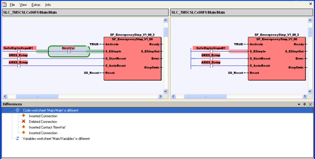

# Comparing Projects

Using the 'Project > Compare projects...' command, the project sources of two projects can be compared.

For comparing two projects, it is not necessary to previously compile the projects involved. This way, also projects can be compared which do not compile.

**NOTE:**

Code worksheets in ST are an exception here. These must be compiled so that code changes are recognized during project comparison.

**NOTE:**

Both projects to be compared must have been edited or at least opened once with SoSafe Programmable V2.x or Machine Expert – Safety V1.x or later.

This topic contains information on the following:

* [Finding project modifications reliably in terms of safety](comparingprojectsources.html#comparingprojectsources__ProjectCompare_SafetyRelated)
* [Compared project parts](comparingprojectsources.html#comparingprojectsources__ProjectComparer_WhatIs)
* [How to compare project sources](comparingprojectsources.html#comparingprojectsources__ProjectComparer_HowTo)
* [Project Compare workspace](comparingprojectsources.html#comparingprojectsources__ProjectComparerWorkspace)
* [External comparison tool](comparingprojectsources.html#comparingprojectsources__CompareProject_ExternalTool)

## Finding project modifications reliably in terms of safety

**NOTE:**

The results delivered by the project comparison in Machine Expert – Safety must not contribute (neither directly nor indirectly) to the executable code (including data) of the safety-related application system. The Machine Expert – Safety project comparison feature is classified as T1 tool according to the standard 61508:4:2010.

For a reliable detection of modified project parts, the results of the project comparison must only be used in combination with a manual comparison of the checksums (CRCs) calculated by Machine Expert – Safety. CRCs are output in the ['Project Info' dialog](ProjectInformation.html#ProjectInformation) and, for [verified POUs](POUverification.html#POUverification), in the project tree.

These CRCs are the only valid basis for reliably detecting safety-related project modifications. To support you in finding modification details in project parts with different CRCs, Machine Expert – Safety provides the project comparison tool described here.

| WARNING | |
| --- | --- |
|  | **UNINTENDED EQUIPMENT OPERATION**   * Make certain that the results of the project comparison are only used in combination with a manual comparison of the CRCs calculated by Machine Expert – Safety. * Always apply the measures and regulations defined by relevant safety standards when modifying safety-related program parts or safety-related device parameters.   **Failure to follow these instructions can result in death, serious injury, or equipment damage.** |

General procedure for a safety-related detection of project modifications:

1. Manually compare

   * the CRCs listed in the ['Project Info' dialog](ProjectInformation.html#ProjectInformation) ('Project > Project Information', tab 'Project') of the project loaded in Machine Expert – Safety
   * with the CRCs in the archived project documentation of the project to be compared.

   Differing CRCs indicate that the respective project part has been modified.

   Identical CRCs indicate that the respective project part has not been modified.
2. If the 'Logic CRC' differs, you can use the [POU verification feature](POUverification.html#POUverification) to locate modified POUs.

   For that purpose, manually compare

   * the POU CRCs shown at the POU icons in the project tree
   * with the POU CRCs in the printed project documentation of the project to be compared.

   (The checksum that has been calculated by Machine Expert – Safety on verification is printed below the POU name in the footer of each code worksheet and local variables worksheet of the verified POU.)
3. Based on the results of the CRC comparisons in step 1 and 2, you can use the project comparison as described in this topic for locating the project modification details.

## Compared project parts

The project comparer browses the following project items for differences:

| Project part | Detected differences | Undetectable changes |
| --- | --- | --- |
| Project structure  ('Logical POUs' folder) | Added, renamed, or deleted POUs.  Added, renamed, or deleted code worksheets.  Modified order of code worksheets within POUs. | Added/deleted libraries  Added description worksheets |
| FBD/LD Code | Any code-relevant differences and comments.  What does "code-relevant" mean?  Each modification that affects the resulting application code is considered as code-relevant. Besides inserting, deleting, or modifying code objects, this also includes all modifications that influence the execution order, for example, moving an entire code network.  In contrast, moving single variables, LD objects, or functions/FBs to another worksheet position modifies the visible layout but does not affect the execution order on the Safety Logic Controller. Therefore, such modifications are not considered as code-relevant and are not detected when comparing. | None |
| ST Code | Any differences.  The project comparer, however, provides no graphical representation of found differences. If implemented in your Machine Expert – Safety version, an [external comparison tool](comparingprojectsources.html#comparingprojectsources__CompareProject_ExternalTool) can be used for that purpose. | None |
| Variables worksheets | Any differences.  The project comparer, however, provides no graphical representation of found differences. If implemented in your Machine Expert – Safety version, an [external comparison tool](comparingprojectsources.html#comparingprojectsources__CompareProject_ExternalTool) can be used for that purpose. | None |
| Description worksheets | None | Not included in the project comparison. |
| Project information dialog | None | Not included in the project comparison. |
| Parameterization of safety-related devices | Any modifications in the safety-related device parameterization editor. | None |

Detected differences are listed in the [Project Comparer workspace](comparingprojectsources.html#comparingprojectsources__ProjectComparerWorkspace) which opens automatically.

## How to compare project sources

**NOTE:**

Read and observe the instructions given in section ["Finding project modifications reliably in terms of safety"](comparingprojectsources.html#comparingprojectsources__ProjectCompare_SafetyRelated) before comparing projects.

As the Machine Expert – Safety project is part of the related Machine Expert project, you can select Machine Expert projects for comparison. The project comparison function compares the safety-related parts contained therein. It is also possible to compare safety-related projects that have been exported from Machine Expert – Safety.

1. Open the project to be compared (project A) with another project (B).

   The file extension of Machine Expert projects is \*.project.

   The file extension of safety-related exported projects is \*.spa.
2. Select 'Project > Compare projects...' and choose the project to be compared (project B) with the present project (A).

   You can select either a Machine Expert project (see note above) or an exported safety-related project (\*.spa).

   The comparison is then started automatically.

   If the present project (A) been modified but not yet saved, you are first asked to save modifications.

   If you do not save these modifications, the project version saved last is compared. The modifications you made, however, are not discarded.
3. After starting the comparison, the [Project Comparer workspace](comparingprojectsources.html#comparingprojectsources__ProjectComparerWorkspace) appears displaying the results. (If the Project Comparer workspace is already open showing a previous comparison, its content is updated.)

## Project Comparer workspace

**NOTE:**

Read and observe the instructions given in section ["Finding project modifications reliably in terms of safety"](comparingprojectsources.html#comparingprojectsources__ProjectCompare_SafetyRelated) before using the project comparison results.

| WARNING | |
| --- | --- |
|  | **UNINTENDED EQUIPMENT OPERATION**  Make certain that the results of the project comparison are only used in combination with a manual comparison of the CRCs calculated by Machine Expert – Safety.  **Failure to follow these instructions can result in death, serious injury, or equipment damage.** |

The Project Comparer workspace opens automatically after starting the comparison. It is composed of two areas (see example figure at the end of this topic).

The **'Differences' list** (lower screen area) displays the detected differences in a hierarchical, grouped way. The following groups can be listed (depending on the detected differences): Project Changes, Code Changes, Variable Changes, SDIO changes and Bus Navigator Changes.

Each group node can be expanded to view the contained details, such as affected worksheets or modules. By further expanding a detail node, the detected changes become visible.

Expanding and collapsing a particular group is done in the usual manner by clicking the '+' or '-' sign at the beginning of the respective entry. To expand/collapse all entries in the list, right-click into the list view and select the 'Expand all' or 'Collapse all' context menu item. Symbols beside the list entries indicate the modification type:

|  |  |
| --- | --- |
|  | Added element |
|  | Modified/updated element |
|  | Deleted element |
|  | Moved element |

**Comparative code view** (upper screen area): Differing **FBD/LD** code worksheets of both projects can be viewed side by side in read-only mode. This is done by clicking on an entry in the 'Difference' list. Differing code-relevant FBD/LD objects (including comments) are highlighted by colored borders and a gray background. (Differences in other project parts than FBD/LD code can optionally be displayed in an [external comparison tool](comparingprojectsources.html#comparingprojectsources__CompareProject_ExternalTool).)

What does "code-relevant" mean?

Each modification that affects the resulting application code is considered as code-relevant. Besides inserting, deleting, or modifying code objects, this also includes all modifications that influence the execution order, for example, moving an entire code network.

In contrast, moving single variables, LD objects, or functions/FBs to another worksheet position modifies the visible layout but does not affect the execution order on the Safety Logic Controller. Therefore, such modifications are not considered as code-relevant and are not detected when comparing.

| Color | Meaning | Example |
| --- | --- | --- |
| Green | Newly inserted objects in the project. Only visible in the left code view. |  |
| Blue | Modified objects. Visible in both the left and the right code view. |  |
| Red | Deleted objects. Only visible in the right code view. |  |
| Orange | Network which has been moved to another worksheet position. Visible in both the left and the right code view. Observe the explanation regarding "code-relevant modifications" above. |  |

**Functions of the Project Comparer workspace:**

Synchronized scrolling in the comparative code view.

If the 'Extras > Synchronize scrolling' menu item in the Project Comparer workspace is selected, the positions in both code worksheets are scrolled synchronously (horizontally and vertically). This allows to compare the code even in large worksheets.

If the worksheets show different code positions when selecting the menu item, they are synchronized to the same position.

Launching an external comparison tool

Machine Expert – Safety supports an external comparison tool (for example, Beyond Compare) which can be used for displaying differences in other project parts than FBD/LD code. After you have installed the external tool and configured it accordingly you can launch it via the context menu of the respective entries in the 'Differences' list. Refer to the section ["External comparison tool"](comparingprojectsources.html#comparingprojectsources__CompareProject_ExternalTool) for details.

Accessing and editing a particular code position

In the comparative code view, no editing is possible (read-only view). You can, however, directly jump to code worksheets of the project you opened first and edit them. The "compare project" (selected as second project) cannot be accessed this way.

* Either right-click the respective entry in the 'Differences' list and select the 'Edit source' context menu item.
* Or double-click the desired code position in the **left** window of the comparative code view.

Printing the comparison results

The 'File' menu in the Project Comparer workspace provides menu items for printing and previewing the comparison results.

Example

## External comparison tool

**NOTE:**

The external comparison tool as described here is supported as of Machine Expert V2.0.

The Project Comparer workspace displays a graphical representation of found differences for FBD/LD code in the comparative code view. However, differences in ST code, variables/device parameter grids, or in the project tree cannot be displayed in the comparative code view (although they are shown in the 'Differences' list).

Machine Expert – Safety supports any common external comparison tool, for example, Beyond Compare. It can be used to display differences in such project parts.

Provided that you have installed and configured the external tool (see section below), the context menu item 'Open external compare tool...' is available for the respective entries in the 'Differences' list. After launching the external comparison tool this way, the older comparison project (project B which you have chosen in [step 2](comparingprojectsources.html#comparingprojectsources__ProjectComparer_HowTo)) is shown right and the current project (A) on the left side.

Machine Expert – Safety transfers project copies to the external comparison tool to help avoid accidental modifications to the original files.

When configuring the external comparison tool, you can use tool-specific features. For example, you can specify a write protection for the left or right project (e.g., `/leftreadonly` when using Beyond Compare). When viewing the comparison results in the external tool, you can use the available tool commands.

**Further Information:**

For information on the available command line parameters and further commands in the external comparison tool, refer to the respective software documentation (for example, Beyond Compare online help).

How to configure an external comparison tool

1. In Machine Expert – Safety, select 'Project > Configure external compare tool…'.
2. In the configuration dialog, define the path to the tool executable installed on your PC.

   Examples:

   Beyond Compare: `C:\Program Files (x86)\Beyond Compare\BComp.exe`

   TortoiseSVN: `C:\Program Files\TortoiseSVN\bin\TortoiseMerge.exe`
3. In the lower dialog field, specify the following command line parameters, independently of the external tool you are using:

   `%base %mine`

   `%base` represents the project which is currently open in Machine Expert – Safety (project A) and `%mine` represents the older comparison project (B).

   When launching the external tool, the parameters `%base` and `%mine` are substituted by the corresponding file names from the 'Differences' list.

   The `%worksheet` parameter can be used in addition to hand over worksheet names to the external tool.
4. Supplement the command line by tool-specific parameters.

   **NOTE:**

   It is mandatory to specify a write-protection for the current project which is displayed on the left side.

   Beyond Compare, for example, supports the parameters `/leftreadonly`, `/rightreadonly`, or `/readonly`.

Command line examples for Beyond Compare:

* `%base %mine /leftreadonly` results in a write-protected current project which is displayed on the left side.
* `%base %mine /title1=%worksheet /title2=%worksheet /leftreadonly` results in a write-protection of the current project and the worksheet names are displayed as titles in Beyond Compare on both sides.

Command line example for TortoiseSVN:

`/base:%base /mine:%mine /basename:%worksheet /minename:%worksheet /readonly`

EIO0000002147.09