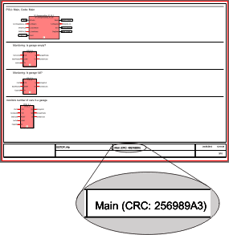

# Printing and Preview

After successful commissioning of the safety-related application, it is **mandatory** to print the whole project.

The 'File' menu provides commands to define printer settings, display a preview and to print the entire project or parts of it.

* 'Print...' prints the active worksheet with the pagelayout texts defined in the 'Pagelayout text appearance' dialog. For detailed information refer to the procedure "How to print a single worksheet" below. Before printing the single worksheet, you can use the preview (see next item).
* 'Print Preview' calls the page preview for the present worksheet showing the present layout.

  Cross references are not displayed in the preview. The page preview cannot be called for worksheets in online mode.
* 'Print Setup...' calls the standard Windows 'Printer Setup' dialog. For detailed information refer to the Microsoft documentation and your printer documentation.
* 'Print Project...' calls the 'Print Project' dialog which is used to set the print options, call the 'Pagelayout text appearance' dialog, and print the whole project (see next section).

How to print the whole project

**NOTE:**

Printing the project documentation is a **mandatory** part of the acceptance procedure.

Print all code and variables worksheets, local and global cross references, project information, Bus Navigator settings as well as safety-related device parameters.

For that purpose, select 'File > Print Project...' and activate the checkboxes in the 'Print Project' dialog.

If desired, modify/define the pagelayout texts to be printed on each page (see procedure below).

How to print a single worksheet

**NOTE:**

Cross references are not printed using the 'Print' menu item.

1. Click into the worksheet to be printed.
2. If desired, modify the pagelayout texts as described below.
3. You can verify the layout by selecting 'File > Print Preview'.
4. Select 'File > Print'.

How to specify the pagelayout texts

1. Select 'File > Print Project...'.
2. In the 'Print Project' dialog, click 'Pagelayout Texts...'.
3. In the 'Pagelayout text appearance dialog', enter/modify the desired text elements and confirm the dialog by clicking on 'OK'.

   **NOTE:**

   If your company logo does not appear in the print preview or on your printed worksheets, reduce the size of the bitmap. Bitmap files (\*.bmp) up to 64 KB and 300x200 pixels can be printed.
4. Click 'Cancel' to close the dialog without printing.

## CRC of verified POUs is printed

If the verification flag has already been set for a POU (see topic ["POU verification"](POUverification.html#POUverification)), the checksum (CRC) that has been calculated by Machine Expert – Safety on verification is printed below the POU name in the **footer** of each **code** worksheet and **local variables** worksheet of the verified POU. This applies when printing the entire project or only a single worksheet.

By manually comparing the CRCs in the printed project documentation of an archived project version with the CRCs in the project tree of a project loaded in Machine Expert – Safety, you can determine modified POUs. Afterwards, you can use the [project comparison tool](comparingprojectsources.html#comparingprojectsources) for locating project modifications in these POUs.

**Further Information:**

Observe the section ["Finding project modifications reliably in terms of safety"](comparingprojectsources.html#comparingprojectsources__ProjectCompare_SafetyRelated) for information how you have to use the CRC checksums for comparing projects.

For POUs that are not yet verified, only the POU name is printed on code and variables worksheets.

EIO0000002147.09