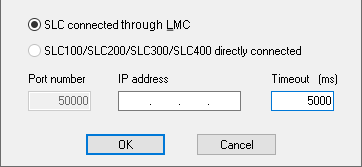
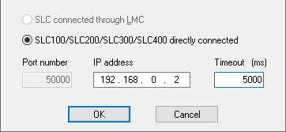

# Communication Settings

Before you can download the project to the Safety Logic Controller, display the variable status, or debug the project, a communication link between the PC you are working with and the connected Safety Logic Controller has to be established. This is done by defining the communication parameters and then connecting the configuration PC either directly to the Safety Logic Controller (SLC) or to the higher-level standard controller (LMC) which in turn communicates with the SLC.

To set the communication parameters:

1. Select the 'Online > TCPIP Communication parameters' menu item.

   A dialog for defining the communication parameters opens.
2. Depending on the connection (directly or via standard controller), the communication settings differ.

   If the communication between PC and Safety Logic Controller (SLC) is handled ...

   * via the higher-level standard controller (LMC), activate the 'SLC connected through LMC' radio button.

     

     In this case, no further settings are required. Data transmission (such as project download, handling of debug data, upload of online values, etc.) is completely performed via the LMC standard control.

     **NOTE:**

     After startup of the standard controller, the communication connection between the standard controller and SLC is not possible until the Sercos bus has entered phase 2 (device verification phase).

     **NOTE:**

     To allow the connection between Machine Expert – Safety and the Safety Logic Controller via the Sercos bus, appropriate Ethernet settings have to be applied on the standard controller. Refer to the M262 Programming Guide, chapter "Ethernet Services" for information on IP forwarding settings. For PacDrive refer to the User Guide "How to Configure the Firewall for PacDrive LMC Controllers". The CommonToolbox Library Guide provides information on related application functions.

   * directly (e.g., via LAN connection), select the 'SLC directly connected' radio button and enter the 'IP address' of the connected Safety Logic Controller.

     

     When specifying a 'Timeout' period, Machine Expert – Safety monitors the elapsed response time of the SLC. If this timeout period is exceeded, the SLC communication status is set to TIMEOUT. This communication status is indicated in the 'SafePLC' control dialog.
3. Click 'OK' and connect the configuration PC either to the standard controller (LMC) or to the Safety Logic Controller (SLC), depending on the settings you made.

**Verification of the serial number when connecting.**

When establishing the communication connection to the SLC, the system verifies whether the PC was previously connected to the same or a different SLC. This is done by means of the SLC serial number. This helps to avoid connection to an unintended controller. See topic ["Downloading a project (step 2)"](downloadingaproject.html#downloadingaproject) for more information.

EIO0000002147.09