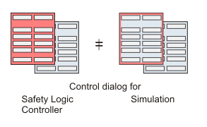

# Safety Logic Controller States

If the [simulation mode](Simulation.html#Simulation) is activated and **safe mode** is simulated, the ['SafePLC' dialog](dialogSafePLC.html#dialogSafePLC) looks different. Instead of having a completely red background, it only shows a **red border**. In debug mode, no difference is visible between simulation and Safety Logic Controller.

**NOTE:**

Make certain that the desired target (Safety Logic Controller or simulation) is connected when working with the dialog.

The following table lists the possible Safety Logic Controller states whether you are connected to the Safety Logic Controller or the simulator. The active state is indicated in the ['SafePLC' dialog](dialogSafePLC.html#dialogSafePLC).

|  |  |
| --- | --- |
| **Safety Logic Controller state** | **Meaning** |
| On | Power supply of the Safety Logic Controller is switched on. No valid program is stored in the Safety Logic Controller memory, i.e., no program data and system data are available. |
| No Execution | Application program has been downloaded and is stored on the Safety Logic Controller. Start-up operations are executed by the firmware, online communication is already possible.  The Safety Logic Controller will automatically transition to the RUN [Safe] state after a few execution cycles. No measures are required. |
| STOP [Safe] | The program is loaded but not executing. Therefore, the safety-related I/O images are not updated and no output signals are transmitted to the safety-related output terminals.  To start the program execution, [switch the Safety Logic Controller to debug mode](SafePLC_OperatingModes.html#SafePLC_OperatingModes__SwitchSafeDebug) (state 'STOP [Debug]') and press the 'Start' button. |
| RUN [Safe] | You can display the [variable status (variable values)](DisplayVariableStatus.html#DisplayVariableStatus) in online worksheets. No debug operations are possible. For debugging you have to [switch the Safety Logic Controller to debug mode](SafePLC_OperatingModes.html#SafePLC_OperatingModes__SwitchSafeDebug) (state RUN [Debug]).  If an error is detected while in this state, the Safety Logic Controller switches to STOP [Debug].  To stop the program execution, the Safety Logic Controller must be [switched to debug mode](SafePLC_OperatingModes.html#SafePLC_OperatingModes__SwitchSafeDebug). In debug mode, the 'Stop' button becomes active. |
| STOP [Debug] | The program is loaded but not executing. The 'Start' button is active to initiate program execution.  The 'Download' button is active for sending the project to the Safety Logic Controller.  By pressing 'Halt', the single cycle operation is entered. By pressing 'Safe', the Safety Logic Controller switches back to safe mode and enters the state 'STOP [Safe]'. 1 |
| RUN [Debug] | While in RUN [Debug], debug operations can be performed ([forcing/overwriting variables](debuggingtheproject.html#debuggingtheproject__forcingandoverwritingvariables) and [single cycle operation](debuggingtheproject.html#debuggingtheproject__SingleCycleMode)). You can also display the [variable status (variable values)](DisplayVariableStatus.html#DisplayVariableStatus) in online worksheets.  The 'Stop' button for stopping the program execution is active. By pressing 'Safe', the Safety Logic Controller enters the state RUN [Safe].  If an error is detected while in this state, the Safety Logic Controller switches to STOP [Debug]. |
| HALT [Debug] | This state occurs when executing single cycle operations in debug mode.  When clicking the 'Single cycle' button, the Safety Logic Controller processes exactly one program cycle and then waits for the next command. Pressing 'Continue' terminates the single cycle operation and the Safety Logic Controller enters the state RUN [Debug].  If an error is detected while in this state, the Safety Logic Controller switches to STOP [Debug]. |

|  |  |
| --- | --- |
| 1 | An exception to transition from STOP [Debug] to STOP [Safe] is in the case that you attempt to close the control dialog while in debug mode.  This is an error condition that is entered if the Safety Logic Controller detects disconnection from Machine Expert – Safety by closing the control dialog while in debug mode and after the elapse of more than 10 minutes, or if another condition that does not allow further execution of the program has occured on the Safety Logic Controller. After this, the control dialog will indicate the STOP [Debug] state and the 'Error' button will be available. The 'Safe' button will not be available. Press the 'Error' button to display the message. For more information see section ["Debug Watchdog"](SafePLC_OperatingModes.html#SafePLC_OperatingModes__DebugWatchdog). |

Further information about the Safety Logic Controller states are contained in your Safety Logic Controller manual.

Though not a Safety Logic Controller state, the control dialog may indicate a status of TIMEOUT as the controller state. This state indicates that the communication between Machine Expert – Safety and the Safety Logic Controller could not be established within, or interrupted for a duration greater than, the given timeout interval. Refer to the procedure shown below.

## How to eliminate the TIMEOUT communication state

1. Close the Safety Logic Controller control dialog.
2. Verify that the Safety Logic Controller is connected correctly to the PC directly or via standard controller and is switched on.
3. Select 'Online > TCPIP Communication settings ...'.

   * Verify the [set communication parameters](dialogcommunicationparameters.html#dialogcommunicationparameters) as well as the firewall settings, and correct, if necessary.

     Confirm the 'Communication parameters' dialog.
   * Verify that the PC is connected correctly as set in the communication parameters: either directly to the Safety Logic Controller or to the LMC standard controller if communication is established through the LMC.
4. Open the Safety Logic Controller control dialog and verify the connection state again.

EIO0000002147.09