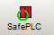
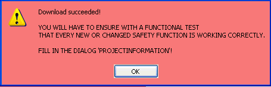

# Downloading the Project

After having [compiled](compiling.html#compiling) your project, you have to download it to the Safety Logic Controller. Downloading a project means that the whole project including the parameterization data is transmitted to the Safety Logic Controller.

| WARNING | |
| --- | --- |
|  | **UNINTENDED EQUIPMENT OPERATION**   * Prior to downloading the application, make certain that suitable organizational measures (according to applicable sector standards) have been taken to avoid hazardous situations if the safety logic application operates in an unintended or incorrect way, or an incorrect target for the download was selected. * Do not enter the zone of operation while the machine is operating. * Ensure that no other persons can access the zone of operation while the machine is operating. * Observe the regulations given by relevant sector standards while the machine is running in any other operating mode than "operational". * Use appropriate safety interlocks where personnel and/or equipment hazards exist.   **Failure to follow these instructions can result in death, serious injury, or equipment damage.** |

**NOTE:**

**Safety Logic Controller simulation**

Machine Expert – Safety provides a function for [simulating the Safety Logic Controller](Simulation.html#Simulation). You can use the simulation to test the behavior of the safety logic fully independently of the Safety Logic Controller.

## Download procedure

1. Before downloading the project, ensure that the Safety Logic Controller is connected to the PC and is switched on.

   **NOTE:**

   To allow the connection between Machine Expert – Safety and the Safety Logic Controller via the Sercos bus, appropriate Ethernet settings have to be applied on the standard controller. Refer to the M262 Programming Guide, chapter "Ethernet Services" for information on IP forwarding settings. For PacDrive refer to the User Guide "How to Configure the Firewall for PacDrive LMC Controllers". The CommonToolbox Library Guide provides information on related application functions.
2. Click the 'SafePLC' icon on the toolbar.

   

   **Verification of the identification number**

   When establishing the communication connection, the system verifies whether the safety-related project was previously connected to the same or a different Safety Logic Controller. This is done by comparing the identification numbers of the controller to be connected now and of the controller connected last.

   If this comparison results in different Safety Logic Controller identification numbers, a dialog informs you that the Safety Logic Controller has been replaced since the last connection.

   Example:

   

   * Clicking 'Yes' in this dialog connects the Safety Logic Controller and stores its identification number for the next comparison.
   * Clicking 'No' cancels the connection attempt and opens a dialog asking you to verify some settings as well as the Safety Logic Controller configuration.

   **Not yet logged-on to the Safety Logic Controller?**

   If you are not yet logged-on to the Safety Logic Controller, the logon dialog appears. Enter the Safety Logic Controller password and click 'OK'. Refer to the topic ["Password protection"](PasswordProtection.html#PasswordProtection) for further information.

   The ['SafePLC' control dialog](dialogSafePLC.html#dialogSafePLC) appears.

   **NOTE:**

   **Safety Logic Controller simulation mode active**

   If the [simulation mode](Simulation.html#Simulation) is activated and safe mode is simulated, the ['SafePLC' dialog](dialogSafePLC.html#dialogSafePLC) looks different. Instead of having a completely red background, it only shows a red border. In debug mode, no difference is visible between simulation and Safety Logic Controller.

   Make certain that the desired target (Safety Logic Controller or simulation) is connected when working with the dialog.
3. Safety Logic Controller not in debug mode?

   In the control dialog, click the 'Debug' button to switch the Safety Logic Controller to debug mode.

   Observe the message and confirm the dialog **within 30 seconds**.

   * If the Safety Logic Controller is stopped, the 'Download' button is active.
   * If the Safety Logic Controller is in run state, click 'Stop' to enable the 'Download' button.
4. Click the 'Download' button.
5. Project already stored on the Safety Logic Controller?

   If another project or the same project but downloaded by another user (identified by a different CRC, see note at the end of this topic) is already stored on the Safety Logic Controller, a corresponding dialog appears.

   In this case, click 'Yes' in the message dialog to overwrite the present project.
6. The status bar indicates the download process and a message informs about the successful project download.

   Download succeeded message:

   

   After confirming this message, the Safety Logic Controller is reset and the controller then transitions to a RUN [Safe] state automatically.

   | WARNING | |
   | --- | --- |
   |  | **UNINTENDED EQUIPMENT OPERATION**  * Prior to downloading the application, make certain that suitable organizational measures (according to applicable sector standards) have been taken to avoid hazardous situations if the safety logic application operates in an unintended or incorrect way, or an incorrect target for the download was selected. * Do not enter the zone of operation while the machine is operating. * Ensure that no other persons can access the zone of operation while the machine is operating. * Observe the regulations given by relevant sector standards while the machine is running in any other operating mode than "operational". * Use appropriate safety interlocks where personnel and/or equipment hazards exist. **Failure to follow these instructions can result in death, serious injury, or equipment damage.** |

## Next steps

Continue with the following steps:

* Perform a function test on the project (see topics ["Monitoring..."](DisplayVariableStatus.html#DisplayVariableStatus) and ["Debugging..."](debuggingtheproject.html#debuggingtheproject).

  A proper functional testing of the safety-related application is mandatory and must not be omitted.

  | WARNING | |
  | --- | --- |
  |  | **NON-CONFORMANCE TO SAFETY FUNCTION REQUIREMENTS**  Be sure that the functional testing you perform entirely corresponds to your risk analysis and consider each possible operating mode and scenario the safety-related application should cover.  **Failure to follow these instructions can result in death, serious injury, or equipment damage.** |

  When testing and commissioning the system, unintentional system states or incorrect responses must be anticipated.

  | WARNING | |
  | --- | --- |
  |  | **UNINTENDED EQUIPMENT OPERATION**  + Make certain that the functional testing cannot result in hazardous situations for persons or material. + Make certain that requesting the safety function during the functional testing cannot result in hazardous situations for persons or material. + Do not enter the zone of operation while the machine is operating. + Ensure that no other persons can access the zone of operation while the machine is operating. + Observe the regulations given by relevant sector standards while the machine is running in any other operating mode than "operational". + Use appropriate safety interlocks where personnel and/or equipment hazards exist. **Failure to follow these instructions can result in death, serious injury, or equipment damage.** |
* Document the project (see topic ["Project Information"](ProjectInformation.html#ProjectInformation)).

**NOTE:**

**Check values (CRC)**

To ensure that any distortions of the downloaded project data can be reliably detected, a checksum (CRC) is calculated in Machine Expert – Safety when compiling the project. Once the project has been downloaded, the Safety Logic Controller also calculates a checksum for the received data. If the checksums on the Safety Logic Controller and in Machine Expert – Safety are identical, all data has been saved on the Safety Logic Controller undistorted. If the checksums differ, a corresponding error message is output.

EIO0000002147.09