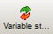
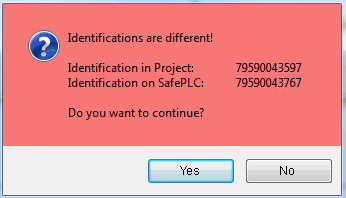
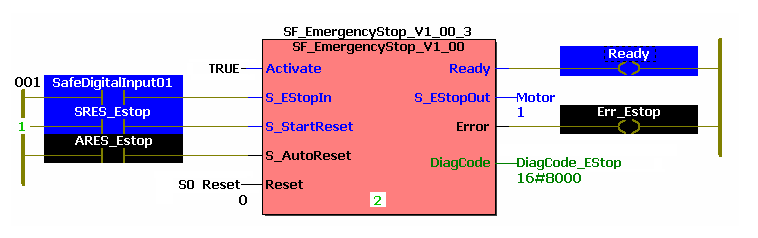
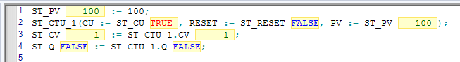

# Monitoring: Displaying the Variable Status

This topic contains information on the following:

* [What is the variable status?](DisplayVariableStatus.html#DisplayVariableStatus__WhatIsVariableStatus)
* [Switching worksheets between variable status and offline mode](DisplayVariableStatus.html#DisplayVariableStatus__SwitchOnlineOffline)
* [Behavior in case of instantiated FB POUs](DisplayVariableStatus.html#DisplayVariableStatus__InCaseOfInstantiatedPOUs)
* [Worksheet layout in variable status (online appearance)](DisplayVariableStatus.html#DisplayVariableStatus__VarStatus_OnlineLayout)

After having [downloaded the project](downloadingaproject.html#downloadingaproject) to the Safety Logic Controller, followed by the automatic transition to RUN [Safe] state, you must perform a function test to ensure that the Safety Logic Controller is working correctly and, therefore, that the safety logic and all the cabling are working correctly as well.

A proper functional testing of the safety-related application is mandatory and must not be omitted.

| WARNING | |
| --- | --- |
|  | **NON-CONFORMANCE TO SAFETY FUNCTION REQUIREMENTS**  Be sure that the functional testing you perform entirely corresponds to your risk analysis and consider each possible operating mode and scenario the safety-related application should cover.  **Failure to follow these instructions can result in death, serious injury, or equipment damage.** |

When testing and commissioning the system, unintentional system states or incorrect responses must be anticipated.

| WARNING | |
| --- | --- |
|  | **UNINTENDED EQUIPMENT OPERATION**   * Make certain that the functional testing cannot result in hazardous situations for persons or material. * Make certain that requesting the safety function during the functional testing cannot result in hazardous situations for persons or material. * Do not enter the zone of operation while the machine is operating. * Ensure that no other persons can access the zone of operation while the machine is operating. * Observe the regulations given by relevant sector standards while the machine is running in any other operating mode than "operational". * Use appropriate safety interlocks where personnel and/or equipment hazards exist.   **Failure to follow these instructions can result in death, serious injury, or equipment damage.** |

To support you in functional testing, Machine Expert – Safety enables you to open code/variables worksheets in online mode and display the variable status. Additionally, you can use the [watch window](watchwindow.html#watchwindow) for collecting variables from different worksheets and displaying their online values.

## What is the variable status?

Displaying the variable status means that the variables values are cyclically read from the Safety Logic Controller and displayed in the worksheets as they are stored in the I/O image at the end of an execution cycle. Basically, the variable status corresponds to online monitoring of worksheets.

Variable status is possible while the Safety Logic Controller is running in **safe mode** and in **debug mode** (in debug mode, additionally debug commands can be executed).

If you detect any programming errors in any worksheet, terminate the variable status display (go offline) and correct the worksheets. Then compile the modified project, download, and start it up as usual.

## Switching worksheets between variable status and offline mode

Click the 'Variable status' icon on the toolbar or press <F10>:

When establishing the communication connection, the system verifies whether the safety-related project was previously connected to the same or a different Safety Logic Controller. This is done by comparing the identification numbers of the controller to be connected now and of the controller connected last. If this comparison results in different Safety Logic Controller identification numbers, a dialog informs you that the Safety Logic Controller has been replaced since the last connection.

* Clicking 'Yes' in this dialog connects the Safety Logic Controller and stores its identification number for the next comparison.
* Clicking 'No' cancels the connection attempt and opens a dialog asking you to verify some settings as well as the Safety Logic Controller configuration.

Example

After confirming the project identifications (if applicable), all open worksheets are switched automatically to online mode. If you open a new code worksheet from the project tree or a variables worksheet by pressing the 'Toggle WS' icon, this is also called in online mode. In online mode, the 'Variable status' icon appears pressed.

Alternatively, you can select 'Variable status' from the context menu of an already opened worksheet, or select 'Open instance' from the context menu of a POU in the project tree or from the context menu of an already opened worksheet.

## Behavior in case of instantiated FB POUs

If open function block code worksheets are instantiated several times and you want to display the variable status for these worksheets, a message appears indicating that you have to use the 'Open instance' menu item to call these worksheets in online mode.

In this case, choose 'Open instance' from the context menu of the worksheet and then select the desired FB instance in the 'Open Instance' dialog. The 'Open Instance' dialog also appears if the variable status is switched on and you try to open a code worksheet from the project tree which is instantiated several times.

## Worksheet layout in online mode (variable status)

The following **colors** are used in graphical online worksheets:

| **Color** | **Meaning** | **Used for ...** |
| --- | --- | --- |
| Black | FALSE | Boolean variables (safety-related and standard) |
| Blue | TRUE | Boolean variables (safety-related and standard) |
| Green | Numerical values | Non-Boolean variables (safety-related and standard) |

**FBD/LD online code worksheets:** The execution order of contained functions or function blocks is displayed in the code. The execution order bases on the intermediate IEC 61131 code which is created while compiling. Inside of every function or function block and below every network number, the green execution number is shown. Forced variables are displayed on a pink background in the online worksheet. The context menu of the worksheets in variable status contains menu items which can, for example, be used to call the control dialog or add variables to the watch window.

The online representation of code worksheets can be modified using the ['Online Layout' dialog](dialog_onlinelayout.html#dialog_onlinelayout).

Example for an FBD/LD online worksheet

**ST online code worksheets:** Variable values that can be overwritten are displayed on a yellow background in the online ST worksheet.

Example for an online ST worksheet

**Online variables worksheets:** The additional column 'Online value' is displayed in online mode. The context menu of variables worksheets in online mode contains menu items which are also available in online code worksheets.

EIO0000002147.09