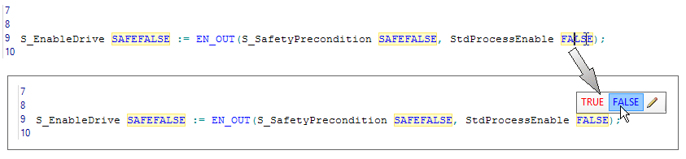

# Debugging: Forcing, Overwriting, Single Cycle Operations

This topic contains information on the following:

* [What is the debug mode?](debuggingtheproject.html#debuggingtheproject__WhatIsDebugMode)
* [Safety notes concerning debug mode](debuggingtheproject.html#debuggingtheproject__SafetyNotesDebugMode)
* [Forcing and overwriting variables](debuggingtheproject.html#debuggingtheproject__forcingandoverwritingvariables)
* [Single cycle operation](debuggingtheproject.html#debuggingtheproject__SingleCycleMode)

## What is the debug mode?

To analyze the behavior of the Safety Logic Controller (i.e., of your safety logic) and as a supplement to the mandatory function test, you can display the [variable status](DisplayVariableStatus.html#DisplayVariableStatus) in Machine Expert – Safety. In this mode, online values are read cyclically from the Safety Logic Controller and displayed in the editor.

In addition to the function test, you can use the debug mode in Machine Expert – Safety while commissioning the application. Instead of, for example, pressing an emergency-stop button, you can force the variable corresponding to the safety-related control device in the FBD/LD editor.

Debug mode provides the possibility of

* opening worksheets in [variable status](DisplayVariableStatus.html#DisplayVariableStatus) in order to display online values.
* [overwriting](debuggingtheproject.html#debuggingtheproject__forcingandoverwritingvariables) local variables and global symbolic variables.
* [forcing](debuggingtheproject.html#debuggingtheproject__forcingandoverwritingvariables) global I/O variables (process data items).
* using the [single cycle operation](debuggingtheproject.html#debuggingtheproject__SingleCycleMode) for executing the application program cycle by cycle.

Debug mode and forcing I/Os is also possible in the [EASYSIM Controller Simulation](Simulation.html#Simulation).

**NOTE:**

Switching the Safety Logic Controller into debug mode is only possible after [entering the correct Safety Logic Controller password](PasswordProtection.html#PasswordProtection).

## Safety-related Program Execution

Debug mode is considered as non-safety-related because you can influence the execution of the program by forcing/overwriting variables.

| WARNING | |
| --- | --- |
|  | **UNINTENDED EQUIPMENT OPERATION**   * Prior to switching to debug mode, make certain that suitable organizational measures (according to applicable sector standards) have been taken to avoid hazardous situations if the safety logic application operates in an unintended or incorrect way, or an incorrect target for debugging was selected. * Verify the impact of forcing or overwriting variables or using the single cycle operation. * Do not enter the zone of operation while the machine is operating. * Ensure that no other persons can access the zone of operation while the machine is operating. * Observe the regulations given by relevant sector standards while the machine is running in any other operating mode than "operational". * Use appropriate safety interlocks where personnel and/or equipment hazards exist.   **Failure to follow these instructions can result in death, serious injury, or equipment damage.** |

**NOTE:**

The test of the safety-related application in debug mode must not replace the proper function test using safety-related I/O devices/sensors/actuators under any circumstances. The test in debug mode may only be performed in addition to the standard function test.

## Forcing and overwriting variables in debug mode

Forcing and overwriting means assigning a new value to a variable. Both operations are only possible while the debug mode is active. What is the difference between forcing and overwriting?

* **Overwriting** is possible for variables without assigned process data item (i.e., symbolic variables but not I/O variables).

  The value is overwritten (set) only once at the beginning of the task execution cycle. Then, the variable is processed normally. Thus, the new value of the variable remains until a write access is performed. A write access can be performed by a programmed store operation or by initializing the variable in case of a Safety Logic Controller cold start.
* **Forcing** is only possible for variables connected to process data items, i.e., I/O variables (physical inputs and outputs).

  Forcing means setting the I/O variable to the force value, regardless of the logic of the I/O image, until forcing is reset by the user.

Timing sequence in the Safety Logic Controller cycle when forcing variables

Generally, forcing is performed once per cycle. The point of time, however, at which a variable is forced differs depending on the variable type:

* Inputs are forced at the beginning of a cycle before processing the input variable. This way, the Safety Logic Controller application uses the forced value.
* Outputs are forced at the end of a cycle. The variable value processed by the application is finally replaced by the forced value in the output image.

  **NOTE:**

  Machine Expert – Safety allows reading of output variables. When forcing an output variable and this output variable is read during the Safety Logic Controller cycle, reading is done before forcing. In this case, the present value calculated by the application is read and further processed but not the force value.

  As the force value is written at the end of the cycle, the displayed online value may differ from the forced value until the I/O image is updated and the variable status is read and displayed.

How to force/overwrite variables

1. Click the 'SafePLC' icon on the toolbar.

   The ['SafePLC' control dialog](dialogSafePLC.html#dialogSafePLC) appears.
2. Not yet logged-on to the Safety Logic Controller?

   If you are not yet logged-on to the Safety Logic Controller, the button for switching to debug mode is inactive in the control dialog. For logging on, select 'Online > SafePLC Log On' and enter the Safety Logic Controller password.

   Refer to the topic ["Password protection"](PasswordProtection.html#PasswordProtection) for further information.
3. In the control dialog, click the 'Debug' button to switch the Safety Logic Controller to debug mode.

   Observe the appearing message and confirm the dialog **within 30 seconds**.
4. Open the worksheet to be debugged in [variable status](DisplayVariableStatus.html#DisplayVariableStatus) by clicking the 'Variable status' icon on the toolbar or pressing <F10>:

   
5. In FBD/LD code or variables worksheets:

   Right-click on a variable to be forced/overwritten and select 'Debug dialog...' from the context menu, or double-click on the variable. The ['Debug' dialog](dialog_debug_resource_name.html#dialog_debug_resource_name) appears.

   In ST code worksheets:

   Double-click on an online variable value (not the name) that is displayed with a yellow background in order to overwrite it. The edit field and the button for overwriting the variable appear.

   Example

   
6. In FBD/LD code or variables worksheets:

   In the 'Debug' dialog, enter the desired value for a non-Boolean variable or select TRUE or FALSE for a Boolean variable.

   In ST code worksheets:

   In the edit field, enter the desired value for a non-Boolean variable or select TRUE or FALSE for a Boolean variable.

   **NOTE:**

   Enter force/overwrite values for safety-related variables with preceding data type in the following format: SAFEINT#*value*, SAFEBYTE#*value*, SAFEWORD#*value*, SAFEDWORD#*value*, or SAFETIME#*value*s.

   (*value* represents the proper value, e.g., SAFEINT#13 or SAFETIME#1s.)

   To force a safety-related Boolean value to FALSE, you can either enter SAFEBOOL#0 or SAFEFALSE. Use accordingly SAFEBOOL#1 or SAFETRUE to force a safety-related Boolean variable to TRUE.
7. In FBD/LD code or variables worksheets:

   * Click 'Overwrite' to overwrite in case of a symbolic variable (not an I/O variable).
   * Click 'Force' to force an I/O variable.

     Forced variables are shown on a pink background in online code worksheets and in the global variables worksheet in online mode.

   In ST code worksheets, forcing is not possible because I/O variables cannot be processed in ST POUs.

   Click the  button to overwrite the symbolic variable.

How to unforce variables

1. Select 'Debug dialog...' from the context menu of the variable (in variable status).

   The ['Debug' dialog](dialog_debug_resource_name.html#dialog_debug_resource_name) appears.
2. In the dialog, you can reset one specific forced variable or all forced variables.

   * 'Reset force' unforces the selected variable.
   * 'Reset force list' unforces all forced variables.

## Single cycle operation

**NOTE:**

Machine Expert – Safety displays a simulation while single cycle operation is activated. No outputs are set on the Safety Logic Controller.

|  |  |
| --- | --- |
| In debug mode, Machine Expert – Safety provides an additional debug function referred to as single cycle operation. In single cycle operation, the Safety Logic Controller interrupts the continuous cyclic processing.  To activate this mode, press the 'Halt' button in the ['SafePLC' dialog](dialogSafePLC.html#dialogSafePLC). The [Safety Logic Controller state](possibleSafePLCstates.html#possibleSafePLCstates) switches to HALT [Debug].  * By clicking the 'Single cycle' button, exactly one cycle is processed. After this, the Safety Logic Controller waits for the next command. * By clicking the 'Continue' button, the Safety Logic Controller continues normal cyclic processing.  Refer to the topic ["'SafePLC' Dialog"](dialogSafePLC.html#dialogSafePLC) for details on the buttons available in the dialog. |  |

EIO0000002147.09