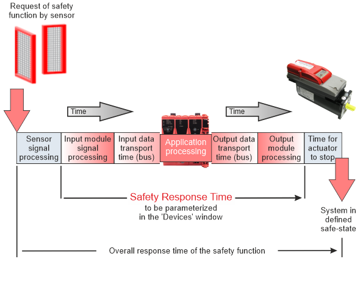

# Safety Response Time for SLCv1

**NOTE:**

This topic applies to devices of the system generation SLCv1. For an SLCv2 system, refer to the chapter ["Safety Response Time for SLCv2"](SLCv2_wp100881.html#SLCv2_wp100881).

This topic contains information on the following:

* [General information on the safety response time](wp100881.html#wp100881__SRT_GeneralInformation)
* [Technical background information](wp100881.html#wp100881__SRT_TechBackground)
* [General steps: from parameter determination to response time calculation](wp100881.html#wp100881__SRT_GeneralSteps)
* ["How to" step-by-step procedures](wp100881.html#wp100881__SRT_HowTo)

## General information on the safety response time

The safety response time is the time between the arrival of the sensor signal on the safety-related input module and the output of the request signal for the defined safe-state at the safety-related output module. Based on the calculated safety response time, the safety-related equipment must be planned and installed. For example, the safety response time delivers the required minimum distance of a safety-related sensor (such as a light beam) from the protected zone of operation.

The following figure illustrates the influences on the safety response time:

The safety response time (SRT) is calculated as follows:

`SRT = processing time in safety-related input module`

`(incl. configured filter/delay times),`

`+ input transport time (bus transfer input module -> SLC)`

`+ application processing time in the SLC`

`+ output transport time (bus transfer SLC -> output module)`

`+ processing time in safety-related output module`

`(incl. configured delay times),`

As shown in the figure, the **overall response time of the safety function**, i.e., the time period that elapses from the occurrence of the safety function requesting event until the machine/plant is in the defined safe-state, **additionally** comprises the signal processing time of the safety-related sensor as well as the time for the actuator to stop.

**NOTE:**

The safety response time (SRT) as calculated in Machine Expert – Safety is part of the **overall response time of the safety function**.

Machine Expert – Safety facilitates the SRT calculation by providing calculator dialogs for...

* determining the necessary response time-relevant parameters MinDataTransportTime, MaxDataTransportTime and CommunicationWatchdog (dialog 'Response Time Relevant Parameters').

  These parameters are additionally used for communication monitoring.
* calculating the resulting safety response time based on these relevant parameters values entered in the Machine Expert – Safety 'Devices' window.

  The 'Response Time Calculator' dialog outputs a time value for each input-output signal path.

  Use these results for determining the physical positions of your safety equipment.

## Technical background information

As visible in the formula and figure above, two aspects are decisive for the response time: signal processing times and data transport times.

The **signal processing time** in safety-related input and output modules depends on the individual modules and their set parameters (such as filter settings, etc.).

Signal processing time of input and output modules

For calculating the safety response time, the signal processing time in the safety-related input and output modules must be considered (added) as described in this section.

It is not necessary to enter the values listed here in Machine Expert – Safety. When selecting an input module, an available channel, and an output channel in the response time calculator, the system automatically uses the relevant values for calculating the safety response time.

**Safety-related digital input modules**

For the signal processing in safety-related digital input modules, the following values apply:

* The filter value of the switch-off filter
* 5000 µs when configuring the external clock signals ('PulseMode' = 'External')

**Safety-related analog input modules, temperature, and counter input modules**

For these safety-related input modules, the signal processing time depends on the time value set for the 'InputFilter' parameter which defines the update interval of the input module. The following tables list the signal processing time of the modules resulting from the set 'InputFilter' value.

* TM5SAI4AFS (SLCv1) analog input module:

  | Configured filter value | Maximum signal processing time of the module |
  | --- | --- |
  | 1 ms | 17 ms |
  | 2 ms | 19 ms |
  | 10 ms | 35 ms |
  | 16.7 ms | 50 ms |
  | 20 ms | 55 ms |
  | 33.3 ms | 82 ms |
  | 40 ms | 95 ms |
  | 66.7 ms | 122 ms |
* TM5STI4ATCFS (SLCv1) temperature input module:

  | Configured filter value | Maximum signal processing time of the module |
  | --- | --- |
  | 1 ms | 32 ms |
  | 2 ms | 40 ms |
  | 10 ms | 86 ms |
  | 16.7 ms | 132 ms |
  | 20 ms | 152 ms |
  | 33.3 ms | 240 ms |
  | 40 ms | 284 ms |
  | 66.7 ms | 372 ms |

Safety-related Digital Counter Input Module TM5SDC1FS (SLCv1)

With the safety-related digital counter module TM5SDC1FS, the signal processing time depends on the value set for the 'Timebase' parameter. The following table lists the signal processing time of the module resulting from the set 'Timebase' parameter and its corresponding I/O update time value.

| Configured 'Timebase' value | I/O update time | Time + I/O update time  Modes A-A and A-B | Time + I/O update time  Mode A-A/-B-B/ |
| --- | --- | --- | --- |
| 10 ms | 2 ms | 12 ms | 22 ms |
| 50 ms | 2 ms | 52 ms | 102 ms |
| 100 ms | 2 ms | 102 ms | 202 ms |
| 500 ms | 5 ms | 505 ms | 1005 ms |
| 1 s | 10 ms | 1010 ms | 2010 ms |
| 5 s | 50 ms | 5050 ms | 10050 ms |
| 10 s | 100 ms | 10.1 s | 20.1 s |
| 50 s | 500 ms | 50.5 s | 100.5 s |
| 100 s | 1 s | 101 s | 201 s |

Safety-related output modules, mixed modules, and drives

The duration for signal processing in safety-related output modules is:

* TM5SDOxxxx (SLCv1) : 800 µs
* TM5SDM4DTRFS (SLCv1): maximum 51 ms
* TM7SDM12DTFS (SLCv1): maximum 1 ms
* ILM62FS and LXM62FS (SLCv1): maximum 2 ms

**NOTE:**

The displayed resulting safety response time depends on the firmware version installed on the safety-related device involved.

If a device in the selected input/output signal path does not have the latest firmware installed (as defined in the Release Notes for the SLCV1 or SLCv2 system), the values shown in the 'Response Time Calculator' dialog may differ from the actual physical behavior.

To help ensure a correct display and thus consistency, ensure that the firmware version specified in the release notes is installed in the devices. If necessary, perform a firmware update for the affected devices.

**NOTE:**

Verify that the signal processing time of each safety-related input and output module is included in the safety response time calculations.

The **transport time** is the time that is needed to transfer data from a data producer to a consumer. The input transport time relates to the data transfer from a safety-related input module to the Safety Logic Controller (via TM5 and SERCOS III bus). Accordingly, the output transport time is the time for transferring data from the Safety Logic Controller to a safety-related output module (via SERCOS III and TM5 bus). The transport time from an input to the Safety Logic Controller (or output) is the sum of the cycle times or CPU copy times in the transfer line.

Lexium Motion Controller (standard (non-safety-related) controller) settings are also important ...

The timing on the bus also depends on Lexium Motion Controller (standard (non-safety-related) controller) parameter settings. However, these parameters are not safety-related because their values can be modified in or by the standard application.

The safety-related components located in this network segment might be shut off by the Safety Logic Controller

* if modified Lexium Motion Controller parameters result in modified bus transport times,
* or if EMC disturbances cause data loss

that result in Machine Expert – Safety parameters exceeding the value range defined in the 'SafetyResponseTime' parameter group.

| WARNING | |
| --- | --- |
|  | **UNINTENDED EQUIPMENT OPERATION**   * Perform an appropriate risk analysis with regard to the impact of a possible device power off by the Safety Logic Controller. * Include in the validation of the safety-related architecture the impact of the device power off and thoroughly test the application.   **Failure to follow these instructions can result in death, serious injury, or equipment damage.** |

**Safety-related data communication**: According to the openSAFETY specification, devices (safety-related I/O modules as well as the Safety Logic Controller) communicate by sending and receiving cyclic data, referred to as openSAFETY telegrams. A telegram generating (sending) device is designated as producer, a receiving device is a consumer.

**Monitoring of the safety-related data communication**: Transport times of openSAFETY telegrams between producers and consumers are monitored in order to verify safety-related communication. For verification, the parameters MinDataTransportTime, MaxDataTransportTime, and CommunicationWatchdog are used. These parameters are defined in the Device Parameterization editor for the modules involved. They also are the basis for calculating the safety response time.

MinDataTransportTime and MaxDataTransportTime parameters

MaxDataTransportTime specifies the **maximum** and MinDataTransportTime the **minimum** needed transport time on the bus, as described above. For each module, one MaxDataTransportTime and one MinDataTransportTime parameter is available. If desired, a module can use the common default MaxDataTransportTime/MinDataTransportTime value (if 'Manual Configuration = No') instead of the values of the module.

Each openSAFETY data telegram includes a time stamp for time validation of the communication. On receipt of a telegram, the consumer compares this time stamp with the present time. If the schedule is kept, the communication is considered as valid.

If a telegram is delayed or received earlier than defined, communication is considered as invalid and is not processed further. As a result, the module is set to the defined safe-state. The 'SafeModuleOK' process data item also becomes SAFEFALSE. The implications for the rest of the safety-related systems depend on the defined safety-related function.

CommunicationWatchdog parameter

Machine Expert – Safety provides a communication watchdog which is used to calculate the safety response time.

The CommunicationWatchdog value sets this watchdog, which is then used to monitor whether a consumer receives telegrams from a producer in time. If the watchdog expires, communication is considered as invalid. The CommunicationWatchdog parameter thus defines the maximum time period within which a consumer must receive a valid data telegram from a producer in order to consider the safety-related communication as valid and continue the application.

There is one CommunicationWatchdog parameter for each module. If desired, a module can use the common default CommunicationWatchdog value (if 'Manual Configuration = No') instead of the value of the module.

The calculated parameter value depends on the MaxDataTransportTime parameter value.

Based on the CommunicationWatchdog parameter value, Machine Expert – Safety calculates the safety response time.

If the consumer gets the telegram **in time** (communication watchdog is not yet expired **and** the transmission time is within the period specified by the parameters MinDataTransportTime and MaxDataTransportTime), the watchdog timer is restarted and communication is considered as valid. The time stamp contained in the received telegram is not evaluated, only the receipt of the telegram is relevant.

If no telegram is received (due to delay or loss) and the **communication watchdog expires** in the consumer, communication is considered as invalid. As a result, the module is set to the defined safe-state. The 'SafeModuleOK' process data item also becomes SAFEFALSE indicating that the safety-related communication of the module is no longer valid. The implications for the rest of the safety-related systems depend on the defined safety-related function.

## General steps: from parameter determination to safety response time calculation

The following is the general procedure for determining the safety response time of your system. For detailed step-by-step descriptions and background information refer to the "How to..." sections below.

1. Calculate the values for the parameters CommunicationWatchdog, MinDataTransportTime, and MaxDataTransportTime.

   Use the calculator 'Response Time Relevant Parameters' (to be opened via the 'Project' menu) as described in the next section. Observe the different dialog tabs for manual and default parameters.

   **NOTE:**

   If you set the MaxDataTransportTime and CommunicationWatchdog parameters to significantly greater values than proposed by the calculator (for example, 6500 ms), this can result in an unstable system because these parameter influence the timeouts and restart timing of the safety-related system. In this case, the ModuleOK status for some safety-related modules is not reached or is unstable.

   Use the values calculated by the 'Response Time Calculator'.

   Do not increase the parameters by more than factor two.

   **NOTE:**

   If the MaxDataTransportTime parameter is set to a value that is too small, the Safety Logic Controller does not change its status to RUN.

   Workaround: Use the value from the 'Response Time Calculator'. If this value does not work, increase the MaxDataTransportTime/CommunicationWatchdog parameters in small steps up to a maximum of two times the calculated value.

   **NOTE:**

   If you set the MinDataTransportTime parameter to a value less than the value calculated by the 'Response Time Calculator', a build error message may be displayed. The MinDataTransportTime parameter must be set to the calculated value.
2. For each safety-related module: Enter the calculated values in the parameter group 'SafetyResponseTime' in the 'Devices' window. Observe the possibility of using manual or default parameter values for the modules involved.
3. Use the 'Response Time Calculator' dialog ('Project > Response time calculator' menu item) to calculate the safety response time for each selected input module, the available channels, and the output module.
4. Use the results for projecting your safety function.

## How to...

How to determine and use the parameters CommunicationWatchdog, MinDataTransportTime and MaxDataTransportTime

1. Select 'Project > Response Time Relevant Parameters'.
2. In the appearing dialog box, open either the 'Default' tab if you want to use one common CommunicationWatchdog, MinDataTransportTime, and MaxDataTransportTime value for the modules involved.

   If individual parameter values are required for each module, open the 'Manual' tab.
3. You can adjust the system tolerance by specifying the number of allowed telegram losses. This increases the calculated minimum watchdog interval and therefore the availability of the system. Enter an Integer value (range 0..99) to specify the number of telegrams that may be lost without generating an exception.

   An entered 'Network Package Loss' does not influence the MinDataTransportTime and MaxDataTransportTime but only the CommunicationWatchdog value.
4. Section 'Variable Parameters':

   If a differing Sercos III cycle time is used for calculating the parameters than the cycle time set in Machine Expert (e.g., to take cycle time modifications by the application program into account), select 'Make Selectable' and select or enter the desired 'Sercos III Cycle Time'.

   'Ring/Double Line' checkbox: Ring and double line bus structures require higher parameter values in order to implement a stable running system. Select 'Ring/Double Line' to take into account the bus structure.

   The 'Ring/Double Line' checkbox only influences the MaxDataTransportTime value. It does not influence the MinDataTransportTime value.

   The checkbox is activated by default. This is suitable for a ring bus structure and a double line bus structure. If you are implementing a line structure, the checkbox can be deselected to decrease the resulting parameter value. Values calculated for a ring/double line structure can be used for a line structure but not vice versa.

   The 'System Parameters' section is read-only and displays system/module properties set in Machine Expert. When modifying these parameters while the dialog is open, the values are updated automatically without closing the calculator dialog.
5. The calculated CommunicationWatchdog, MinDataTransportTime and MaxDataTransportTime value(s) are shown.

   Note the resulting value(s) and enter each value in the respective parameter grid:

   * If you want to use one common CommunicationWatchdog, MinDataTransportTime, and MaxDataTransportTime value for the modules involved, fill in the 'Safety Response Time Defaults' group that belongs to the Safety Logic Controller parameters. Additionally, the 'Manual Configuration' parameter must be set to 'No' for each module which is to use (inherit) these default values from the SLC.
   * If individual parameter values are required for each module, enter the values in the 'Safety Response Time' group of each involved module. Additionally set 'Manual Configuration = Yes' for each module that is to use its own individual values.

How to calculate the safety response time in Machine Expert – Safety

1. Make sure that safety response time-relevant parameters for the modules involved are specified in the 'Devices' window. These parameters are:

   * ManualConfiguration
   * MinDataTransportTime
   * MaxDataTransportTime
   * CommunicationWatchdog
2. In Machine Expert – Safety, select the 'Project > Response Time Calculator' menu item.

   The 'Result' section at the bottom shows the overall worst case response time for the user-defined functional safety system.

   You can now calculate the safety response time for individual input-output signal paths (input module, the available channel, and the output module) as follows:
3. Select the input module for which the response time is to be calculated, and, if applicable, for the selected module, an input channel.

   The response time-relevant parameters set for the selected input module/channel are now shown in the area below. Initially, the parameter values are set to zero if no output module is selected.
4. In the right list box, select the output 'Module' for which the response time is to be calculated.

   The dialog automatically shows the calculated response time(s).

   Note that the safety-related parameter values used to determine the safety response time are only shown if an input module, an available channel, and an output module are selected.

**NOTE:**

If 'Manual Configuration = No' is set for modules, their response times only differ due to module-specific processing times as they use the same common MinDataTransportTime, MaxDataTransportTime, or CommunicationWatchdog value.

**NOTE:**

For input/mixed modules, the displayed resulting safety response time depends on the firmware version installed on the device involved.

If a device in the selected safety-related input/output signal path does not have the latest firmware installed, the 'Response Time Calculator' dialog shows the calculated response time values for the current and the latest firmware version. Perform a firmware update for the devices concerned in such a case.

| WARNING | |
| --- | --- |
|  | **UNINTENDED MACHINE OPERATION**   * Verify that the signal processing time within the sensor is included in the calculations of the overall response time of the safety function. * Verify that the time required by the actuator to come to a standstill is included in the calculations of the overall response time of the safety function. * Validate the overall safety-related function with regard to the resulting overall response time of the safety function and thoroughly test the application.   **Failure to follow these instructions can result in death, serious injury, or equipment damage.** |

EIO0000002147.09