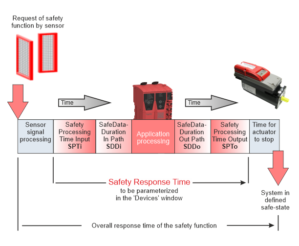

# Safety Response Time for SLCv2

**NOTE:**

This topic applies to devices of the system generation SLCv2. For an SLCv1 system, refer to the chapter ["Safety Response Time for SLCv1"](wp100881.html#wp100881).

This topic contains information on the following:

* [General information on the safety response time](SLCv2_wp100881.html#SLCv2_wp100881__SRT_slcv2_GeneralInformation)
* [Technical background information](SLCv2_wp100881.html#SLCv2_wp100881__SRT_slcv2_TechBackground)
* [General steps: from parameter determination to response time calculation](SLCv2_wp100881.html#SLCv2_wp100881__SRT_slcv2_GeneralSteps)
* [Displaying and verifying the safety response time in Machine Expert – Safety](SLCv2_wp100881.html#SLCv2_wp100881__SRT_slcv2_DisplaySRT)

## General information on the safety response time

The safety response time is the time between the arrival of the sensor signal on the safety-related input module and the output of the request signal for the defined safe-state at the safety-related output module. Based on the calculated safety response time, the safety-related equipment must be planned and installed. For example, the safety response time delivers the required minimum distance of a safety-related sensor (such as a light beam) from the protected zone of operation.

The following figure illustrates the influences on the safety response time:

The safety response time (SRT) is composed by the following partial time values:

`SRT = safety processing time in safety-related input module (SPTi)`

`+ SafeDataDuration time input path (SDDi) * (ToleratedPacketLoss + 1)`

`+ SafeDataDuration time output path (SDDo) * (ToleratedPacketLoss + 1)`

`+ safety processing time in safety-related output module (SPTo)`

In short, the calculation of the SRT is as follows:

`SRT = SPTi + SDDi * (TPL +1) + SDDo * (TPL +1) + SPTo`

With `SPT = higher value of SPTi and SPTo` and `SDD = SDDi = SDDo` (symetrical system), the following applies:

`SRT = 2 * SPT + 2* SDD * (TPL+1)`

As shown in the figure, the **overall response time of the safety function**, i.e., the time period that elapses from the occurrence of the safety function requesting event until the machine/plant is in the defined safe-state, **additionally** comprises the signal processing time of the safety-related sensor as well as the time for the actuator to stop.

**NOTE:**

The safety response time (SRT) as calculated in Machine Expert – Safety is part of the **overall response time of the safety function**.

The parameters SafeDataDuration (SDD) and ToleratedPacketLoss (TPL) must be specified for the SLC and each safety-related module involved in the Machine Expert – Safety 'Devices' window.

According to the above formula for a symmetrical system, SDD is calculated as follows:

`SDD = (SRT - 2*SPT) / (2*(TPL+1))`

For verification purposes, the 'Response Time Calculator' dialog is provided in the 'Project' menu. This dialog outputs the SRT for each input-output signal path.

## Technical background information

The **signal processing time** in safety-related input and output modules (SPTi and SPTo) depends on the individual modules and their set parameters (such as filter settings, etc.).

Signal processing time of input and output modules

For determining the SafeDataDuration parameter (and calculating the safety response time), the signal processing time in the safety-related input and output modules must be considered (added) as described in this section.

It is not necessary to enter the values listed here in Machine Expert – Safety. When selecting an input module, an available channel, and an output channel in the response time calculator, the system automatically uses the relevant values for calculating the safety response time.

**Safety-related digital input modules**

For the signal processing in safety-related digital input modules, the following values apply:

* The filter value of the switch-off filter
* 5000 µs when configuring the external clock signals ('PulseMode' = 'External')

**Safety-related analog input modules, temperature, and counter input modules**

For these safety-related input modules, the signal processing time depends on the time value set for the 'InputFilter' parameter which defines the update interval of the input module. The following tables list the signal processing time of the modules resulting from the set 'InputFilter' value.

* TM5SAI4AFS (SLCv2) analog input module:

  | Configured filter value | Maximum signal processing time of the module |
  | --- | --- |
  | 1 ms | 17 ms |
  | 2 ms | 19 ms |
  | 10 ms | 35 ms |
  | 16.7 ms | 50 ms |
  | 20 ms | 55 ms |
  | 33.3 ms | 82 ms |
  | 40 ms | 95 ms |
  | 66.7 ms | 122 ms |
* TM5STI4ATCFS (SLCv2) temperature input module:

  | Configured filter value | Maximum signal processing time of the module |
  | --- | --- |
  | 1 ms | 32 ms |
  | 2 ms | 40 ms |
  | 10 ms | 86 ms |
  | 16.7 ms | 132 ms |
  | 20 ms | 152 ms |
  | 33.3 ms | 240 ms |
  | 40 ms | 284 ms |
  | 66.7 ms | 372 ms |

Safety-related Digital Counter Input Module TM5SDC1FS (SLCv2)

With the safety-related digital counter module TM5SDC1FS, the signal processing time depends on the value set for the 'Timebase' parameter. The following table lists the signal processing time of the module resulting from the set 'Timebase' parameter and its corresponding I/O update time value.

| Configured 'Timebase' value | I/O update time | Time + I/O update time  Modes A-A and A-B | Time + I/O update time  Mode A-A/-B-B/ |
| --- | --- | --- | --- |
| 10 ms | 2 ms | 12 ms | 22 ms |
| 50 ms | 2 ms | 52 ms | 102 ms |
| 100 ms | 2 ms | 102 ms | 202 ms |
| 500 ms | 5 ms | 505 ms | 1005 ms |
| 1 s | 10 ms | 1010 ms | 2010 ms |
| 5 s | 50 ms | 5050 ms | 10050 ms |
| 10 s | 100 ms | 10100 ms | 20.1 s |
| 50 s | 500 ms | 50500 ms | 100.5 s |
| 100 s | 1 s | 101 s | 201 s |
| 20 ms | 2 ms | 22 ms | 42 ms |
| 200 ms | 2 ms | 202 ms | 402 ms |
| 2 s | 20 ms | 2020 ms | 4020 ms |
| 20 s | 200 ms | 20.2 s | 40.2 s |

Safety-related output modules, mixed modules, and drives

The duration for signal processing in safety-related output modules is:

* TM5SDOxxxx (SLCv2): 800 µs
* TM5SDM4DTRFS (SLCv2): maximum 51 ms
* TM7SDM12DTFS (SLCv2): maximum 1 ms
* ILM62FS and LXM62FS (SLCv2): maximum 2 ms

**NOTE:**

The displayed resulting safety response time depends on the firmware version installed on the safety-related device involved.

If a device in the selected input/output signal path does not have the latest firmware installed (as defined in the Release Notes for the SLCV1 or SLCv2 system), the values shown in the 'Response Time Calculator' dialog may differ from the actual physical behavior.

To help ensure a correct display and thus consistency, ensure that the firmware version specified in the release notes is installed in the devices. If necessary, perform a firmware update for the affected devices.

The **transport time** is the time that is needed to transfer data from a data producer to a consumer. The input transport time (SDDi) relates to the data transfer from a safety-related input module to the Safety Logic Controller via TM5 (except for AS-i Gateway and Drive Safety Module (DSM)) and SERCOS III bus. Accordingly, the output transport time (SDDo) is the time for transferring data from the Safety Logic Controller to a safety-related output module via SERCOS III and TM5 bus (except for AS-i Gateway and DSM).

| WARNING | |
| --- | --- |
|  | **UNINTENDED EQUIPMENT OPERATION**   * Perform an appropriate risk analysis with regard to the impact of a possible device power off by the Safety Logic Controller. * Include in the validation of the safety-related architecture the impact of the device power off and thoroughly test the application.   **Failure to follow these instructions can result in death, serious injury, or equipment damage.** |

**Safety-related data communication**: According to the openSAFETY specification, devices (safety-related I/O modules and drives as well as the Safety Logic Controller) communicate by sending and receiving cyclic data, referred to as openSAFETY telegrams. A telegram generating (sending) device is designated as producer, a receiving device is a consumer.

**Monitoring of the safety-related data communication**: Transport times of openSAFETY telegrams between producers and consumers are monitored in order to verify safety-related communication. For verification, the internal parameters calculated on the basis of SafeDataDuration and ToleratedPacketLoss are used. These parameters are defined in the Device Parameterization editor for the modules involved. They also are the basis for calculating the safety response time.

Parameter: SafeDataDuration (SDD)

This parameter specifies the **maximum** permissible time for data transmission from a safety-related producer to a consumer, that is, from an input module to the SLC, or from the SLC to an output module.

Based on this parameter value and the value of the 'ToleratedPacketLoss' parameter (described below), the Safety Response Time (SRT) of the system is calculated.

ToleratedPacketLoss parameter (TPL)

This parameter specifies the maximum allowed number of lost packets during data transmission. The number of tolerated packet losses affects the safety response time.

Based on this parameter value and the value of the 'SafeDataDuration' parameter, the Safety Response Time (SRT) of the system is calculated.

## General steps: from parameter determination to safety response time calculation

1. Calculate the value for the parameter SafeDataDuration parameter for each input and output path of the functional safety application.

   **Calculation**: `SDD = (SRT - SPTi - SPTo) / (2* (TPL + 1))`

   With `SPT = higher value of SPTi and SPTo` and `SDD = SDDi = SDDo` (symetrical system), SDD is calculated as follows:

   `SDD = (SRT - 2*SPT) / (2*(TPL+1))`

   The risk analysis you have performed for your functional safety application delivers the maximum allowed overall response time for your safety function and, as part of this, the safety function response time (SRT) of the signal chain.

   From the allowed SRT, deduct the processing times of the safety-related input module (Safety Processing Time Input, SPTi) and the output module (Safety Processing Time Output, SPTo).

   The result is the total maximum permissible time for the safety-related data transmission on the complete safety-related path, i.e., from the input module to the output module. As the SafeDataDuration parameter relates to only one transmission path (input module -> SLC or SLC -> output module), you must divide the value by 2 to get the required value to be entered in the parameter grid.

   A tolerated packet loss greater than zero is taken into account in the calculation formula.

   **NOTE:**

   Based on the SDD and TPL values you have specified for the modules involved, Machine Expert – Safety calculates internal system parameters during compilation and verifies them against known physical timing limitations.

   If system limits are reached, a compiler alert is generated, which contains suggestions for optimizing your system (e.g., by reducing filter times or the SLC cycle time or SERCOS, BC cycle times etc.).
2. For each safety-related module: Enter the calculated values in the parameter group 'SafetyResponseTime' in the 'Devices' window.

   Observe the possibility of using individual or default parameter values for the modules involved.

   * If you want to use one common SafeDataDuration and ToleratedPacketLoss value for the modules involved, fill in the 'Safety Response Time Defaults' group that belongs to the Safety Logic Controller parameters. Additionally, the 'Manual Configuration' parameter must be set to 'No' for each module which is to use (inherit) these default values from the SLC.
   * If individual parameter values are required for a module, enter the values in the 'Safety Response Time' group of each involved module. Additionally set 'Manual Configuration = Yes' for each module that is to use its own individual values.
3. Use the 'Response Time Calculator' dialog ('Project > Response time calculator' menu item) to calculate the safety response time for each selected input module, the available input channels, and the output module. Refer to the [following section](SLCv2_wp100881.html#SLCv2_wp100881__SRT_slcv2_DisplaySRT) for details.
4. Use the results for projecting your safety function. Validate each parameter and the resulting safety response time value with regard to your risk analysis.

   Observe the following hazard message.

| WARNING | |
| --- | --- |
|  | **UNINTENDED MACHINE OPERATION**   * Verify, for the SLC and each safety-related device involved in your application, that the values set for the parameters 'SafeDataDuration' and 'ToleratedPacketLoss' correspond to your risk analysis. * Be sure that your risk analysis includes an evaluation for incorrectly setting the values 'SafeDataDuration' and 'ToleratedPacketLoss'. * Verify that the signal processing time within the sensor is included in the calculations of the overall response time of the safety function. * Verify that the time required by the actuator to come to a standstill is included in the calculations of the overall response time of the safety function. * Validate the overall safety-related function with regard to the resulting overall response time of the safety function and thoroughly test the application.   **Failure to follow these instructions can result in death, serious injury, or equipment damage.** |

## Displaying and verifying the safety response time in Machine Expert – Safety

1. Make sure that safety response time-relevant parameters for the modules involved are specified in the 'Devices' window. These parameters are:

   * ManualConfiguration
   * SafeDataDuration
   * ToleratedPacketLoss
2. In Machine Expert – Safety, select the 'Project > Response Time Calculator' menu item.

   The 'Result' section at the bottom shows the overall worst case response time for the user-defined functional safety system.

   You can now display the safety response time for individual input-output signal paths (input module, the available channel, and the output module) as follows:
3. Select the input module for which the response time is to be calculated, and, if applicable, for the selected module, an input channel.

   The response time-relevant parameters set for the selected input module/channel are now shown in the area below. Initially, the parameter values are set to zero if no output module is selected.
4. In the right list box, select the output 'Module' for which the response time is to be calculated.

   The dialog automatically shows the calculated response time(s).

   Note that the safety-related parameter values used to determine the safety response time are only shown if an input module, an available channel, and an output module are selected.

   **NOTE:**

   If 'Manual Configuration = No' is set for modules, their response times only differ due to module-specific processing times as they use the same common SafeDataDuration and ToleratedPacketLoss value specified for the SLC.

EIO0000002147.09