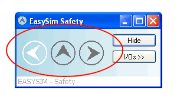
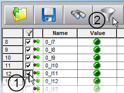
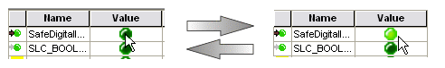
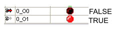
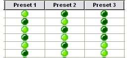
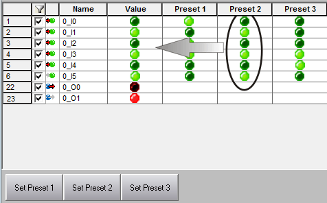

# Using the Simulation

This topic contains information on the following:

* [Starting the project execution (simulation)](SimulationUse.html#SimulationUse__StartSimulationExecution)
* [Context menu of the EASYSIM simulation in the systray](SimulationUse.html#SimulationUse__Simulation_ContextMenu)
* [Configuring EASYSIM for the application in question](SimulationUse.html#SimulationUse__SimuConfig)
* [Saving and loading simulation configurations](SimulationUse.html#SimulationUse__SaveLoadSimu)
* [Setting individual inputs directly](SimulationUse.html#SimulationUse__SimuSetDirect)
* [Using prepared scenarios](SimulationUse.html#SimulationUse__SimuPresetScenarios)

Once you have [started the EASYSIM simulation and loaded the project to the simulation](Simulation.html#Simulation), the  symbol appears in the systray on the right of the Windows taskbar. (Depending on the version, the simulation application may be visible in the Windows taskbar.)

The simulation can remain minimized here during use, provided that you do not want to perform any operations directly in the simulation window. However, if you want to set inputs, or simulate time sequences in the simulation, etc., you will need the EASYSIM user interface which is opened via the EASYSIM context menu.

## Starting the project execution (simulation)

After the project download has been completed, EASYSIM starts to execute the project automatically.

The flashing symbols in the EASYSIM window (circled in red in the graphic below) indicate that the simulation is running:

You can now use monitoring and debug tools of Machine Expert – Safety (in which case EASYSIM runs in the background and can remain minimized) or work directly in the EASYSIM user interface. This allows you to

* [Configure EASYSIM accordingly](SimulationUse.html#SimulationUse__SimuConfig)
* [Set individual inputs](SimulationUse.html#SimulationUse__SimuSetDirect)
* Or use [prepared scenarios](SimulationUse.html#SimulationUse__SimuPresetScenarios)

to analyze the response of the system or safety logic.

You also have the option of [simulating temporal sequences at the inputs](SimulationTimingDiagram.html#SimulationTimingDiagram).

## Context menu of the EASYSIM simulation in the systray

The EASYSIM symbol in the systray provides the following context menu commands:

|  |  |
| --- | --- |
| Open | Opens the EASYSIM window as shown above. |
| Show I/Os | Opens the [EASYSIM inputs and outputs view](SimulationUse.html#SimulationUse__SimuConfig) (also opened by double-clicking on the symbol). |
| Show Expert Mode | Opens the EASYSIM expert mode which enables [time sequences](SimulationTimingDiagram.html#SimulationTimingDiagram) of the application to be simulated. |
| Exit | [Exits](Simulation.html#Simulation) the EASYSIM simulation.  **NOTE:**  If you exit EASYSIM while the 'Simulate' icon is pressed in the programming system, EASYSIM will always restart automatically. |

## Configuring EASYSIM for the application in question

Once you have loaded the project to the simulation, select the 'Show I/Os' menu item from the EASYSIM context menu (in the systray).

A view appears that contains the inputs/outputs available in the simulation, i.e., those global I/O variables that are declared in the global variables worksheet and connected to a process data item.

With the aid of the **filter function** you reduce the number of visible inputs and outputs as follows:

1. Left-click to mark the checkboxes for all the inputs and outputs you need for working with the simulation:

   
2. Click the filter symbol to display only the marked signals.
3. You can save this configuration by clicking on the 'Save' symbol, giving the configuration file a name (\*.sim), and selecting a destination directory.

Clicking on the filter symbol again deactivates the filter setting, thus displaying all the inputs and outputs of the simulated Safety Logic Controller again. The markings in the checkboxes are retained even if you repeatedly switch between a filtered and an unfiltered display.

## Saving and loading simulation configurations

The simulation provides the option of saving and loading every simulation configuration, i.e., visible/hidden inputs/outputs and prepared scenarios (set inputs). To this end, the 'Save' and 'Open' buttons are available in the 'I/Os' view:

A configuration file is saved with the file extension '.sim'.

## Setting individual inputs directly

To set a particular input, left-click on the relevant input in the 'Value' column. The green LED lights up when the input is set to TRUE. Click again to reset the input to FALSE (LED off).

Once you have modified the input, the outputs respond according to the safety logic.

A set output (TRUE) lights up, while the LED for an inactive output (FALSE) will be off:

## Using prepared scenarios

The simulation offers you the option of 'programming' scenarios and applying them at the touch of a button in order to easily implement various system states at the simulation inputs. Three presets are available for this, and you can define the input signal combinations for them in the corresponding columns 'Preset 1', 'Preset 2', and 'Preset 3'.

The settings of the three presets 1 to 3 are also saved in the simulation configuration file (\*.sim).

1. Set the required inputs in the 'Preset 1' to 'Preset 3' columns by left-clicking on the corresponding 'LEDs'. Set inputs (TRUE) light up:

   
2. If required, save the active configuration together with the three preset settings by clicking on 'Save' in the simulation.
3. To apply a particular scenario, i.e., a particular combination of input signals, click on the corresponding button 'Set P1', 'Set P2', or 'Set P3'. The signal values are then transferred from the relevant column, 'Preset 1', 'Preset 2', or 'Preset 3' to the 'Value' column where they are applied. The 'preset 2' combination is activated in the following example:

   

Once you have set the input combination, the outputs respond according to the safety logic.

A set output (TRUE) lights up while the LED for an inactive output (FALSE) is off:

EIO0000002147.09