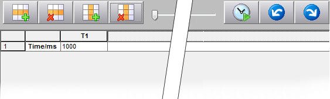
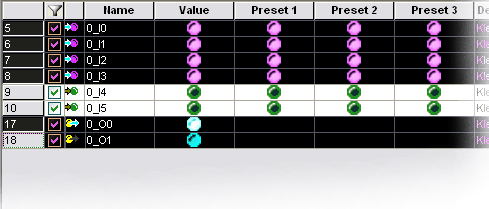
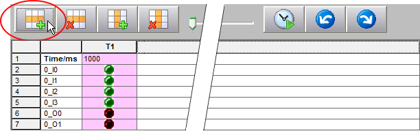
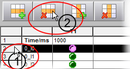
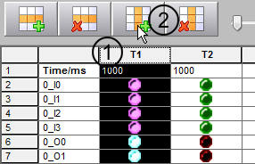
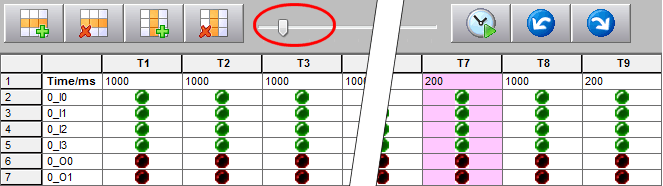
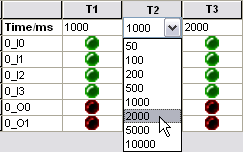
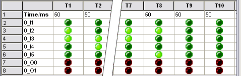
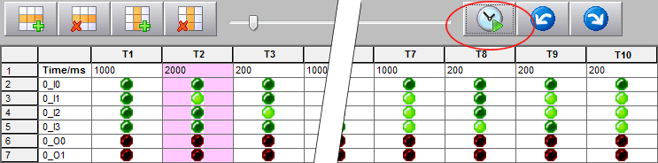
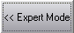

# Simulating Time Sequences in EASYSIM Expert Mode

If the three [scenarios 'P1', 'P2', and 'P3'](SimulationUse.html#SimulationUse__SimuPresetScenarios) are insufficient for simulation purposes, either because three signal combinations are too few or because consecutive sequences which have been defined with specific times are required, you have the option to simulate entire time sequences.

To do this, open the simulation expert mode by clicking on the 'Expert Mode' button:

The command for opening the expert mode is also available in the context menu of the simulation in the systray.

The first time it is opened, the time diagram is empty, i.e., none of the inputs or outputs which need to be taken into account when simulating the time sequence have been inserted.

Time sequences are saved together with the simulation configuration. If you load a configuration in which a time sequence is also saved, this time sequence will be loaded together with the simulation settings.

If no time sequence is included, you must define a new one in the empty expert mode view. To do this, proceed as follows:

1. Insert signals.

   In the top area of the simulation, select the signals to be included in the time-sequence diagram by clicking on their row headers. To select several signals at the same time, hold the <Ctrl> key down and click on the row headers of the required signals one by one.

   **NOTE:**

   The selection in the 'Filter' column  does not affect the transfer of signals to a time sequence in expert mode. This checkbox only serves to show and hide signals by means of the filter function.

   Example

   In this example, input signals 0\_I0 to 0\_I3 and output signals 0\_O0 and 0\_O1 of the (already filtered) signal list are transferred to the time sequence.

   

   Click on the button highlighted below to transfer the selected signals to the time sequence:

   

   To remove a signal from the time sequence again...

   Select the signal by (1) clicking on the corresponding row header (row 2 in the following example), then (2) clicking on the highlighted symbol:

   
2. Insert times.

   A temporal sequence is necessarily comprised of several different times. Each time is represented by a column. You now have to insert these columns into the time sequence.

   You can do this in two ways:

   * Either select an available time by (1) clicking on the column header (to start with, only 'T1' is available) and then (2) clicking on the 'Insert Time' symbol. A new time column is then inserted to the right of the selected column:

     
   * Or use the left mouse button to move the slider to the right (holding the mouse button down). Moving the slider to the right adds times (columns), while moving it to the left removes them (from right to left).

     

   To remove a particular time from the time sequence...

   Select the time by clicking on the corresponding column header, then click on the following symbol:

   
3. Define time intervals.

   Now define the time intervals in milliseconds (ms). The interval for each time is set to 1000 ms by default. To modify a value, click in the time field directly below the column header and select the required value. Repeat this procedure for each time.

   
4. Set input signals.

   Finally, you must set the input signals for the different times. To set a particular input, left-click on it. The green LED lights up when the input is set to TRUE. Click again to reset the input to FALSE (LED off).

   
5. Start time sequence.

   You can now start the time sequence by clicking on the clock button (see graphic below). The time sequence will now be performed according to the set intervals and the corresponding signal combinations will be created. You can identify the created values either by means of the shaded column or the LEDs in the 'Value' column at the top of the simulation.

   

   A set output (TRUE) lights up, while the LED for an inactive output (FALSE) will be off (see graphic above).

   The time sequence is performed cyclically, i.e., when it ends, the simulation starts again from 'T1'. Click on the button highlighted above to terminate cyclic execution of the time sequence.

   **NOTE:**

   If you modify the interval time setting during execution, you must stop the cyclic execution and then start it again in order to transfer the modified time setting.
6. Individual sequence steps: You can use the arrow buttons shown below to manually move through the different times one by one, with no regard to the set intervals.

   
7. Save time sequence.

   If required, save the setting for expert mode together with the simulation configuration by clicking on 'Save' in the simulation.

   

To close expert mode, click on the 'Expert Mode' button again.

**NOTE:**

Exiting expert mode when a simulation is running (i.e., when a time sequence is being actively executed) does not stop the active time sequence.

EIO0000002147.09