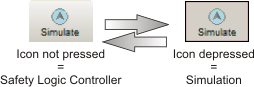
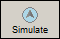

# EASYSIM Controller Simulation

Machine Expert – Safety includes the EASYSIM controller simulation which you can use to simulate the execution of the safety logic. The EASYSIM controller simulation is useful to test your application without being connected to the Safety Logic Controller, or when it is imperative to simulate a function test prior to commissioning of a real, live system.

**NOTE:**

The simulation of the safety-related application must not replace the proper function test using the Safety Logic Controller and safety-related I/O devices/sensors/actuators under any circumstances. The test using the EASYSIM simulation may only be performed in addition to the standard function test.

## When working with the EASYSIM simulation instead of the Safety Logic Controller ...

* If a Safety Logic Controller is connected, it will not be addressed while using the simulator. Device inputs will not be read and outputs will not be written.
* You perform the same steps in Machine Expert – Safety as you would if you were working with the real Safety Logic Controller, although you must ensure that the 'Simulate' icon on the toolbar is pressed (see graphic below). This means that you can force variables or display online values in the code editor as usual.

  The simulation continues to run in the background, with the symbol visible in the notification field of the taskbar (system tray, also referred to as the systray). Depending on the EASYSIM implementation, the simulation may also be minimized in the Windows taskbar instead as icon in the systray.
* You can configure EASYSIM for the application by filtering I/Os.
* [You can 'activate' inputs in the simulation directly](SimulationUse.html#SimulationUse) and monitor the effects on outputs.
* You can [simulate the temporal sequences of the machine/system](SimulationTimingDiagram.html#SimulationTimingDiagram).

## How to...

How to start the simulation and download a project

1. To start the simulation, click the 'Simulate' icon on the toolbar.

   If the icon is pressed, the simulation is active and the commands you perform, such as 'Download' or 'Variable status', will relate to the simulation.

   

   Once the simulation has been started, the  symbol appears in the systray on the right of the Windows taskbar. Here, you can access a context menu for [using EASYSIM](SimulationUse.html#SimulationUse). (Depending on the version, the simulation application may be visible in the Windows taskbar.)
2. The project is then automatically saved and compiled. Any errors detected are output in the message window.
3. You can now [download the project as usual](downloadingaproject.html#downloadingaproject) by calling the ['SafePLC' dialog](dialogSafePLC.html#dialogSafePLC) ('SafePLC' toolbar icon) and clicking the 'Download' button in this dialog.

How to exit the simulation mode

To switch from the EASYSIM simulation to the real Safety Logic Controller (if connected), in Machine Expert – Safety click the simulation icon on the toolbar which already appears pressed:

The simulation is now deactivated and the project is saved automatically again and compiled for use with the real Safety Logic Controller.

As soon as you have exited simulation mode, "online" operations such as "Download" (and the associated start of the Safety Logic Controller) or the forcing of variables relate to the real Safety Logic Controller again.

**NOTE:**

Exiting simulation mode is not the same as exiting the EASYSIM simulation.

After clicking the 'Simulate' icon again, Machine Expert – Safety switches from the EASYSIM simulation to the real Safety Logic Controller. This means that, essentially, you are only interrupting the connection between Machine Expert – Safety and the simulation software. The EASYSIM simulation application is not exited automatically (see below).

How to exit the EASYSIM simulation software

1. First exit simulation mode in Machine Expert – Safety (deselect the 'Simulate' icon).
2. Then select 'Exit' from the EASYSIM context menu (in the systray) or click 'Exit' in the EASYSIM window.

**NOTE:**

If you exit EASYSIM while the 'Simulate' icon is pressed in Machine Expert – Safety, EASYSIM will always restart automatically.

EIO0000002147.09