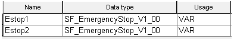

# Instantiation of Function Blocks

According to IEC 61131-3, function blocks are instantiated in Machine Expert – Safety. Instantiation means that a function block is defined once and can be used (instantiated) several times. This applies to all FBs (user-defined POUs as well as library FBs, such as basic IEC 61131 FBs).

Why instantiation? A function block has an internal memory where it stores its own processing data (local variables). As a consequence, the output values calculated by the FB depend on the internally stored values. The same input values applied to an FB instance do not necessarily deliver the same results in another FB instance. Therefore, it is necessary to store the internal data of the FB to a separated memory area each time the function block is processed, i.e., for each FB instance. To uniquely identify each FB instance and to clearly separate its memory area, instance names are used. The instance name of the function block has to be declared in the variables worksheet of the POU where the FB is going to be used.

Function blocks can be instantiated in other function blocks or the 'Main' program.

Example

The library function block SF\_EmergencyStop shall be called twice in the 'Main' program to evaluate two safety-related emergency stop control devices connected to different safety-related input/output signals. Therefore, two instances of the FB are declared in the local variables worksheet of the 'Main' POU. In the code, the FB call can now be inserted twice, each instance connected to different variables, input, or output signals.

The same would apply to a user-defined function block whose code is defined in a FB POU of the project.

**NOTE:**

Like IEC 61131-defined FBs and Safety Logic Controller-specific FBs (contained in a [library](librariesinSafeFOX.html#librariesinSafeFOX)), user-defined FB POUs are available in the Edit Wizard after editing, saving, and compiling the corresponding worksheets. This way, the call of a user-defined FB can be easily inserted into the code of the calling POU via drag & drop and declaring an instance name. Refer to the topic ["Inserting function blocks using the Edit Wizard"](insertingfunctionsorfunctionblocksinthegraphiceditorusingtheeditwizard.html#insertingfunctionsorfunctionblocksinthegraphiceditorusingtheeditwizard) for details.

Functions (as contained in the Edit Wizard) can be called without instantiation because they do not have an internal memory.

EIO0000002147.09