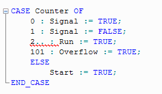

# Error (ST parser): Invalid range

The ST parser detected a syntactical error in a CASE statement: an end value is missing in a value range contained in the case list.

**NOTE:**

This error message does not relate to a value which does not match the data type of the control variable (exceeded or incorrect data type). Here, only a syntactical check is made.

EIO0000002147.09