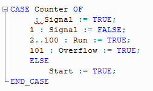

# Error (ST parser): Constant or range expected

The ST parser detected a syntactical error in a CASE statement: a value or a value range is missing in a line of the case list.

Before the `:` operator, either a single constant or a value range must be specified.

**Error example**: In the first line, this constant or range is missing.

**NOTE:**

The Edit Wizard prevents entering syntactical errors. Using the Edit Wizard, syntax templates prepared with place holders can be inserted.

**Further Information:**

Refer to the topic ["ST Code Elements"](elementsintheSTeditor.html#elementsintheSTeditor) for information on the ST syntax.

EIO0000002147.09