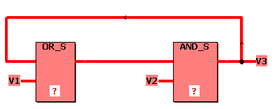
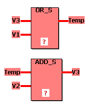

# Error: Explicit feedback!

Invalid explicit feedback detected by the FBD/LD compiler.

Example for an invalid explicit feedback:

1. In the message window, double-click the error message.

   The worksheet opens and the cursor marks an output parameter.
2. Remove the feedback logic by modifying the code.

   Split the invalid network into two separate networks and use a feedback variable (TEMP in the example below) to program an allowed implicit feedback.

   

EIO0000002147.09