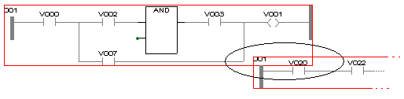

# Network layouts are overlapping!

Networks must not overlap in the code. Overlapping is automatically prevented by the editor while inserting new networks. However, this layout error may occur when moving existing networks.

Networks are considered as big as a virtual surrounding rectangle would be (the upper left point and the lower right point represent the corners of this rectangle). When moving networks, they must not be dropped at a position where the surrounding rectangles of two networks overlap.

Example:

* In the message window, double-click the error message. The code worksheet opens and the overlapping network is marked.
* Move the overlapping network to a valid position.

EIO0000002147.09