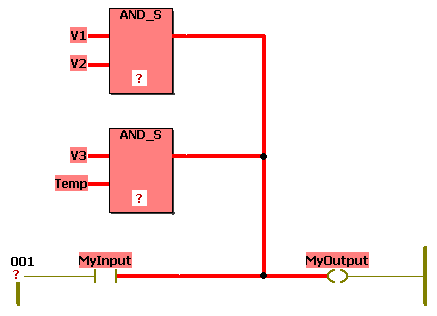

# Error: Outputs are connected!

An FBD/LD network contains the invalid direct connection of at least two outputs.

Error example:

Double-click the error in the message window to jump to the suspected worksheet (where the first suspected output is marked) and correct.

EIO0000002147.09