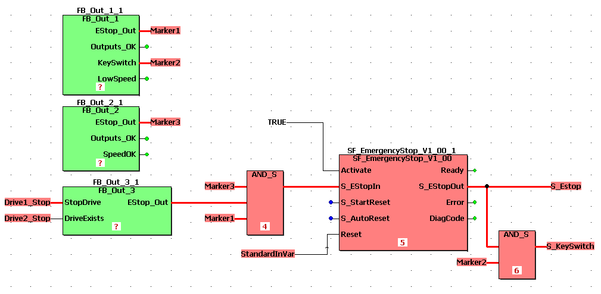

# Internal Error '4034'. Please contact the technical support!

An internal error occurred. Mostly, this error occurs if several FBs which only have outputs but no inputs are connected to the same AND/OR function in the same network.

The following procedure may solve the issue by splitting the connections into separate networks:

1. Double-click the error in the message window to jump to the suspected worksheet (where the second variable declaration is marked).
2. Delete the connection lines between the outputs of the affected FBs and the AND/OR function.
3. Replace the deleted lines by local variables thus splitting the network.

If the error still remains, contact your local Schneider Electric representative.

Example: replacing the connection lines by the local variables Marker1, Marker2, and Marker3 splits the network into three separate networks.

EIO0000002147.09