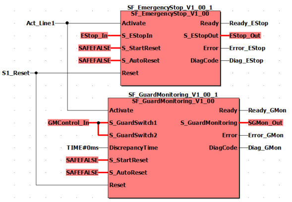

# Group activation of safety equipment

Group activation/deactivation of safety equipment refers to the possibility of manually connecting and disconnecting different, mutually independent safety-related functions via a common signal. This equipment cannot be operated when disconnected.

| WARNING | |
| --- | --- |
|  | **UNINTENDED START-UP**   * Be sure that your risk analysis includes an evaluation for the deactivation of safety equipment. * Make certain that appropriate procedures and measures (according to applicable sector standards) have been established when deactivating safety equipment. * Use appropriate safety interlocks where personnel and/or equipment hazards exist.   **Failure to follow these instructions can result in death, serious injury, or equipment damage.** |

## Single-channel application

The graphic below shows a code example for this type of group deactivation in a single-channel layout.

In this example, different items of safety equipment, which are evaluated by different safety-related function blocks, act on different safety-related outputs of the Safety Logic Controller: For the function block SF\_EmergencyStop on output S\_EStop\_Out (global I/O variable EStop\_Out) and for SF\_GuardMonitoring on output S\_GuardMonitoring (global I/O variable SGMon\_Out). These outputs control different, mutually independent safety-related functions.

The safety-related function blocks are activated or deactivated (with the Activate input) via the same signal. When a function block is deactivated (with the Activate input), **all** mutually dependent safety-related functions are disconnected.

## Two-channel application

If the risk analysis shows that the safety equipment needs to be implemented on a two-channel basis, the example shown above must be implemented with two-channel input/output signals.

EIO0000002269.01

© 2020

Schneider Electric.

All rights reserved.