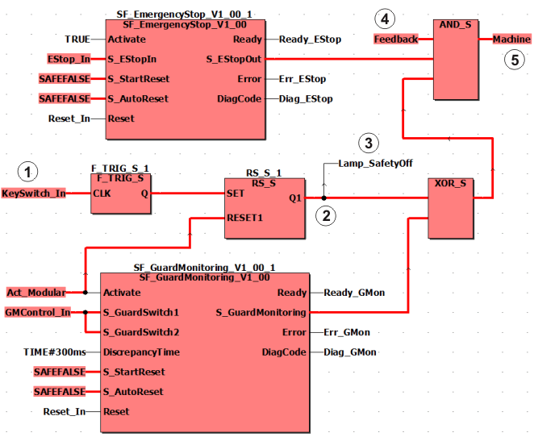

# Modular machines/systems with safety equipment

With modular systems, individual system modules can be connected/disconnected to/from safety equipment depending on the process involved. When a machine module is connected, its safety equipment is designated as safety-related and will have an impact on the danger zone.

If a machine module is disconnected, the safety equipment specific to that module will not be available and will not be designated as safety-related.

| WARNING | |
| --- | --- |
|  | **UNINTENDED START-UP**   * Be sure that your risk analysis includes an evaluation for the deactivation of safety equipment. * Make certain that appropriate procedures and measures (according to applicable sector standards) have been established when deactivating safety equipment. * Use appropriate safety interlocks where personnel and/or equipment hazards exist.   **Failure to follow these instructions can result in death, serious injury, or equipment damage.** |

## Single-channel application

The figure below shows a code example for modular safety equipment in a single-channel layout. In this example, several safety-related function blocks act together on one output of the Safety Logic Controller, which is assigned to the global I/O variable Machine.

|  |  |
| --- | --- |
| (1) | I/O variable KeySwitch\_In is assigned to the signal of a connected key switch: Reset of the start-up inhibit only by authorized persons, when the safety equipment is no longer safety-relevant. |
| (2) | Start-up inhibit: Q1 can only be switched to SAFETRUE when Activate (SF\_GuardMonitoring) = FALSE. |
| (3) | Signaling device for signaling bridged safety equipment. |
| (4) | Feedback signal of the signaling device. |
| (5) | Signal for stopping the machine. |

**NOTE:**

Observe the [important information](ModularDeact.html#ModularDeact__ModularDeact_SafetyRules) when implementing the example.

The safety-related SF\_EmergencyStop and SF\_GuardMonitoring function blocks evaluate signals from the connected safety equipment.

* **Safety equipment 1**: Emergency-stop control device, assigned to the global I/O variable EStop\_In, evaluated by the SF\_EmergencyStop function block, permanently present on the machine.
* **Safety equipment 2**: Door, assigned to the global I/O variable GMControl\_In, evaluated by the safety-related SF\_GuardMonitoring function block, can be temporarily connected/disconnected to/from the application as a whole (depending on the modular design of the system).

  Safety equipment 2 is not available when disconnected, as the module is no longer part of the machine. Safety equipment 2 is not designated as safety-related at such times.

**Disconnecting/connecting safety equipment 2**

In order to disconnect safety equipment 2, the application switches the Activate input of the safety-related SF\_GuardMonitoring function block to FALSE via the global I/O variable Act\_Modular. As a result, the S\_GuardMonitoring enable output switches to SAFEFALSE.

In order to restart the remaining part of the system after the function block has been disconnected and to prevent an automatic start-up, a start-up inhibit is implemented via the safety-related functions F\_TRIG\_S and RS\_S. Removal of the start-up inhibit is implemented in this example with a key switch, whose signal is assigned to the global I/O variable KeySwitch\_In and connected to input CLK of the safety-related function F\_TRIG\_S (digit (**1**) in the graphic). The signal for the start-up inhibit referred to is assigned to other safety-related functions and to the feedback signal from the signaling device.

The resulting link controls the safety-related output (digit (**5**) in the graphic) via the global I/O variable Machine.

The bridged safety equipment 2 is indicated by the signaling device, which is controlled via the global I/O variable Lamp\_SafetyOff (digit (**3**) in the graphic). The positive feedback (global I/O variable Feedback, digit (**4**) in the graphic) must be present via the correct function of the signaling device to switch the safety-related output to SAFETRUE.

The application can still be operated using the connection shown, although the safety-related SF\_GuardMonitoring function block is deactivated.

Safety equipment 1 continues to act on the global I/O variable Machine, which is assigned to the signal for stopping the machine/system (**5**).

## Important information on implementing the application example

Observe the following notes when implementing the application example shown above:

If you are implementing this example, it is absolutely essential that you interconnect the devices as shown in the example. Any deviations from this can cause hazards. Program positions at which an XOR/OR link is used present a particular risk in terms of systematic errors.

Errors can only be discovered by verifying the connections you have created and validating the entire safety-related function. You are responsible for carrying out these validations.

| WARNING | |
| --- | --- |
|  | **UNINTENDED EQUIPMENT OPERATION**   * Only bridge or disconnect the safety equipment when it is no longer designated as safety-related. * Validate that safety equipment is not bridged or disconnected incorrectly. * Clearly label both connected and disconnected safety equipment.   **Failure to follow these instructions can result in death, serious injury, or equipment damage.** |

In the event of a short circuit or cross circuit between any wires and/or unprotected parts of the ground, the error can be eliminated if the wiring is in an electrical installation space and both the cables and the installation space meet the requirements of EN 60204.

| WARNING | |
| --- | --- |
|  | **NON-CONFORMANCE TO SAFETY FUNCTION REQUIREMENTS**   * Use single-channel or two-channel signals with or without cross-circuit detection according to the result of your risk analysis. * Observe installation guidelines with regard to EMC and DIN EN 60204 requirements.   **Failure to follow these instructions can result in death, serious injury, or equipment damage.** |

**NOTE:**

Bridging of the disconnected safety equipment must be indicated by means of a visual and/or acoustic signaling device with a feedback signal.

**NOTE:**

To implement the reset signal at the CLK clock input of the safety-related F\_TRIG\_S function, a key switch is connected to the Safety Logic Controller and assigned to the global I/O variable KeySwitch\_In.

## Two-channel application

If the risk analysis shows that the safety equipment needs to be implemented on a two-channel basis, the example shown above must be implemented with two-channel input/output signals.

EIO0000002269.01

© 2020

Schneider Electric.

All rights reserved.