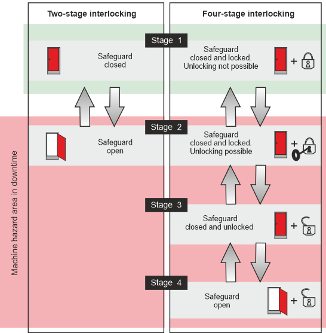

# Interlocking in accordance with EN 1088

The EN 1088 standard (Safety of machinery) provides a definition for interlocking devices associated with guards.

Among other things, a distinction is made between

* Interlocking devices **without** guard locking (**two**-stage interlocking) and
* Interlocking devices **with** guard locking (**four**-stage interlocking).

Both types of interlocking are shown alongside each other in the diagram below.

**NOTE:**

Safety-related function blocks are available for both types of interlocking in the EcoStruxure Machine Expert - Safety software, which enable monitoring and evaluation of the safety equipment with the Safety Logic Controller. These function blocks are:

* GuardMonitoring: Monitoring a guard with two-stage interlocking
* GuardLocking: Monitoring a guard with four-stage interlocking

EIO0000002269.01

© 2020

Schneider Electric.

All rights reserved.