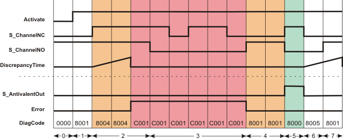

# Additional signal sequence diagrams

Temporary intermediate states are not illustrated in the signal sequence diagrams. Only typical input signal combinations are illustrated in these diagrams. Other signal combinations are possible.

The most significant areas within the signal sequence diagrams are highlighted in color.

**Further Information:**

Refer also to the diagram found in the [overview](sfantivalent.html#sfantivalent__Signal_Overview_Antivalent) for this function block.

**NOTE:**

The signal sequence diagrams in this documentation possibly omit particular diagnostic codes. For example, a diagnostic code is possibly not shown if the related function block state is a temporary transition state and only active for one cycle of the Safety Logic Controller.

Only typical input signal combinations are illustrated. Other signal combinations are possible.

## Exceeding the discrepancy time

|  |  |
| --- | --- |
| 0 | The function block is not yet activated (Activate = FALSE).  As a result, all outputs are FALSE or SAFEFALSE. |
| 1 | Function block activation (Activate = TRUE). In the meantime, input S\_ChannelNC is SAFEFALSE and input S\_ChannelNO is SAFETRUE. |
| 2 | S\_ChannelNC switches to SAFETRUE. This starts measurement of the discrepancy time.  Once the time set at DiscrepancyTime has elapsed, the S\_ChannelNC and S\_ChannelNO inputs have the same states. This results in an error message (Error output = TRUE). The S\_AntivalentOut output remains in the defined safe state (SAFEFALSE). |
| 3 | Irrespective of the states at the S\_ChannelNC and S\_ChannelNO inputs, the S\_AntivalentOut output remains SAFEFALSE for as long as the error message is active (Error = TRUE). The error message must first be "reset" by S\_ChannelNC = SAFEFALSE and S\_ChannelNO = SAFETRUE. |
| 4 | Error message is "reset" by S\_ChannelNC = SAFEFALSE and S\_ChannelNO = SAFETRUE. |
| 5 | Output S\_AntivalentOut switches to SAFETRUE, as S\_ChannelNC = SAFETRUE and S\_ChannelNO = SAFEFALSE. |
| 6 | Output S\_AntivalentOut switches to SAFEFALSE, as S\_ChannelNC switches to SAFEFALSE. The discrepancy time measurement starts when the state at S\_ChannelNC switches. |
| 7 | Output S\_AntivalentOut remains SAFEFALSE, as S\_ChannelNO switches to SAFETRUE within the time set at DiscrepancyTime. |

EIO0000002269.01

© 2020

Schneider Electric.

All rights reserved.