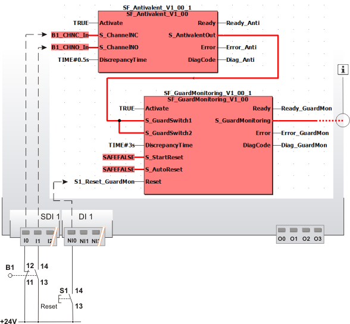

# Additional application examples

This section describes a possible application in which the function block can be used to evaluate signal antivalence (difference).

The function block must only be used in an actual application once a risk analysis has been conducted.

Details of the risk category/SIL/PL have not been included here, as classification is always based on the application in which the function block is used.

**NOTE:**

The use of the function block alone is not sufficient to execute the safety-related function according to the Cat./SIL/PL determined by the risk analysis. In conjunction with the safety-related I/O device used, additional measures must be taken to meet the requirements of the safety-related function. These include, for example, the appropriate wiring and parameterization of the inputs and outputs as well as measures to exclude (design out) errors that cannot be detected. For additional information, refer to the documentation provided with the safety-related I/O device used.

**NOTE:**

Refer to the notes in the User Manual on proper electrical connection of the Safety Logic Controller and all extension modules (e.g., connecting the two-channel sensor or switch).

Refer also to the application example found in the [overview](sfantivalent.html#sfantivalent__ApplEx_Overview_Antivalent) for this function block.

## Evaluating signals for the purpose of door monitoring (position switch with 1 N/C contact + 1 N/O contact)

This example illustrates two-channel control of the safety-related SF\_GuardMonitoring function block with the help of the SF\_Antivalent function block.

Position switch B1 of the door is connected to the inputs I0 and I1 of the safety-related input device SDI with an ID of 1. The N/C and N/O contacts of the position switch are connected to the safety-related SF\_Antivalent function block for evaluation purposes.

The S\_AntivalentOut enable signal of the SF\_Antivalent function block is connected to the SF\_GuardMonitoring function block for further evaluation. The S\_AntivalentOut output of the SF\_Antivalent function block becomes SAFETRUE when the S\_ChannelNC and S\_ChannelNO inputs switch as follows within the time set at DiscrepancyTime: S\_ChannelNC from SAFEFALSE to SAFETRUE and S\_ChannelNO from SAFETRUE to SAFEFALSE.

A start-up inhibit after the Safety Logic Controller has been started up or after the function block has been activated and a restart inhibit after the door B1 has been closed is set for the safety-related SF\_GuardMonitoring function block. Both inhibits are removed by pressing the reset button connected to input NI0 of the standard input device DI with an ID of 1.

**NOTE:**

The enable output S\_GuardMonitoring of the SF\_GuardMonitoring function block is directly connected to a global I/O variable or to an output terminal of the application via additional safety-related functions/function blocks.

Connect the S\_GuardMonitoring enable output of the SF\_GuardMonitoring function block to the S\_OutControl input of the SF\_EDM function block, for example, thus implementing a two-channel output connection.

For more detailed information, refer to the description of the corresponding safety-related function block.

|  |  |
| --- | --- |
| B1 | Door |
| S2 | Reset |
|  | See note above the illustration. |

EIO0000002269.01

© 2020

Schneider Electric.

All rights reserved.