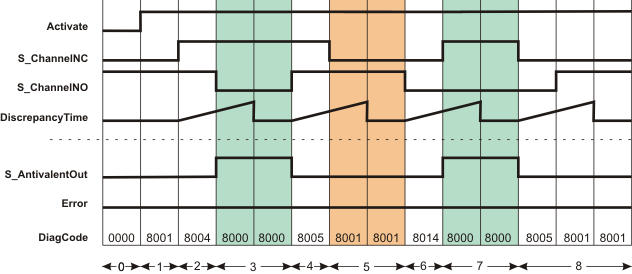
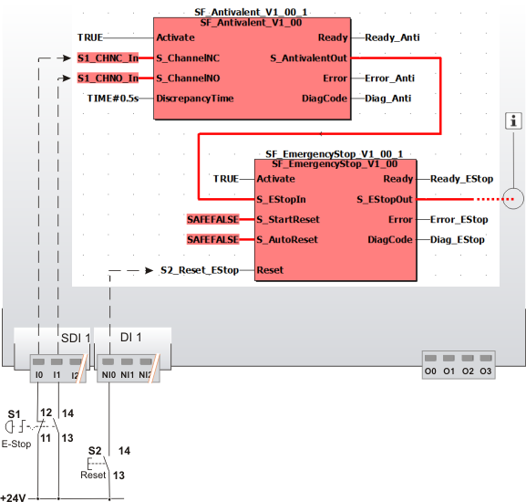

# SF\_Antivalent

The following description is valid for the function block SF\_Antivalent\_V1\_0z, Version 1.0z (where z = 0 to 9).

## Short description

|  |  |
| --- | --- |
| The safety-related SF\_Antivalent function block monitors the signals of two safety-related input terminals for different signal states. Typically, these signals come from two-channel sensors or switches such as an emergency-stop control device.  The S\_AntivalentOut enable signal becomes SAFETRUE when the S\_ChannelNC and S\_ChannelNO inputs switch as follows within the time set at DiscrepancyTime:  * S\_ChannelNC from SAFEFALSE to SAFETRUE * S\_ChannelNO from SAFETRUE to SAFEFALSE |  |

For this to happen, the function block must be activated (Activate = TRUE) and it must not have detected any errors (Error = FALSE).

**NOTE:**

Permanent signals (S\_ChannelNC = SAFETRUE and S\_ChannelNO = SAFEFALSE) at the inputs when the function block is activated (Activate = TRUE) or when the Safety Logic Controller is started up switch the enable signal (S\_AntivalentOut) to SAFETRUE.

**NOTE:**

Always connect the two inputs differently, i.e., with a combination of one N/C contact signal and one N/O contact signal.

## Function block inputs

Click the corresponding hyperlinks to obtain detailed information on the items below.

| Name | Short description | Value |
| --- | --- | --- |
| [Activate](act_Antivalent.html#act_Antivalent) | State-controlled input for activating the function block.  Data type: BOOL  Initial value: FALSE | * **FALSE**: Function block inactive * **TRUE**: Function block activated |
| [S\_ChannelNC](ch_nc_Antivalent.html#ch_nc_Antivalent) | State-controlled input for the NC channel of the connected two-channel switch or sensor.  Data type: SAFEBOOL  Initial value: SAFEFALSE | * **SAFEFALSE**: Request to switch S\_AntivalentOut to SAFEFALSE. * **SAFETRUE**: Request to switch S\_AntivalentOut to SAFETRUE. |
| [S\_ChannelNO](ch_nc_Antivalent.html#ch_nc_Antivalent) | State-controlled input for the NO channel of the connected two-channel switch or sensor.  Data type: SAFEBOOL  Initial value: SAFEFALSE | * **SAFEFALSE**: Request to switch S\_AntivalentOut to SAFETRUE. * **SAFETRUE**: Request to switch S\_AntivalentOut to SAFEFALSE. |
| [DiscrepancyTime](prog_dt_s_Antivalent.html#prog_dt_s_Antivalent) | Input for specifying the maximum permissible discrepancy time in seconds.  Data type: TIME  Initial value: #0ms  If a change in state at an input results in both inputs having the same signals, the discrepancy time measurement starts. The second input must also then modify its state within the discrepancy time, so that both the S\_ChannelNC and S\_ChannelNO inputs have different signals again. If this does not happen, an error message will be output (Error = TRUE) and output S\_AntivalentOut = SAFEFALSE. | Enter a time value according to your risk analysis.  Refer to the hazard message below this table. |

| WARNING | |
| --- | --- |
|  | **NON-CONFORMANCE TO SAFETY FUNCTION REQUIREMENTS**   * Verify that the time value set at DiscrepancyTime corresponds to your risk analysis. * Be sure that your risk analysis includes an evaluation for incorrectly setting the time value for the DiscrepancyTime parameter. * Validate the overall safety-related function with regard to the set DiscrepancyTime value and thoroughly test the application.   **Failure to follow these instructions can result in death, serious injury, or equipment damage.** |

## Function block outputs

| Name | Short description | Value |
| --- | --- | --- |
| [Ready](ready_Antivalent.html#ready_Antivalent) | Output for signaling "Function block activated/not activated".  Data type: BOOL | * **TRUE**: Function block is activated (Activate = TRUE) and the output parameters represent the state of the safety-related function. * **FALSE**: Function block is not activated (Activate = FALSE) and all outputs of the function block are switched to FALSE/SAFEFALSE. |
| [S\_AntivalentOut](out_Antivalent.html#out_Antivalent) | Output for enable signal of the function block.  Data type: SAFEBOOL  Refer to the hazard message below this table. | * **SAFEFALSE**:    + Input S\_ChannelNC = SAFEFALSE and/or input S\_ChannelNO = SAFETRUE   + **or** the function block has detected an error   + **or** the function block is not activated.  * **SAFETRUE**:    + The function block is activated   + **and** input S\_ChannelNC = SAFETRUE **and** input S\_ChannelNO = SAFEFALSE   + **and** the function block has not detected an error. |
| [Error](err_Antivalent.html#err_Antivalent) | Output for error message.  Data type: BOOL  **NOTE:**  To reset the error message, SAFEFALSE must be present at the S\_ChannelNC input and SAFETRUE at input S\_ChannelNO. | * **FALSE**: No error is present. * **TRUE**: The function block has detected an error. The S\_AntivalentOut output switches to SAFEFALSE as a result. |
| [DiagCode](diag_Antivalent.html#diag_Antivalent) | Output for diagnostic message.  Data type: WORD | Diagnostic message of the function block.  The possible values are listed and described in the topic "[Diagnostic codes](codes_Antivalent.html#codes_Antivalent)". |

The function block supports a safety-related monitoring function but not a safety-related control function.

| WARNING | |
| --- | --- |
|  | **UNINTENDED EQUIPMENT OPERATION**   * Verify that the S\_AntivalentOut enable signal does not directly control the safety process. * Validate the overall safety-related function, including the start-up behavior of the process, and thoroughly test the application.   **Failure to follow these instructions can result in death, serious injury, or equipment damage.** |

## Signal sequence diagram

The example below shows a typical signal curve, such as may apply to the different signals S\_ChannelNC = SAFETRUE and S\_ChannelNO = SAFEFALSE within the discrepancy time.

**NOTE:**

The signal sequence diagrams in this documentation possibly omit particular diagnostic codes. For example, a diagnostic code is possibly not shown if the related function block state is a temporary transition state and only active for one cycle of the Safety Logic Controller.

Only typical input signal combinations are illustrated. Other signal combinations are possible.

|  |  |
| --- | --- |
| 0 | The function block is not yet activated (Activate = FALSE).  As a result, all outputs are FALSE or SAFEFALSE. |
| 1 | Function block activation (Activate = TRUE). In the meantime, input S\_ChannelNC = SAFEFALSE and S\_ChannelNO = SAFETRUE. The S\_AntivalentOut output remains SAFEFALSE. |
| 2 | The S\_ChannelNO input remains SAFETRUE and the S\_ChannelNC input switches to SAFETRUE. When the state of an input switches, the discrepancy time measurement starts. |
| 3 | S\_AntivalentOut switches to SAFETRUE, as both inputs switch during the time set at DiscrepancyTime (S\_ChannelNC from SAFEFALSE to SAFETRUE and S\_ChannelNO from SAFETRUE to SAFEFALSE). This results in antivalent signals at the inputs. |
| 4 | S\_AntivalentOut switches to SAFEFALSE, as S\_ChannelNO switches to SAFETRUE. The discrepancy time measurement starts when the state at S\_ChannelNO changes. |
| 5 | S\_AntivalentOut and Error remain FALSE, as input S\_ChannelNC switches to SAFEFALSE during the discrepancy time. |
| 6 | S\_ChannelNO switches to SAFEFALSE. This change in state causes the discrepancy time measurement to start again. |
| 7 | S\_AntivalentOut switches to SAFETRUE, as S\_ChannelNC switches to SAFETRUE during the discrepancy time, resulting in antivalence again. |
| 8 | S\_AntivalentOut switches to SAFEFALSE, as the antivalence comes to an end (S\_ChannelNC becomes SAFEFALSE). The discrepancy time measurement starts when the state at S\_ChannelNC modifies.  S\_AntivalentOut and Error remain FALSE, as the second input also changes its state during the discrepancy time (S\_ChannelNO becomes SAFETRUE). |

**NOTE:**

The other [signal sequence diagram](signaldiagrams_Antivalent.html#signaldiagrams_Antivalent) can also be taken into account.

## Application example

This example illustrates two-channel control of the safety-related SF\_EmergencyStop function block with the help of the SF\_Antivalent function block.

The emergency-stop control device is connected to the inputs I0 and I1 of the safety-related input device SDI with an ID of 1. The N/C and N/O contacts of the emergency-stop control device are connected to the safety-related SF\_Antivalent function block for evaluation purposes.

The S\_AntivalentOut enable signal of the safety-related SF\_Antivalent function block resulting from this is connected to the safety-related SF\_EmergencyStop function block for further evaluation. The S\_AntivalentOut output of the safety-related SF\_Antivalent function block becomes SAFETRUE when the S\_ChannelNC and S\_ChannelNO inputs switch as follows within the time set at DiscrepancyTime:

* S\_ChannelNC from SAFEFALSE to SAFETRUE
* and S\_ChannelNO from SAFETRUE to SAFEFALSE.

A start-up inhibit (after the Safety Logic Controller has been started up or after the function block has been activated) as well as a restart inhibit (after the emergency-stop control device has been deactivated) is set for the safety-related SF\_EmergencyStop function block. Both inhibits are removed by pressing the reset button connected to input NI0 of the standard input device DI with an ID of 1.

**NOTE:**

The enable output S\_EStopOut of the SF\_EmergencyStop function block is directly connected to a global I/O variable or to an output terminal of the application via additional safety-related functions/function blocks.

Connect the S\_EStopOut enable output of the SF\_EmergencyStop function block to the S\_OutControl input of the SF\_EDM function block, for example, thus implementing a two-channel output connection.

**Further Information:**

For more detailed information, refer to the description of the corresponding safety-related function block.

|  |  |
| --- | --- |
| S1 | Emergency-stop |
| S2 | Reset |
|  | See note above the illustration |

**Further Information:**

The [second application example and the accompanying notes](applicationexample_Antivalent.html#applicationexample_Antivalent) can also be taken into account.

## Detailed information

Additional information is available in the following sections:

* [Functional description](function_Antivalent.html#function_Antivalent)
* [Additional signal sequence diagrams](signaldiagrams_Antivalent.html#signaldiagrams_Antivalent)
* [Additional application examples](applicationexample_Antivalent.html#applicationexample_Antivalent)
* [Exception avoidance](faultavoidance_Antivalent.html#faultavoidance_Antivalent)
* [Implementation of safety requirements from applicable standards](safetyrequirements_Antivalent.html#safetyrequirements_Antivalent)

EIO0000002269.01

© 2020

Schneider Electric.

All rights reserved.