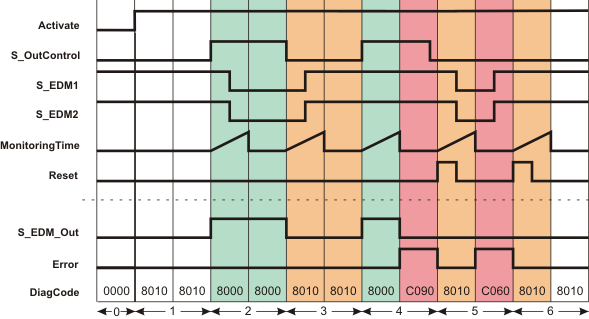

# Additional signal sequence diagrams

Temporary intermediate states are not illustrated in the signal sequence diagrams. Only typical input signal combinations are illustrated in these diagrams. Other signal combinations are possible.

The most significant areas within the signal sequence diagrams are highlighted in color.

**Further Information:**

Refer also to the diagram found in the [overview](sfedm.html#sfedm) for this function block.

**NOTE:**

The signal sequence diagrams in this documentation possibly omit particular diagnostic codes. For example, a diagnostic code is possibly not shown if the related function block state is a temporary transition state and only active for one cycle of the Safety Logic Controller.

Only typical input signal combinations are illustrated. Other signal combinations are possible.

## Device monitoring, no start-up inhibit after Safety Logic Controller start-up/function block activation (S\_StartReset = SAFETRUE)

|  |  |
| --- | --- |
| 0 | The function block is not yet activated (Activate = FALSE).  As a result, all outputs are FALSE or SAFEFALSE. |
| 1 | As parameter S\_StartReset = SAFETRUE, no start-up inhibit is active after the function block has been activated. Output S\_EDM\_Out is SAFEFALSE, as input S\_OutControl = SAFEFALSE. |
| 2 | Output S\_EDM\_Out = SAFETRUE due to a SAFETRUE at S\_OutControl and at S\_EDM1 and S\_EDM2 (initial state of the connected contactors).  The timer set at MonitoringTime starts with the state change at S\_EDM\_Out. S\_EDM1 and S\_EDM2 switch to SAFEFALSE during the monitoring time (switching states of the connected contactors).  Output S\_EDM\_Out remains SAFETRUE, as long as input S\_OutControl = SAFETRUE. |
| 3 | Output S\_EDM\_Out = SAFEFALSE due to a SAFEFALSE at S\_OutControl. The timer set at MonitoringTime starts with the state change at S\_EDM\_Out. S\_EDM1 and S\_EDM2 switch to SAFETRUE during the monitoring time (initial state of the connected contactors). |
| 4 | Output S\_EDM\_Out = SAFETRUE due to a SAFETRUE at S\_OutControl and at S\_EDM1 and S\_EDM2 (initial state of the connected contactors). The timer set at MonitoringTime starts with the state change at S\_EDM\_Out. S\_EDM1 and S\_EDM2 do not switch to SAFEFALSE during the monitoring time (this is incorrect - error state).  After the time set at MonitoringTime has elapsed, output Error = TRUE and S\_EDM\_Out = SAFEFALSE. |
| 5 | When the FALSE > TRUE edge applies at the Reset input, the error message is reset and the time set at MonitoringTime for the two inputs S\_EDM1 and S\_EDM2 is started. S\_EDM1 and S\_EDM2 incorrectly switch to SAFEFALSE during the monitoring time.  After the time set at MonitoringTime has elapsed, Error = TRUE and S\_EDM\_Out remains SAFEFALSE, since, if S\_OutControl = SAFEFALSE, the initial state of the connected contactors is expected before the monitoring time expires. |
| 6 | When the FALSE > TRUE edge applies at the Reset input, the error message is reset and the time set at MonitoringTime for the two inputs S\_EDM1 and S\_EDM2 is started. The monitoring time expires without result, as inputs S\_EDM1 and S\_EDM2 are both SAFETRUE. |

EIO0000002269.01

© 2020

Schneider Electric.

All rights reserved.