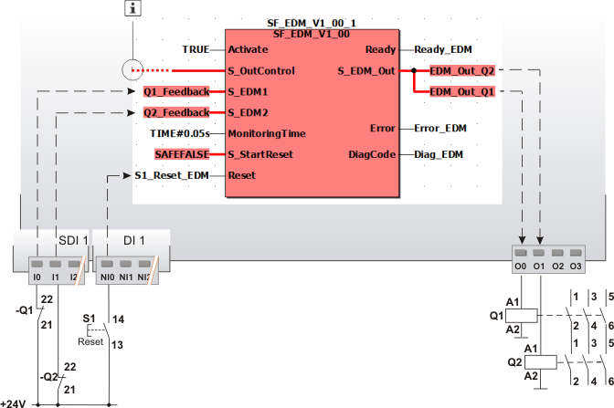
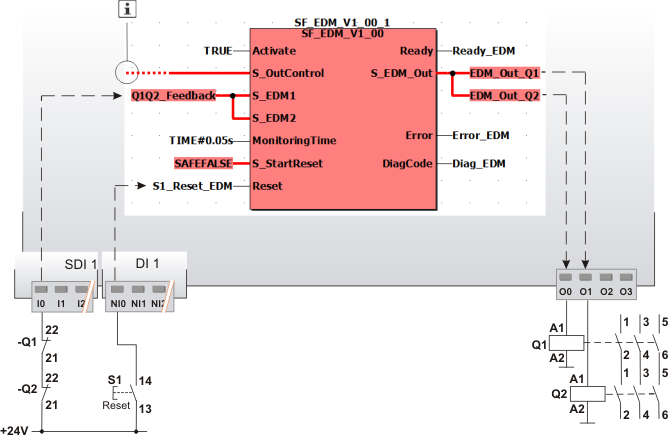

# Additional application examples

**Further Information:**

Refer also to the application example found in the [overview](sfedm.html#sfedm) for this function block.

This section contains additional possible two-channel applications, in which the function block is used to monitor two contactors.

The safety-related function block must only be used in an actual application once a risk analysis has been conducted.

Details of the risk category/SIL/PL have not been included here, as classification is always based on the application in which the function block is used.

**NOTE:**

The use of the safety-related function block alone is not sufficient to execute the safety-related function according to the Cat./SIL/PL determined by the risk analysis. In conjunction with the safety-related I/O device used, additional measures must be taken to meet the requirements of the safety-related function. These include, for example, the appropriate wiring and parameterization of the inputs and outputs as well as measures to exclude (design out) errors that cannot be detected. For additional information, refer to the documentation provided with the safety-related I/O device used.

**NOTE:**

Refer to the notes in the User Manual on proper electrical connection of the Safety Logic Controller and the extension modules (e.g., connecting the contactors).

## Separate feedback from two contactors (two-channel application up to Cat. 4)

In this example, the safety-related SF\_EDM function block controls the two contactors Q1 and Q2 connected to outputs O0 and O1 of the Safety Logic Controller.

Separate feedback is provided from each contactor via an N/C contact to the input terminals I0 and I1 of the safety-related input device SDI 1. The feedback signal of contactor Q1 at terminal I0 is assigned to the global I/O variable Q1\_Feedback, which in turn is connected to the S\_EDM1 function block input. The signal of contactor Q2 at terminal I1 is connected to the S\_EDM2 function block input via the Q2\_Feedback variable.

The reset button S1 is connected to the input terminal NI0 of the standard input device DI 1. The global I/O variable S1\_Reset\_EDM assigned to the signal is connected to the Reset input. The signal is used to remove the start-up inhibit and reset the error states after the cause of the error has been removed.

**NOTE:**

The S\_OutControl input is controlled by another safety-related function block or a safety-related function within the program.

|  |  |
| --- | --- |
| Q1, Q2 | Load contactor with positively driven contacts. |
| S1 | Reset |
|  | See note above the illustration. |

## Combined feedback from two contactors (two contactor contacts in series) (two-channel application up to Cat. 4)

In this example, the safety-related SF\_EDM function block controls the two contactors Q1 and Q2 connected to outputs O0 and O1 of the Safety Logic Controller.

Feedback is provided from each contactor via an N/C contact. The N/C contacts are connected in series and routed to input terminal I0 of the safety-related input device SDI 1. The signal of terminal I0 is assigned to the global I/O variable Q1Q2\_Feedback, which in turn is connected to both function block inputs S\_EDM1 and S\_EDM2.

The reset button S1 is connected to the input terminal NI0 of the standard input device DI 1. The global I/O variable S1\_Reset\_EDM assigned to the signal is connected to the Reset input. The button signal is used to remove the start-up inhibit and reset the error states after the cause of the error has been removed.

**NOTE:**

The S\_OutControl input is controlled by another safety-related function block or a safety-related function within the program.

|  |  |
| --- | --- |
| Q1, Q2 | Load contactor with positively driven contacts. |
| S1 | Reset |
|  | See note above the illustration. |

EIO0000002269.01

© 2020

Schneider Electric.

All rights reserved.