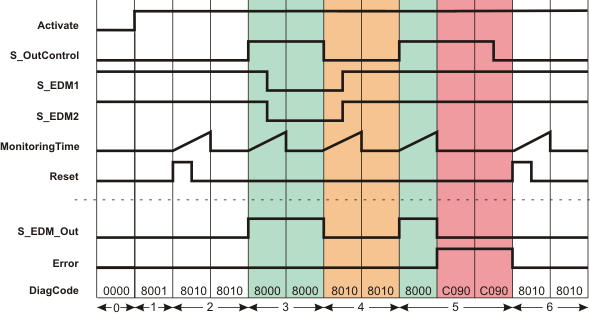
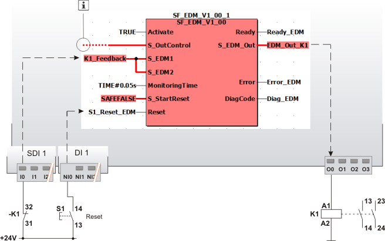

# SF\_EDM (External Device Monitoring)

The following description is valid for the function block SF\_EDM\_V1\_0z, Version 1.0z (where z = 0 to 9).

## Short description

|  |  |
| --- | --- |
| The safety-related SF\_EDM (External Device Monitoring) function block monitors the defined initial state and the switching behavior of contactors connected to the Safety Logic Controller.  S\_StartReset can be used to specify a start-up inhibit. |  |

| WARNING | |
| --- | --- |
|  | **NON-CONFORMANCE TO SAFETY FUNCTION REQUIREMENTS**  Ensure that the contactors used correspond to the results of the risk analysis carried out in accordance with ISO 13849-1.  **Failure to follow these instructions can result in death, serious injury, or equipment damage.** |

## Function block inputs

Click the corresponding hyperlinks to obtain detailed information on the items below.

| Name | Short description | Value |
| --- | --- | --- |
| [Activate](act_EDM.html#act_EDM) | State-controlled input for activating the function block.  Data type: BOOL  Initial value: FALSE | * **FALSE**: Function block inactive * **TRUE**: Function block activated |
| [S\_OutControl](contr_EDM.html#contr_EDM) | State-controlled input for controlling contactors connected to the S\_EDM\_Out function block output.  Data type: SAFEBOOL  Initial value: SAFEFALSE | * **SAFEFALSE**: Request to switch S\_EDM\_Out to SAFEFALSE (stop request) * **SAFETRUE**: Request to switch S\_EDM\_Out to SAFETRUE, taking into account S\_EDM1 and S\_EDM2. |
| [S\_EDM1](edm.html#edm) and [S\_EDM2](edm.html#edm) | State-controlled inputs for feedback signals from the connected contactors.  Data type: SAFEBOOL  Initial value: SAFEFALSE  **NOTE:**  If only one feedback signal is used, this must be connected in parallel to both inputs S\_EDM1 and S\_EDM2.  Both inputs must show the SAFETRUE state (initial state of the contactors) for the function block to be able to switch the S\_EDM\_Out output to SAFETRUE. | * **SAFEFALSE**: Connected contactor is picked up (switching state) * **SAFETRUE**: Connected contactor has dropped out (initial state) |
| [MonitoringTime](prog_mt_s_EDM.html#prog_mt_s_EDM) | Input for specifying the maximum response time for the switching operations of the connected contactors.  Data type: TIME  Initial value: #0ms  The switching operations are evaluated via the S\_EDM1 and S\_EDM2 inputs.  If the specified response time has been exceeded, the Error output is switched to TRUE and the S\_EDM\_Out output is switched to SAFEFALSE as a result. | Enter a time value according to your risk analysis.  Refer to the first hazard message below this table. |
| [S\_StartReset](prog_s_res_EDM.html#prog_s_res_EDM) | Input for specifying the start-up inhibit after the Safety Logic Controller has been started up or the function block has been activated.  Data type: SAFEBOOL  Initial value: SAFEFALSE  An active start-up inhibit must be removed manually by means of a positive signal edge at the Reset input. A deactivated start-up inhibit causes the S\_EDM\_Out output to switch to SAFETRUE automatically when the function block is activated and the safety-related function is not requested.  Refer to the second hazard message below this table. | * **SAFEFALSE**: With start-up inhibit * **SAFETRUE**: Without start-up inhibit |
| [Reset](reset_EDM.html#reset_EDM) | Edge-triggered input for the reset signal:  * Resetting error messages when the cause of the error is no longer present * Manual resetting of an active start-up inhibit (specified by S\_StartReset).  Refer to the third hazard message below this table.  Data type: BOOL  Initial value: FALSE  **NOTE:**  Resetting does not occur with a negative (falling) edge, as specified by standard EN ISO 13849-1, but with a positive (rising) edge. | * **FALSE**: Reset is not requested * Edge **FALSE > TRUE**: Reset is requested |

| WARNING | |
| --- | --- |
|  | **NON-CONFORMANCE TO SAFETY FUNCTION REQUIREMENTS**   * Verify that the time value set at MonitoringTime corresponds to your risk analysis. * Be sure that your risk analysis includes an evaluation for incorrectly setting the time value for the MonitoringTime parameter. * Validate the overall safety-related function with regard to the set MonitoringTime value and thoroughly test the application.   **Failure to follow these instructions can result in death, serious injury, or equipment damage.** |

| WARNING | |
| --- | --- |
|  | **NON-CONFORMANCE TO SAFETY FUNCTION REQUIREMENTS**   * Be sure that your risk analysis includes an evaluation if the start-up inhibit is deactivated (S\_StartReset = SAFETRUE). * Observe the regulations given by relevant sector standards regarding the start-up inhibit. * Verify that a suitable start-up inhibit is in place at another location or using other means if the start-up inhibit is deactivated by setting S\_StartReset = SAFETRUE.   **Failure to follow these instructions can result in death, serious injury, or equipment damage.** |

Resetting the function block by means of a positive signal edge at the Reset input can cause the S\_EDM\_Out output to switch to SAFETRUE immediately (depending on the status of the other inputs).

| WARNING | |
| --- | --- |
|  | **UNINTENDED START-UP**   * Include in your risk analysis the impact of the reset by means of a positive signal edge at the Reset input. * Make certain that appropriate procedures and measures (according to applicable sector standards) have been established to help avoid hazardous situations when resetting. * Do not enter the zone of operation when resetting. * Ensure that no other persons can access the zone of operation when resetting. * Use appropriate safety interlocks where personnel and/or equipment hazards exist.   **Failure to follow these instructions can result in death, serious injury, or equipment damage.** |

## Function block outputs

| Name | Short description | Value |
| --- | --- | --- |
| [Ready](ready_EDM.html#ready_EDM) | Output for signaling "Function block activated/not activated".  Data type: BOOL | * **TRUE**: Function block is activated (Activate = TRUE) and the output parameters represent the state of the safety-related function. * **FALSE**: Function block is not activated (Activate = FALSE) and all outputs of the function block are switched to FALSE/SAFEFALSE. |
| [S\_EDM\_Out](out_EDM.html#out_EDM) | Output for the signal to control the connected contactors.  Data type: SAFEBOOL | * **SAFEFALSE**:  + Control signal at input S\_OutControl = SAFEFALSE   + or at least one of the connected contactors is not functioning correctly (initial state and/or switching behavior not OK)   + or the function block is not activated   + or the start-up inhibit is active   + or the error message is present. * **SAFETRUE**:  + Control signal at input S\_OutControl = SAFETRUE   + and the connected contactors are functioning correctly (initial state and switching behavior OK)   + and the function block is activated   + and the start-up inhibit is not active   + and no error message is present. |
| [Error](err_EDM.html#err_EDM) | Output for error message.  Data type: BOOL | * **FALSE**: No error is present. * **TRUE**: The function block has detected an error. The S\_EDM\_Out output switches to SAFEFALSE as a result. |
| [DiagCode](diag_EDM.html#diag_EDM) | Output for diagnostic message.  Data type: WORD | Diagnostic message of the function block.  The possible values are listed and described in the topic "[Diagnostic codes](codes_EDM.html#codes_EDM)". |

## Signal sequence diagram

This diagram is based on a typical interconnection with a start-up inhibit after the function block has been activated or the Safety Logic Controller has started up (S\_StartReset = SAFEFALSE).

**NOTE:**

The signal sequence diagrams in this documentation possibly omit particular diagnostic codes. For example, a diagnostic code is possibly not shown if the related function block state is a temporary transition state and only active for one cycle of the Safety Logic Controller.

Only typical input signal combinations are illustrated. Other signal combinations are possible.

**NOTE:**

The other [signal sequence diagram](signaldiagrams_EDM.html#signaldiagrams_EDM) can be taken into account.

|  |  |
| --- | --- |
| 0 | The function block is not yet activated (Activate = FALSE).  As a result, all outputs are FALSE or SAFEFALSE. |
| 1 | After the function block has been activated by Activate = TRUE, the start-up inhibit is active at first. |
| 2 | When the FALSE > TRUE edge applies at the Reset input, the start-up inhibit is removed and the time set at MonitoringTime for the two inputs S\_EDM1 and S\_EDM2 is started.  The monitoring time expires without result, as inputs S\_EDM1 and S\_EDM2 are both SAFETRUE. |
| 3 | The feedback signals at inputs S\_EDM1 and S\_EDM2 report the initial state of the contactors (S\_EDM1 and S\_EDM2 are SAFETRUE). In this state, S\_OutControl = SAFETRUE. Monitoring time measurement begins at this point and the S\_EDM\_Out output becomes SAFETRUE.  Both feedback signals S\_EDM1 and S\_EDM2 switch to SAFEFALSE during the time set at MonitoringTime. Consequently, both monitored contactors function correctly, so that the S\_EDM\_Out output remains SAFETRUE and the Error output remains FALSE. |
| 4 | The state at the S\_OutControl input switches to SAFEFALSE, which results in the S\_EDM\_Out output switching to SAFEFALSE.  Monitoring time measurement starts again with the state change at S\_EDM\_Out. Both feedback signals S\_EDM1 and S\_EDM2 switch to SAFETRUE correctly during the time set at MonitoringTime (initial state of the contactors). As a result, the Error output remains FALSE. |
| 5 | The S\_OutControl input becomes SAFETRUE, which switches the S\_EDM\_Out output to SAFETRUE. At this time, both the feedback signals S\_EDM1 and S\_EDM2 = SAFETRUE (initial state of the connected contactors).  The timer set at MonitoringTime starts when the S\_EDM\_Out output switches to SAFETRUE. The feedback signals at inputs S\_EDM1 and S\_EDM2 do not switch to SAFEFALSE during the monitoring time, as the connected contactors may be inoperable, for example.  After the time set at MonitoringTime has elapsed, output Error = TRUE and output S\_EDM\_Out = SAFEFALSE. |
| 6 | The error message is reset (Error becomes FALSE) when the positive edge applies at the Reset input. This signal edge also starts the timer set at MonitoringTime. The monitoring time expires without result, as the feedback signals at the inputs S\_EDM1 and S\_EDM2 are still SAFETRUE. |

## Application example

In this example, the safety-related SF\_EDM function block monitors the switching behavior of a contactor K1 connected at output terminal O0 of the Safety Logic Controller.

Via input terminal I0 of the safety-related input device SDI 1, an N/C contact provides single-channel feedback signal from the contactor to the S\_EDM1 and S\_EDM2 inputs (single-channel application up to Cat. 2). The resulting signal of the input terminal is assigned to the global I/O variable K1\_Feedback.

The reset button S1 is connected to the input terminal NI0 of the standard input device DI 1. The signal at input terminal NI0 assigned to the global I/O variable S1\_Reset\_EDM is used to remove the start-up inhibit and reset the error states after the cause of the error has been removed.

**NOTE:**

The S\_OutControl input is controlled by another safety-related function block or a safety-related function within the program.

|  |  |
| --- | --- |
| K1 | Contactor or relay with positively driven contacts. |
| S1 | Reset |
|  | See note above the illustration. |

**Further Information:**

The [other application examples and the accompanying notes](applicationexample_EDM.html#applicationexample_EDM) can be taken into account.

## Detailed information

Additional information is available in the following sections:

* [Functional description](function_EDM.html#function_EDM)
* [Additional signal sequence diagrams](signaldiagrams_EDM.html#signaldiagrams_EDM)
* [Additional application examples](applicationexample_EDM.html#applicationexample_EDM)
* [Exception avoidance](faultavoidance_EDM.html#faultavoidance_EDM)
* [Implementation of safety requirements from applicable standards](safetyrequirements_EDM.html#safetyrequirements_EDM)

EIO0000002269.01

© 2020

Schneider Electric.

All rights reserved.