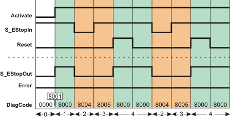
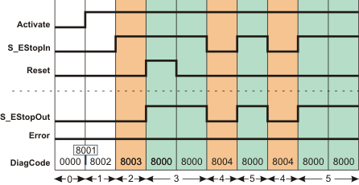
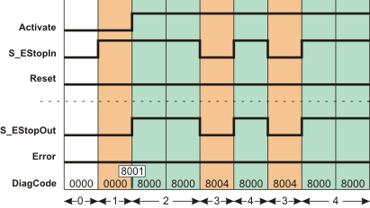

# Additional signal sequence diagrams

Temporary intermediate states are not illustrated in the signal sequence diagrams. Only typical input signal combinations are illustrated in these diagrams. Other signal combinations are possible.

The most significant areas within the signal sequence diagrams are highlighted in color.

**Further Information:**

Refer also to the diagram found in the [overview](sfemergencystop.html#sfemergencystop) for this function block.

**NOTE:**

The signal sequence diagrams in this documentation possibly omit particular diagnostic codes. For example, a diagnostic code is possibly not shown if the related function block state is a temporary transition state and only active for one cycle of the Safety Logic Controller.

Only typical input signal combinations are illustrated. Other signal combinations are possible.

## Emergency-stop function, no start-up inhibit but restart inhibit specified

**S\_StartReset = SAFETRUE:** No start-up inhibit after the Safety Logic Controller has been started up/the function block has been activated

**S\_AutoReset = SAFEFALSE:** Active restart inhibit after the emergency-stop control device has been deactivated (SAFETRUE signal returns at the S\_EStopIn input)

|  |  |
| --- | --- |
| 0 | The function block is not yet activated (Activate = FALSE).  As a result, all outputs are FALSE or SAFEFALSE. |
| 1 | Function block activated by Activate = TRUE. The S\_EStopOut output becomes SAFETRUE immediately, as no start-up inhibit after start-up/function block activation has been specified with S\_StartReset. |
| 2 | Emergency-stop request. The control device is activated. The S\_EStopOut output becomes SAFEFALSE. |
| 3 | The emergency-stop control device is deactivated again and the S\_EStopOut output remains SAFEFALSE at first, as the restart inhibit has been specified by S\_AutoReset once the SAFETRUE signal has returned at the S\_EStopIn input. |
| 4 | Positive signal edge at the Reset input resets the restart inhibit, followed by normal operation. The S\_EStopOut output becomes SAFETRUE. |

## Emergency-stop function, start-up inhibit specified but no restart inhibit

**S\_StartReset = SAFEFALSE:** Active start-up inhibit after the Safety Logic Controller has been started up

**S\_AutoReset = SAFETRUE:** No restart inhibit after the emergency-stop control device has been deactivated

|  |  |
| --- | --- |
| 0 | The function block is not yet activated (Activate = FALSE).  As a result, all outputs are FALSE or SAFEFALSE. |
| 1 | After the function block has been activated by Activate = TRUE, the start-up inhibit is active at first. |
| 2 | The previously activated emergency-stop control device is deactivated (N/C contacts closed). The S\_EStopOut output remains SAFEFALSE at first, as S\_StartReset = SAFEFALSE has been used to specify a start-up. |
| 3 | Positive signal edge at the Reset input resets the start-up inhibit, followed by normal operation. The S\_EStopOut output becomes SAFETRUE. |
| 4 | Emergency-stop request. The control device is activated, the S\_EStopOut output becomes SAFEFALSE. |
| 5 | The emergency-stop control device is deactivated again. The S\_EStopOut output becomes SAFETRUE immediately, as no restart inhibit was specified with S\_AutoReset = SAFETRUE after the return of the SAFETRUE signal at the S\_EStopIn input. |

## Emergency-stop function, no start-up inhibit and no restart inhibit specified

**S\_StartReset = SAFETRUE:** No start-up inhibit after the Safety Logic Controller has been started up

**S\_AutoReset = SAFETRUE:** No restart inhibit after the emergency-stop control device has been deactivated

|  |  |
| --- | --- |
| 0 | The function block is not yet activated (Activate = FALSE).  As a result, all outputs are FALSE or SAFEFALSE. |
| 1 | The previously activated emergency-stop control device is deactivated (N/C contacts closed), the signal at input S\_EStopIn becomes SAFETRUE.  As the function block is not yet activated (Activate = FALSE), the S\_EStopOut output remains SAFEFALSE. |
| 2 | After the function block has been activated by Activate = TRUE, the S\_EStopOut output immediately switches to SAFETRUE because no start-up inhibit is specified with S\_StartReset = SAFETRUE and input S\_EStopIn is still SAFETRUE.  Normal operation of the machine. |
| 3 | Emergency-stop request. The control device is activated, the S\_EStopOut output becomes SAFEFALSE. |
| 4 | The emergency-stop control device is deactivated again. The S\_EStopOut output becomes SAFETRUE immediately, as no restart inhibit was specified with S\_AutoReset = SAFETRUE after the return of the SAFETRUE signal at the S\_EStopIn input.  Normal operation of the machine. |

EIO0000002269.01

© 2020

Schneider Electric.

All rights reserved.