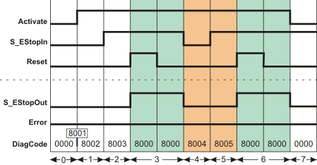
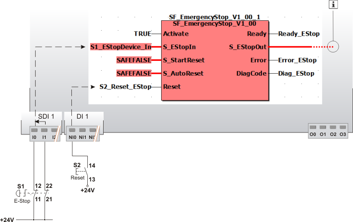

# SF\_EmergencyStop

The following description is valid for the function block SF\_EmergencyStop\_V1\_0z, Version 1.0z (where z = 0 to 9).

## Short description

|  |  |
| --- | --- |
| The safety-related SF\_EmergencyStop function block monitors the switching states of an emergency-stop control device. When the connected emergency-stop device is activated, the enable signal at output S\_EStopOut becomes SAFEFALSE.  S\_StartReset can be used to specify a start-up inhibit and S\_AutoReset can be used to specify a restart inhibit. |  |

## Function block inputs

Click the corresponding hyperlinks to obtain detailed information on the items below.

| Name | Short description | Value |
| --- | --- | --- |
| [Activate](act_EmergencyStop.html#act_EmergencyStop) | State-controlled input for activating the function block.  Data type: BOOL  Initial value: FALSE | * **FALSE**: Function block inactive * **TRUE**: Function block activated |
| [S\_EStopIn](estop.html#estop) | State-controlled input for the status of the emergency-stop control device.  Data type: SAFEBOOL  Initial value: SAFEFALSE | * **SAFEFALSE**: Emergency-stop control device is activated * **SAFETRUE**: Emergency-stop control device is not activated |
| [S\_StartReset](prog_s_res_EmergencyStop.html#prog_s_res_EmergencyStop) | State-controlled input for specifying the start-up inhibit after the Safety Logic Controller has been started up or the function block has been activated.  An active start-up inhibit must be removed manually by means of a positive signal edge at the Reset input. A deactivated start-up inhibit causes the S\_EStopOut output to switch to SAFETRUE automatically when the function block is activated and the safety-related function is not requested.  Data type: SAFEBOOL  Initial value: SAFEFALSE  Refer to the first hazard message below this table. | * **SAFEFALSE**: With start-up inhibit * **SAFETRUE**: Without start-up inhibit |
| [S\_AutoReset](prog_a_res_EmergencyStop.html#prog_a_res_EmergencyStop) | State-controlled input for specifying the restart inhibit after the SAFETRUE signal has returned at the S\_EStopIn input, i.e., after the previously activated emergency-stop control device has been deactivated again.  An active restart inhibit must be removed manually by means of a positive signal edge at the Reset input. A deactivated restart inhibit causes the S\_EStopOut output to switch to SAFETRUE automatically when the function block is activated and the safety-related function is no longer requested.  Data type: SAFEBOOL  Initial value: SAFEFALSE  Refer to the first hazard message below this table. | * **SAFEFALSE**: With restart inhibit * **SAFETRUE**: Without restart inhibit |
| [Reset](reset_EmergencyStop.html#reset_EmergencyStop) | Edge-triggered input for the reset signal:  * Resetting error messages when the cause of the error is no longer present. * Manual resetting of an active start-up/restart inhibit (specified by S\_StartReset and/or S\_AutoReset).  Refer to the second hazard message below this table.  Data type: BOOL  Initial value: FALSE  **NOTE:**  Resetting does not occur with a negative (falling) edge, as specified by standard EN ISO 13849-1, but with a positive (rising) edge. | * **FALSE**: Reset is not requested * Edge **FALSE > TRUE**: Reset is requested |

| WARNING | |
| --- | --- |
|  | **NON-CONFORMANCE TO SAFETY FUNCTION REQUIREMENTS**   * Verify the impact of a deactivated start-up inhibit (S\_StartReset = SAFETRUE) and/or restart inhibit (S\_AutoReset = SAFETRUE) on your machine or process prior to implementation. * Observe the regulations given by relevant sector standards regarding the start-up/restart inhibit. * Verify that a suitable start-up inhibit is in place at another location or using other means.   **Failure to follow these instructions can result in death, serious injury, or equipment damage.** |

Resetting the function block by means of a positive signal edge at the Reset input can cause the S\_EStopOut output to switch to SAFETRUE immediately (depending on the status of the other inputs).

| WARNING | |
| --- | --- |
|  | **UNINTENDED START-UP**   * Include in your risk analysis the impact of the reset by means of a positive signal edge at the Reset input. * Make certain that appropriate procedures and measures (according to applicable sector standards) have been established to help avoid hazardous situations when resetting. * Do not enter the zone of operation when resetting. * Ensure that no other persons can access the zone of operation when resetting. * Use appropriate safety interlocks where personnel and/or equipment hazards exist.   **Failure to follow these instructions can result in death, serious injury, or equipment damage.** |

## Function block outputs

Click the corresponding hyperlinks to obtain detailed information on the items below.

| Name | Short description | Value |
| --- | --- | --- |
| [Ready](ready_EmergencyStop.html#ready_EmergencyStop) | Output for signaling "Function block activated/not activated".  Data type: BOOL | * **TRUE**: Function block is activated (Activate = TRUE) and the output parameters represent the state of the safety-related function. * **FALSE**: Function block is not activated (Activate = FALSE) and all outputs of the function block are switched to FALSE/SAFEFALSE. |
| [S\_EStopOut](out_EmergencyStop.html#out_EmergencyStop) | Output for enable signal of the function block.  Data type: SAFEBOOL | * **SAFEFALSE**:    + Emergency-stop control device is activated   + or the function block is not activated   + or the start-up/restart inhibit is active   + or the error message is present. * **SAFETRUE**:    + Emergency-stop control device is not activated   + and the function block is activated   + and the start-up/restart inhibit is not active   + and no error message is present. |
| [Error](err_EmergencyStop.html#err_EmergencyStop) | Output for error message.  Data type: BOOL | * **FALSE**: No error is present. * **TRUE**: The function block has detected an error. The S\_EStopOut output switches to SAFEFALSE as a result. |
| [DiagCode](diag_EmergencyStop.html#diag_EmergencyStop) | Output for diagnostic message.  Data type: WORD | Diagnostic message of the function block.  The possible values are listed and described in the topic "[Diagnostic codes](codes_EmergencyStop.html#codes_EmergencyStop)". |

## Signal sequence diagram

This diagram relates to a typical emergency-stop function with an active start-up inhibit and an active restart inhibit:

* **S\_StartReset = SAFEFALSE:** Start-up inhibit after the function block has been activated and the Safety Logic Controller has started up
* **S\_AutoReset = SAFEFALSE:** Restart inhibit after the connected emergency-stop control device has been deactivated (SAFETRUE signal returns at the S\_EStopIn input)

**NOTE:**

The other [signal sequence diagram](signaldiagrams_EmergencyStop.html#signaldiagrams_EmergencyStop) can be taken into account.

**NOTE:**

The signal sequence diagrams in this documentation possibly omit particular diagnostic codes. For example, a diagnostic code is possibly not shown if the related function block state is a temporary transition state and only active for one cycle of the Safety Logic Controller.

Only typical input signal combinations are illustrated. Other signal combinations are possible.

|  |  |
| --- | --- |
| 0 | The function block is not yet activated (Activate = FALSE).  As a result, all outputs are FALSE or SAFEFALSE. |
| 1 | After the function block has been activated by Activate = TRUE, the start-up inhibit is active at first. |
| 2 | The previously activated emergency-stop control device is deactivated (N/C contacts closed). The S\_EStopOut output remains SAFEFALSE at first, as S\_StartReset = SAFEFALSE prevents automatic start-up. |
| 3 | Positive signal edge at the Reset input removes the start-up inhibit, followed by normal operation. The S\_EStopOut output becomes SAFETRUE. |
| 4 | Emergency-stop request. The control device is activated. The S\_EStopOut output becomes SAFEFALSE. |
| 5 | The emergency-stop control device is deactivated again and the S\_EStopOut output remains SAFEFALSE at first, as the restart inhibit has been specified by S\_AutoReset = SAFEFALSE. |
| 6 | Positive signal edge at the Reset input removes the start-up inhibit, followed by normal operation. The S\_EStopOut output becomes SAFETRUE. |
| 7 | The function block activation is reset (Activate = FALSE), S\_EStopOut output = SAFEFALSE. |

## Application example

This example illustrates a single-channel connection of the N/C contact of an emergency-stop control device S1 with the safety-related SF\_EmergencyStop function block. The emergency-stop control device is connected to input terminal I0 of the safety-related input device SDI with an ID of 1.

In this example the following applies:

* The signal of the input terminal I0 of the safety-related input device SDI 1 is assigned to the global I/O variable S1\_EStopDevice\_In. This global I/O variable is connected to the S\_EStopIn input of the function block for evaluation.
* The global I/O variable EStopOut\_K1 is connected to output S\_EStopOut of the function block. This global I/O variable has the O0 output terminal of the Safety Logic Controller as address.

The function block is perpetually activated by the TRUE constant at the Activate input.

S\_StartReset = SAFEFALSE specifies a start-up inhibit after the Safety Logic Controller has been started up or the function block has been activated. Furthermore, S\_AutoReset = SAFEFALSE specifies a restart inhibit of the function block after the emergency-stop control device has been deactivated, i.e., once the SAFETRUE signal has returned at the S\_EStopIn input. Both inhibits are only removed when there is a positive signal edge at the Reset input.

To this end, the S2 reset button is connected to input NI0 of the standard input device DI 1.

|  |  |
| --- | --- |
| S1 | Emergency-stop |
| S2 | Reset |

**Further Information:**

The [other application examples and the accompanying notes](applicationexample_EmergencyStop.html#applicationexample_EmergencyStop) can be taken into account.

## Detailed information

Additional information is available in the following sections:

* [Functional description](function_EmergencyStop.html#function_EmergencyStop)
* [Additional signal sequence diagrams](signaldiagrams_EmergencyStop.html#signaldiagrams_EmergencyStop)
* [Additional application examples](applicationexample_EmergencyStop.html#applicationexample_EmergencyStop)
* [Exception avoidance](faultavoidance_EmergencyStop.html#faultavoidance_EmergencyStop)
* [Implementation of safety requirements from applicable standards](safetyrequirements_EmergencyStop.html#safetyrequirements_EmergencyStop)

EIO0000002269.01

© 2020

Schneider Electric.

All rights reserved.