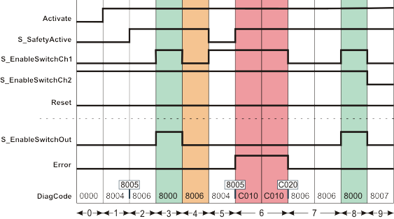

# Additional signal sequence diagram

Temporary intermediate states are not illustrated in the signal sequence diagram. Only typical input signal combinations are illustrated in the diagram. Other signal combinations are possible.

The most significant areas within the signal sequence diagram are highlighted in color.

**Further Information:**

Refer also to the diagram found in the [overview](sfenableswitch.html#sfenableswitch) for this function block.

**NOTE:**

The signal sequence diagrams in this documentation possibly omit particular diagnostic codes. For example, a diagnostic code is possibly not shown if the related function block state is a temporary transition state and only active for one cycle of the Safety Logic Controller.

Only typical input signal combinations are illustrated. Other signal combinations are possible.

## No restart inhibit after invalid signal sequence (S\_AutoReset = SAFETRUE)

|  |  |
| --- | --- |
| 0 | The function block is not yet activated (Activate = FALSE).  As a result, all outputs are FALSE or SAFEFALSE. |
| 1 | The function block is activated (Activate = TRUE). Switching stage 1 is present (input S\_EnableSwitchCh1 = SAFEFALSE, input S\_EnableSwitchCh2 = SAFETRUE). The operating mode is not active (S\_SafetyActive = SAFEFALSE). |
| 2 | The operating mode is active (S\_SafetyActive = SAFETRUE). |
| 3 | In the operating mode, the switching stage changes from stage 1 to stage 2 (input S\_EnableSwitchCh2 and input S\_EnableSwitchCh1 = SAFETRUE) and the S\_EnableSwitchOut output becomes SAFETRUE. |
| 4 | Change from switching stage 2 back to switching stage 1 (signal at S\_EnableSwitchCh1 becomes SAFEFALSE); the S\_EnableSwitchOut output becomes SAFEFALSE. |
| 5 | Change from switching stage 1 to switching stage 2 (S\_EnableSwitchCh1 becomes SAFETRUE again). However, as the operating mode is no longer active (S\_SafetyActive = SAFEFALSE), the S\_EnableSwitchOut output remains SAFEFALSE. |
| 6 | The operating mode is now active again (S\_SafetyActive = SAFETRUE) and the function block initially expects switching stage 1. However, as switching stage 2 is present at this time (S\_EnableSwitchCh1 and S\_EnableSwitchCh2 = SAFETRUE), the Error output switches to TRUE. |
| 7 | Change from switching stage 2 back to switching stage 1 (S\_EnableSwitchCh1 becomes SAFEFALSE). As the restart inhibit is not active (S\_AutoReset = SAFETRUE), the Error output immediately switches to FALSE again. |
| 8 | In the operating mode, the switching stage changes from stage 1 to stage 2 (input S\_EnableSwitchCh2 and input S\_EnableSwitchCh1 = SAFETRUE) and the S\_EnableSwitchOut output becomes SAFETRUE. |
| 9 | Switching stage 3 is present (S\_EnableSwitchCh1 and S\_EnableSwitchCh2 = SAFEFALSE), the S\_EnableSwitchOut output becomes SAFEFALSE. |

EIO0000002269.01

© 2020

Schneider Electric.

All rights reserved.