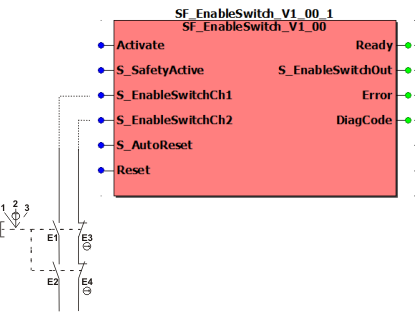
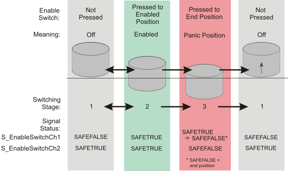
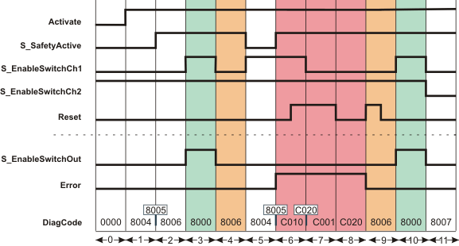
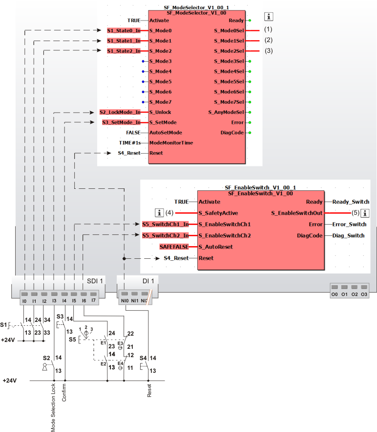

# SF\_EnableSwitch

The following description is valid for the function block SF\_EnableSwitch\_V1\_0z, Version 1.0z (where z = 0 to 9).

## Short description

|  |  |
| --- | --- |
| The safety-related SF\_EnableSwitch function block evaluates the signals of a manually actuated three-stage enable switch (in accordance with EN 60204) in order to identify its switching stage and direction.  The connected enable switch can be used to remove safeguarding, provided that the appropriate operating mode (e.g., limitation of the speed or range of motion) is selected and active.  A restart inhibit can be specified via S\_AutoReset. |  |

## Connection and switching diagram

Connect the signals of the enable switch connected to the Safety Logic Controller to the inputs of the safety-related SF\_EnableSwitch function block as follows:

|  |  |
| --- | --- |
|  | Pressure point |
|  | Forcibly guided contacts |

Connect the signal resulting from N/O contacts E1 and E2 of the enable switch to function block input S\_EnableSwitchCh1. Connect the signal resulting from N/C contacts E3 and E4 to function block input S\_EnableSwitchCh2. By means of this defined signal sequence of the contacts, the safety-related function block can detect the switching stage and the switching direction of the enable switch.

The used three-stage enable switch must support the switching sequence shown in the graphic below for its three switching stages. This sequence results in the signals also shown in the graphic at function block inputs S\_EnableSwitchCh1 and S\_EnableSwitchCh2.

**NOTE:**

The error state of the function block can only be exited if the cause of the error no longer exists. To leave the error state, release the enable switch to move it to switch position 1. If a restart inhibit has been set with S\_AutoReset = SAFEFALSE, it must then be removed by pressing the reset button.

## Function block inputs

Click the corresponding hyperlinks to obtain detailed information on the items below.

| Name | Short description | Value |
| --- | --- | --- |
| [Activate](act_EnableSwitch.html#act_EnableSwitch) | State-controlled input for activating the function block.  Data type: BOOL  Initial value: FALSE | * **FALSE**: Function block inactive * **TRUE**: Function block activated |
| [S\_SafetyActive](s_act_EnableSwitch.html#s_act_EnableSwitch) | State-controlled signal input for setting the selected operating mode to active (feedback signal, e.g., from safety-related SF\_ModeSelector function block).  Data type: SAFEBOOL  Initial value: SAFEFALSE | * **SAFEFALSE**: The selected operating mode is **not** active. The S\_EnableSwitchOut output remains SAFEFALSE, irrespective of the other inputs. * **SAFETRUE**: The selected operating mode is active. |
| [S\_EnableSwitchCh1](s_1_EnableSwitch.html#s_1_EnableSwitch) | Input for the signal resulting from contacts E1 and E2 of the connected enable switch.  Data type: SAFEBOOL  Initial value: SAFEFALSE | Possible values are: SAFETRUE or SAFEFALSE, depending on the switching stage (see [diagram](sfenableswitch.html#sfenableswitch__EnableSwitch_Diagrams)). |
| [S\_EnableSwitchCh2](s_1_EnableSwitch.html#s_1_EnableSwitch) | Input for the signal resulting from contacts E3 and E4 of the connected enable switch.  Data type: SAFEBOOL  Initial value: SAFEFALSE | Possible values are: SAFETRUE or SAFEFALSE, depending on the switching stage (see [diagram](sfenableswitch.html#sfenableswitch__EnableSwitch_Diagrams)). |
| [S\_AutoReset](prog_a_res_EnableSwitch.html#prog_a_res_EnableSwitch) | State-controlled input for specifying the restart inhibit after the connected enable switch has returned a valid signal sequence/combination at inputs S\_EnableSwitchCh1 and/or S\_EnableSwitchCh2.  An active restart inhibit must be removed manually by a positive signal edge at the Reset input. A deactivated restart inhibit causes the S\_EnableSwitchOut output to switch to SAFETRUE automatically when the function block is activated and the safety-related function is no longer requested.  Refer to the first hazard message below this table.  Data type: SAFEBOOL  Initial value: SAFEFALSE | * **SAFEFALSE**: With restart inhibit * **SAFETRUE**: Without restart inhibit |
| [Reset](reset_EnableSwitch.html#reset_EnableSwitch) | Edge-triggered input for the reset signal:  * Resetting error messages when the cause of the error is no longer present. * Manual resetting of the active restart inhibit (specified by S\_AutoReset).  Refer to the second hazard message below this table.  Data type: BOOL  Initial value: FALSE  **NOTE:**  Resetting does not occur with a negative (falling) edge, as specified by the EN ISO 13849-1 standard, but with a positive (rising) edge. | * **FALSE**: Reset is not requested. * Edge **FALSE > TRUE**: Reset is requested. |

| WARNING | |
| --- | --- |
|  | **NON-CONFORMANCE TO SAFETY FUNCTION REQUIREMENTS**   * Be sure that your risk analysis includes an evaluation if the restart inhibit is deactivated (S\_AutoReset = SAFETRUE). * Observe the regulations given by relevant sector standards regarding the restart inhibit. * Verify that a suitable start-up inhibit is in place at another location or using other means if the restart inhibit is deactivated by setting S\_AutoReset = SAFETRUE.   **Failure to follow these instructions can result in death, serious injury, or equipment damage.** |

Resetting the function block by means of a positive signal edge at the Reset input can cause the S\_EnableSwitchOut output to switch to SAFETRUE immediately (depending on the status of the other inputs).

| WARNING | |
| --- | --- |
|  | **UNINTENDED START-UP**   * Include in your risk analysis the impact of the reset by means of a positive signal edge at the Reset input. * Make certain that appropriate procedures and measures (according to applicable sector standards) have been established to help avoid hazardous situations when resetting. * Do not enter the zone of operation when resetting. * Ensure that no other persons can access the zone of operation when resetting. * Use appropriate safety interlocks where personnel and/or equipment hazards exist.   **Failure to follow these instructions can result in death, serious injury, or equipment damage.** |

## Function block outputs

Click the corresponding hyperlinks to obtain detailed information on the items below.

| Name | Short description | Value |
| --- | --- | --- |
| [Ready](ready_EnableSwitch.html#ready_EnableSwitch) | Output for signaling "Function block activated/not activated".  Data type: BOOL | * **TRUE**: Function block is activated (Activate = TRUE) and the output parameters represent the state of the safety-related function. * **FALSE**: Function block is not activated (Activate = FALSE) and all outputs of the function block are switched to FALSE/SAFEFALSE. |
| [S\_EnableSwitchOut](out_EnableSwitch.html#out_EnableSwitch) | Output for enable signal of the function block.  Data type: SAFEBOOL | * **SAFEFALSE**: **No** enable for removing safeguarding.    + The enable switch is not in switching stage 2   + or the function block is not activated   + or an error message is present   + or the operating mode is not active (S\_SafetyActive = SAFEFALSE)   + or a restart inhibit is active. * **SAFETRUE**: Enable for removing safeguarding.    + The enable switch is in switching stage 2   + and the function block is activated   + and no error message is present   + and the operating mode is active (S\_SafetyActive = SAFETRUE)   + and the restart inhibit is not active. |
| [Error](err_EnableSwitch.html#err_EnableSwitch) | Output for error message.  Data type: BOOL  Refer to the hazard message below this table. | * **FALSE**: No error is present. * **TRUE**: The function block has detected an error. The S\_EnableSwitchOut output switches to SAFEFALSE as a result. |
| [DiagCode](diag_EnableSwitch.html#diag_EnableSwitch) | Output for diagnostic message.  Data type: WORD | Diagnostic message of the function block.  The possible values are listed and described in the topic "[Diagnostic codes](codes_EnableSwitch.html#codes_EnableSwitch)". |

If you have not activated a restart inhibit (S\_AutoReset = SAFETRUE), a manual reset does not have to be performed following error removal. In such cases, the error message is confirmed automatically once the error is removed.

| WARNING | |
| --- | --- |
|  | **UNINTENDED START-UP**   * Include in your risk analysis the impact of removing the cause of an error with regard to the automatic reset and restart of the machine if the restart inhibit is deactivated (S\_AutoReset = SAFETRUE). * Make certain that appropriate procedures and measures (according to applicable sector standards) have been established to help avoid hazardous situations when removing the source of an error if the restart inhibit is deactivated. * Do not enter the zone of operation when removing an error under this condition. * Ensure that no other persons can access the zone of operation when removing an error under this condition. * Use appropriate safety interlocks where personnel and/or equipment hazards exist.   **Failure to follow these instructions can result in death, serious injury, or equipment damage.** |

## Signal sequence diagram

This diagram shows the signal curve for a typical application with a set restart inhibit after an invalid signal sequence (S\_AutoReset = SAFEFALSE).

**NOTE:**

The signal sequence diagrams in this documentation possibly omit particular diagnostic codes. For example, a diagnostic code is possibly not shown if the related function block state is a temporary transition state and only active for one cycle of the Safety Logic Controller.

Only typical input signal combinations are illustrated. Other signal combinations are possible.

|  |  |
| --- | --- |
| 0 | The function block is not yet activated (Activate = FALSE).  As a result, all outputs are FALSE or SAFEFALSE. |
| 1 | The function block is active (Activate = TRUE). Switching stage 1 is present (input S\_EnableSwitchCh1 = SAFEFALSE, input S\_EnableSwitchCh2 = SAFETRUE). The operating mode is not active (S\_SafetyActive = SAFEFALSE). The S\_EnableSwitchOut output thus remains in the defined safe state (SAFEFALSE). |
| 2 | The operating mode is active (S\_SafetyActive = SAFETRUE). |
| 3 | Change from switching stage 1 to switching stage 2 (S\_EnableSwitchCh1 and S\_EnableSwitchCh2 = SAFETRUE); the S\_EnableSwitchOut output becomes SAFETRUE. |
| 4 | Change from switching stage 2 back to switching stage 1 (S\_EnableSwitchCh1 becomes SAFEFALSE); the S\_EnableSwitchOut output becomes SAFEFALSE. |
| 5 | Change from switching stage 1 to switching stage 2 (S\_EnableSwitchCh1 becomes SAFETRUE again). However, as the operating mode is no longer active (S\_SafetyActive = SAFEFALSE), the S\_EnableSwitchOut output remains SAFEFALSE. |
| 6 | The operating mode is now active again and the function block initially expects switching stage 1. However, as switching stage 2 is present at this time (S\_EnableSwitchCh1 and S\_EnableSwitchCh2 = SAFETRUE), the Error output becomes TRUE.  The positive edge at the Reset input is ignored, as the impermissible switching stage 2 is still present (S\_EnableSwitchCh1 = SAFETRUE and S\_EnableSwitchCh2 = SAFETRUE). |
| 7 | Change to valid switching stage 1. However, the function block detects a static TRUE signal at the Reset input, so the Error output remains TRUE. |
| 8 | While the valid switching stage 1 is present (S\_EnableSwitchCh1 = SAFEFALSE and S\_EnableSwitchCh2 = SAFETRUE), the static signal disappears from the Reset input. However, the error state (Error = TRUE) then has to be reset by a positive edge at the Reset input. |
| 9 | The positive edge at the Reset input resets the Error output to FALSE and removes the restart inhibit. |
| 10 | Change from switching stage 1 to switching stage 2 (S\_EnableSwitchCh2 and S\_EnableSwitchCh1 = SAFETRUE), the S\_EnableSwitchOut output becomes SAFETRUE. |
| 11 | Change from switching stage 2 to switching stage 3 (S\_EnableSwitchCh1 and S\_EnableSwitchCh2 = SAFEFALSE), the S\_EnableSwitchOut output is SAFEFALSE. |

**NOTE:**

The other [signal sequence diagram](signaldiagrams_EnableSwitch.html#signaldiagrams_EnableSwitch) can be taken into account.

## Application example

This example illustrates the typical connection of a three-stage enable switch S1 to the safety-related SF\_EnableSwitch function block. The two signals resulting from the enable switch are connected to input terminals I0 and I1 of the safety-related input device SDI 1.

* The signal of the safety-related input terminal I0 of the safety-related input device SDI 1 is assigned to the global I/O variable SwitchControl1\_In. This global I/O variable is connected to the S\_EnableSwitchCh1 input of the function block for evaluation.
* Likewise, the following applies to the second channel of the enable switch: the signal of the safety-related input terminal I1 of the safety-related input device SDI 1 is assigned to the global I/O variable SwitchControl2\_In. This global I/O variable is connected to the S\_EnableSwitchCh2 input of the function block for evaluation.

The function block is perpetually activated by the TRUE constant at the Activate input.

A restart inhibit is set via S\_AutoReset. This inhibit becomes active after a valid signal sequence returns at the function block inputs S\_EnableSwitchCh1 and/or S\_EnableSwitchCh2. The Reset button S2 for removing the restart inhibit is connected to input terminal NI0 of the standard input device DI 1.

**NOTE:**

In the example, the enable signal at the S\_EnableSwitchOut output controls the removal of safeguarding. To this end, the S\_EnableSwitchOut enable output is connected to other safety-related function blocks or functions.

|  |  |
| --- | --- |
| S2 | Reset |
|  | See second note above the illustration. |

**Further Information:**

The [second application example and the accompanying notes](applicationexample_EnableSwitch.html#applicationexample_EnableSwitch) can be taken into account.

## Detailed information

Additional information is available in the following sections

* [Functional description](EnableSwitch_function.html#EnableSwitch_function)
* [Additional signal sequence diagrams](signaldiagrams_EnableSwitch.html#signaldiagrams_EnableSwitch)
* [Additional application example](applicationexample_EnableSwitch.html#applicationexample_EnableSwitch)
* [Exception avoidance](faultavoidance.html#faultavoidance)
* [Implementation of safety requirements from applicable standards](safetyrequirements.html#safetyrequirements)

EIO0000002269.01

© 2020

Schneider Electric.

All rights reserved.