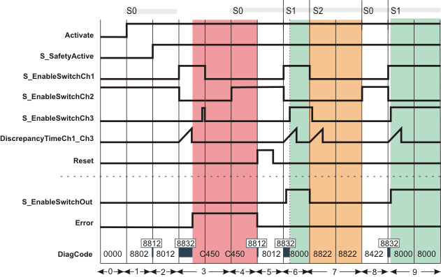

# Additional signal sequence diagram

Temporary intermediate states are not illustrated in the signal sequence diagram. Only typical input signal combinations are illustrated in the diagram. Other signal combinations are possible.

The most significant areas within the signal sequence diagram are highlighted in color.

**Further Information:**

Refer also to the diagram found in the [overview](sfenableswitch_se.html#sfenableswitch_se) for this function block.

**NOTE:**

The signal sequence diagrams in this documentation possibly omit particular diagnostic codes. For example, a diagnostic code is possibly not shown if the related function block state is a temporary transition state and only active for one cycle of the Safety Logic Controller.

Only typical input signal combinations are illustrated. Other signal combinations are possible.

## Restart inhibit after equivalence error (S\_AutoReset = SAFEFALSE)

|  |  |
| --- | --- |
| 0 | The function block is not yet activated (Activate = FALSE).  As a result, all outputs are FALSE or SAFEFALSE. |
| 1 | The function block is activated (Activate = TRUE). Switching stage 0 (S0 in the figure) is present (input S\_EnableSwitchCh1 and S\_EnableSwitchCh3 = SAFEFALSE, input S\_EnableSwitchCh2 = SAFETRUE). The operating mode is not active (S\_SafetyActive = SAFEFALSE). The S\_EnableSwitchOut output remains in the defined safe state (SAFEFALSE). |
| 2 | The operating mode is signaled via the feedback signal S\_SafetyActive = SAFETRUE. |
| 3 | The change from switching stage 0 to switching stage 1 fails: S\_EnableSwitchCh1 switches to SAFETRUE and S\_EnableSwitchCh2 becomes SAFEFALSE. S\_EnableSwitchCh3, however, does not follow the signal at input S\_EnableSwitchCh1 within the time period set at DiscrepancyTimeCh1\_Ch3. The relevant conditions for enabling are not fulfilled. S\_EnableSwitchOut output remains SAFEFALSE. The Error output becomes TRUE to indicate the error state. |
| 4 | The defective enable switch device is replaced. During replacement, SAFEFALSE applies to the inputs S\_EnableSwitchCh1 to S\_EnableSwitchCh3.  With the new enable switch device connected, switching stage 0 (S0 in the figure) is present again. As no reset has yet been performed, the Error output remains TRUE and S\_EnableSwitchOut output remains SAFEFALSE. |
| 5 | As the error reason does no longer exist, the positive edge at the Reset input resets the Error output to FALSE and removes the restart inhibit. According to switching state 0, S\_EnableSwitchOut remains SAFEFALSE. |
| 6 | Change from switching stage 0 to switching stage 1 (S1 in the figure): S\_EnableSwitchCh1 switches to SAFETRUE and S\_EnableSwitchCh2 becomes SAFEFALSE. S\_EnableSwitchCh3 follows S\_EnableSwitchCh1 within the time period set at DiscrepancyTimeCh1\_Ch3. All relevant conditions are fulfilled, S\_EnableSwitchOut output becomes SAFETRUE. |
| 7 | Change from switching stage 1 to switching stage 2 (S\_EnableSwitchCh1 and S\_EnableSwitchCh2 and S\_EnableSwitchCh3 = SAFEFALSE), the S\_EnableSwitchOut output becomes SAFEFALSE. |
| 8 | From stage 2 a transition is only possible to stage 0: By releasing the button of the enable switch device, input S\_EnableSwitchCh1 and S\_EnableSwitchCh3 switch to SAFEFALSE (DiscrepancyTimeCh1\_Ch3 is not exceeded) and input S\_EnableSwitchCh2 becomes SAFETRUE. S\_EnableSwitchOut output remains SAFEFALSE. |
| 9 | Successful change from switching stage 0 to switching stage 1 (S1 in the figure). All relevant conditions are fulfilled, S\_EnableSwitchOut output becomes SAFETRUE. |

EIO0000002371.03

© 2020

Schneider Electric.

All rights reserved.