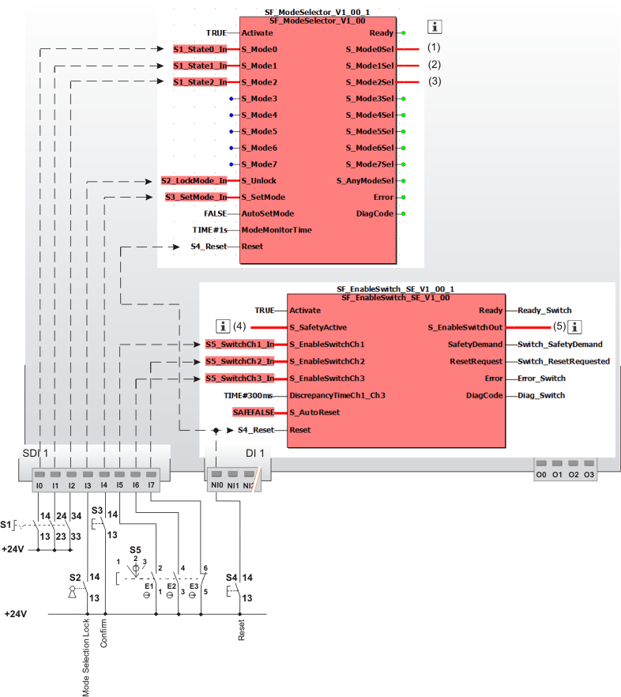

# Additional application example

This section describes an additional possible application, where the function block evaluates a three-stage enable switch.

The function block must only be used in an actual application once a risk analysis has been conducted.

Details of the risk category/SIL/PL have not been included here, as classification is always based on the application in which the function block is used.

**NOTE:**

The use of the function block alone is not sufficient to execute the safety-related function according to the Cat./SIL/PL determined by the risk analysis. In conjunction with the safety-related I/O device used, additional measures must be taken to meet the requirements of the safety-related function. These include, for example, the appropriate wiring and parameterization of the inputs and outputs as well as measures to exclude (design out) errors that cannot be detected. For additional information, refer to the documentation provided with the safety-related I/O device used.

**NOTE:**

Refer to the notes in the User Manual on proper electrical connection of the Safety Logic Controller and the extension modules (e.g., connecting the three-stage, manually actuated enable switch).

## Evaluating a three-stage enable switch. Confirming the selected operating mode using SF\_ModeSelector.

This example describes the evaluation of the three-stage enable switch "Preventa XY2 XY2AU1" by the SF\_EnableSwitch\_SE function block. The enable switch is used to manually confirm an operating mode of a machine. The operating mode is selected by means of a three-stage mode selector switch S1, which is evaluated using the safety-related SF\_ModeSelector function block.

In order to operate the controlled machine in operating mode 2 (in the example shown, this is setup mode) or 3 (manual mode), the selected mode must be enabled manually by pressing the enable switch.

Connecting the SF\_EnableSwitch\_SE function block:

* The function block is permanently activated by the TRUE constant at the Activate input.
* The enable switch S5 is connected to input terminals I5, I6 and I7 of the safety-related input device SDI 1. The signals are assigned to the global I/O variables and the function block inputs are connected as follows:

  | Terminal | Global I/O variable | Function block input |
  | --- | --- | --- |
  | I5 | S5\_SwitchCH1\_In | S\_EnableSwitchCh1 |
  | I6 | S5\_SwitchCH3\_In | S\_EnableSwitchCh3 |
  | I7 | S5\_SwitchCH2\_In | S\_EnableSwitchCh2 |
* The selected operating mode is confirmed at input S\_SafetyActive of the safety-related SF\_EnableSwitch\_SE function block in the form of a feedback signal issued by the speed monitor, see note below.
* A restart inhibit is set via S\_AutoReset of the SF\_EnableSwitch\_SE function block. This inhibit becomes active after a valid signal sequence returns at the function block inputs S\_EnableSwitchCh1, S\_EnableSwitchCh2 and S\_EnableSwitchCh3. The Reset button S4 for removing the restart inhibit is connected to input terminal NI0 of the standard input device DI 1. The reset signal is assigned to the global I/O variable S4\_Reset. The reset button resets error states for both function blocks.
* The function block monitors signal equivalence at its inputs S\_EnableSwitchCh1 and S\_EnableSwitchCh3. The discrepancy time within which the signals at these inputs may switch differently without triggering an error is set using the time constant TIME#300ms at input DiscrepancyTimeCh1\_Ch3.

Connecting the SF\_ModeSelector function block:

* The constant TRUE at the Activate input also causes the safety-related SF\_ModeSelector function block to be permanently activated.
* The mode selector switch S1 to be evaluated is connected to the three input terminals I0, I1 and I2 of the safety-related input device SDI 1. The signals are assigned to the global I/O variables and the function block inputs are connected as follows:

  | Terminal | Global I/O variable | Function block input |
  | --- | --- | --- |
  | I0 | S1\_State0\_In | S\_Mode0 |
  | I1 | S1\_State1\_In | S\_Mode1 |
  | I2 | S1\_State2\_In | S\_Mode2 |
* A key switch S2 is connected to input terminal I3 of the safety-related input device SDI 1. The signal is assigned to the global I/O variable S2\_LockMode\_In, which in turn is connected to the S\_Unlock input of the SF\_ModeSelector function block. Locking the key switch (S\_Unlock = SAFEFALSE) locks the operating mode that has been set.
* The AutoSetMode input is switched to FALSE, which means that manual confirmation of the set operating mode is required at the S\_SetMode input. A button S3 is connected to the input terminal I4 of the safety-related input device SDI 1 for this purpose. The signal is assigned to the global I/O variable S3\_SetMode\_In, which in turn is connected to the function block input S\_SetMode.
* The signal of reset button S4 connected to input terminal NI0 of the standard input device DI1 is used for resetting error messages and removing the active restart inhibit (positive signal edge at the Reset function block input). The global I/O variable S4\_Reset is assigned to the function blocks SF\_EnableSwitch\_SE and SF\_ModeSelector.

**NOTE:**

**Notes on the graphic:**

The S\_Mode0Sel to S\_Mode2Sel enable signals of the SF\_ModeSelector function block have the following functions:

**(1)**: Automatic mode.

**(2)**: Setup mode. Request for the safely reduced speed at the speed monitor.

**(3)**: Manual mode.

Connecting the SF\_EnableSwitch\_SE function block:

**(4)**: The S\_SafetyActive input of the SF\_EnableSwitch\_SE function block is connected to the feedback signal of the speed monitor. This feedback signal is used to set the operating mode selected (reduced speed).

**(5)**: The S\_EnableSwitchOut enable signal of the SF\_EnableSwitch\_SE function block is connected to additional safety-related function blocks or functions and controls the application accordingly.

|  |  |
| --- | --- |
| S1 | Mode selector switch with 3 switch positions |
| S2 | Key switch |
| S3 | Confirmation |
| S4 | Reset |
| S5 | Three-stage enable switch type "Preventa XY2 XY2AU1" |
|  | See note above the illustration. |

EIO0000002371.03

© 2020

Schneider Electric.

All rights reserved.