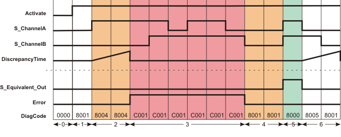

# Additional signal sequence diagrams

Temporary intermediate states are not illustrated in the signal sequence diagrams. Only typical input signal combinations are illustrated in these diagrams. Other signal combinations are possible.

The most significant areas within the signal sequence diagrams are highlighted in color.

**Further Information:**

Refer also to the diagram found in the [overview](sfequivalent.html#sfequivalent) for this function block.

**NOTE:**

The signal sequence diagrams in this documentation possibly omit particular diagnostic codes. For example, a diagnostic code is possibly not shown if the related function block state is a temporary transition state and only active for one cycle of the Safety Logic Controller.

Only typical input signal combinations are illustrated. Other signal combinations are possible.

## Exceeding the discrepancy time

|  |  |
| --- | --- |
| 0 | The function block is not yet activated (Activate = FALSE).  As a result, all outputs are FALSE or SAFEFALSE. |
| 1 | Function block activation (Activate = TRUE) during which SAFEFALSE is present at both the S\_ChannelA and S\_ChannelB inputs. |
| 2 | S\_ChannelA switches to SAFETRUE. This starts measurement of the discrepancy time.  Once the time set at DiscrepancyTime has elapsed, the inputs have different states. This results in an error message (Error output = TRUE). The S\_EquivalentOut output remains in the defined safe state (SAFEFALSE). |
| 3 | Irrespective of the states at the S\_ChannelA and S\_ChannelB inputs, the S\_EquivalentOut output remains SAFEFALSE for as long as the error message is active (Error = TRUE). |
| 4 | The Error output switches to FALSE again (error message is removed) as **both inputs are** now SAFEFALSE. |
| 5 | S\_EquivalentOut becomes SAFETRUE as both inputs S\_ChannelA and S\_ChannelB both become SAFETRUE at the same time. |
| 6 | S\_EquivalentOut switches to SAFEFALSE, as S\_ChannelA switches to SAFEFALSE. The discrepancy time measurement starts when the state at S\_ChannelA switches.  S\_EquivalentOut remains SAFEFALSE, as S\_ChannelB also switches to SAFEFALSE within the time set at DiscrepancyTime. |

EIO0000002269.01

© 2020

Schneider Electric.

All rights reserved.