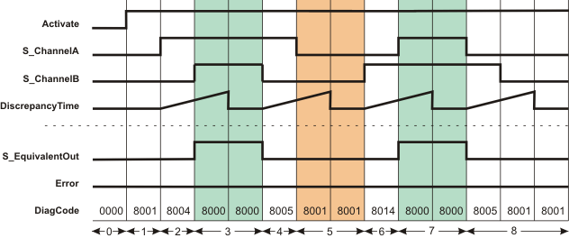
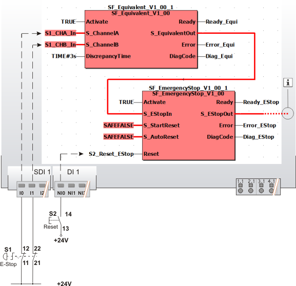

# SF\_Equivalent

The following description is valid for the function block SF\_Equivalent\_V1\_0z, Version 1.0z (where z = 0 to 9).

## Short description

|  |  |
| --- | --- |
| The safety-related SF\_Equivalent function block monitors the signals of two safety-related input terminals for the same signal states. Typically, these signals come from two-channel sensors or switches such as an emergency-stop control device.  The enable signal S\_EquivalentOut becomes SAFETRUE when the function block is activated, has not detected an error and the S\_ChannelA and S\_ChannelB inputs both show the SAFETRUE state within the time set at DiscrepancyTime. |  |

For this to happen, the function block must be activated (Activate = TRUE) and it must not have detected any errors (Error = FALSE).

**NOTE:**

Always connect both inputs to either N/C contacts or N/O contacts.

## Function block inputs

Click the corresponding hyperlinks to obtain detailed information on the items below.

| Name | Short description | Value |
| --- | --- | --- |
| [Activate](act_Equivalent.html#act_Equivalent) | State-controlled input for activating the function block.  Data type: BOOL  Initial value: FALSE | * **FALSE**: Function block inactive * **TRUE**: Function block activated |
| [S\_ChannelA](ch_a_Equivalent.html#ch_a_Equivalent) | State-controlled input for the A channel of the connected two-channel switch or sensor.  Data type: SAFEBOOL  Initial value: SAFEFALSE | * **SAFEFALSE**: Request to switch S\_EquivalentOut to SAFEFALSE. * **SAFETRUE**: Request to switch S\_EquivalentOut to SAFETRUE. |
| [S\_ChannelB](ch_a_Equivalent.html#ch_a_Equivalent) | State-controlled input for the B channel of the connected two-channel switch or sensor.  Data type: SAFEBOOL  Initial value: SAFEFALSE | * **SAFEFALSE**: Request to switch S\_EquivalentOut to SAFEFALSE. * **SAFETRUE**: Request to switch S\_EquivalentOut to SAFETRUE. |
| [DiscrepancyTime](prog_dt_s_Equivalent.html#prog_dt_s_Equivalent) | Input for specifying the maximum permissible discrepancy time in seconds. During this discrepancy time the signals at S\_ChannelA und S\_ChannelB may switch differently.  Data type: TIME  Initial value: #0ms  The discrepancy time is exceeded if different states are present at the inputs once the set duration has elapsed. This results in an error message (if output Error = TRUE, output S\_EquivalentOut = SAFEFALSE). | Enter a time value according to your risk analysis.  Refer to the hazard message below this table. |

| WARNING | |
| --- | --- |
|  | **NON-CONFORMANCE TO SAFETY FUNCTION REQUIREMENTS**   * Verify that the time value set at DiscrepancyTime corresponds to your risk analysis. * Be sure that your risk analysis includes an evaluation for incorrectly setting the time value at the DiscrepancyTime parameter. * Validate the overall safety-related function with regard to the set DiscrepancyTime value and thoroughly test the application.   **Failure to follow these instructions can result in death, serious injury, or equipment damage.** |

## Function block outputs

| Name | Short description | Value |
| --- | --- | --- |
| [Ready](ready_Equivalent.html#ready_Equivalent) | Output for signaling "Function block activated/not activated".  Data type: BOOL | * **FALSE**: Function block is not activated (Activate = FALSE) and all outputs of the function block are switched to FALSE/SAFEFALSE. * **TRUE**: Function block is activated (Activate = TRUE) and the output parameters represent the state of the safety-related function. |
| [S\_EquivalentOut](out_Equivalent.html#out_Equivalent) | Output for enable signal of the function block.  Data type: SAFEBOOL  Refer to the hazard message below this table. | * **SAFEFALSE**:    + At least one input shows the state SAFEFALSE   + **or** the function block has detected an error   + **or** the function block is not activated. * **SAFETRUE**:    + The function block is activated   + **and** both inputs show the state SAFETRUE   + **and** the function block has not detected an error. |
| [Error](err_Equivalent.html#err_Equivalent) | Output for error message.  Data type: BOOL  **NOTE:**  To reset the error message, the SAFEFALSE state must be set at both inputs. | * **FALSE**: No error is present. * **TRUE**: The function block has detected an error. The S\_EquivalentOut output switches to SAFEFALSE as a result. |
| [DiagCode](diag_Equivalent.html#diag_Equivalent) | Output for diagnostic message.  Data type: WORD | Diagnostic message of the function block.  The possible values are listed and described in the topic "[Diagnostic codes](codes_Equivalent.html#codes_Equivalent)". |

The function block supports a safety-related monitoring function but not a safety-related control function.

| WARNING | |
| --- | --- |
|  | **UNINTENDED EQUIPMENT OPERATION**   * Verify that the S\_EquivalentOut enable signal does not directly control the safety process. * Validate the overall safety-related function, including the start-up behavior of the process, and thoroughly test the application.   **Failure to follow these instructions can result in death, serious injury, or equipment damage.** |

## Signal sequence diagram

The example below shows the signal curve which occurs if both inputs switch to SAFETRUE or SAFEFALSE within the discrepancy time.

**NOTE:**

The signal sequence diagrams in this documentation possibly omit particular diagnostic codes. For example, a diagnostic code is possibly not shown if the related function block state is a temporary transition state and only active for one cycle of the Safety Logic Controller.

Only typical input signal combinations are illustrated. Other signal combinations are possible.

|  |  |
| --- | --- |
| 0 | The function block is not yet activated (Activate = FALSE).  As a result, all outputs are FALSE or SAFEFALSE. |
| 1 | Function block activation (Activate = TRUE) during which SAFEFALSE is present at both the S\_ChannelA and S\_ChannelB inputs. |
| 2 | S\_ChannelA switches to SAFETRUE. When the state of an input switches, the discrepancy time measurement starts. |
| 3 | S\_EquivalentOut switches to SAFETRUE as both inputs (S\_ChannelA and S\_ChannelB) switch from SAFEFALSE to SAFETRUE within the time set at DiscrepancyTime. |
| 4 | S\_EquivalentOut switches to SAFEFALSE, as S\_ChannelB switches to SAFEFALSE. The discrepancy time measurement starts when the state at S\_ChannelB modifies. |
| 5 | S\_EquivalentOut and Error remain FALSE, as input S\_ChannelA switches to SAFEFALSE during the discrepancy time. |
| 6 | The discrepancy time measurement starts when the state at S\_ChannelB modifies again. |
| 7 | S\_EquivalentOut switches to SAFETRUE as both inputs (S\_ChannelA and S\_ChannelB) switch from SAFEFALSE to SAFETRUE within the time set at DiscrepancyTime. |
| 8 | S\_EquivalentOut switches to SAFEFALSE, as S\_ChannelA switches to SAFEFALSE. The discrepancy time measurement starts when the state at S\_ChannelA modifies.  S\_EquivalentOut remains SAFEFALSE, as S\_ChannelB also switches to SAFEFALSE within the time set at DiscrepancyTime. |

**NOTE:**

The other [signal sequence diagram](signaldiagrams_Equivalent.html#signaldiagrams_Equivalent) can be taken into account.

## Application example

This example illustrates two-channel control of the safety-related SF\_EmergencyStop function block with the help of the safety-related SF\_Equivalent function block. The emergency-stop control device is connected to the inputs I0 and I1 of the safety-related input device SDI with an ID of 1.

The N/C contacts of the emergency-stop control device are connected to the safety-related SF\_Equivalent function block for evaluation purposes. The S\_EquivalentOut enable signal of the SF\_Equivalent function block resulting from this is connected to the safety-related SF\_EmergencyStop function block for further evaluation.

**NOTE:**

The enable output S\_EStopOut of the SF\_EmergencyStop function block is directly connected to a global I/O variable or to an output terminal of the application via additional safety-related functions/function blocks.

Connect the S\_EStopOut enable output of the SF\_EmergencyStop function block to the S\_OutControl input of the SF\_EDM function block, for example, thus implementing a two-channel output connection.

**Further Information:**

The [details and additional information for this example](applicationexample_Equivalent.html#applicationexample_Equivalent) can be taken into account.

|  |  |
| --- | --- |
| S1 | Emergency-stop |
| S2 | Reset |
|  | See note above the illustration |

## Detailed information

Additional information is available in the following sections:

* [Functional description](function_Equivalent.html#function_Equivalent)
* [Additional signal sequence diagrams](signaldiagrams_Equivalent.html#signaldiagrams_Equivalent)
* [Details of the application example](applicationexample_Equivalent.html#applicationexample_Equivalent)
* [Exception avoidance](faultavoidance_Equivalent.html#faultavoidance_Equivalent)
* [Implementation of safety requirements from applicable standards](safetyrequirements_Equivalent.html#safetyrequirements_Equivalent)

EIO0000002269.01

© 2020

Schneider Electric.

All rights reserved.