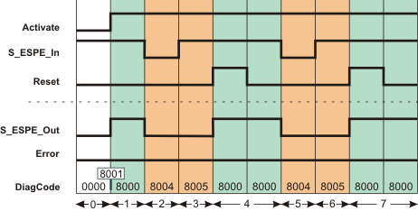
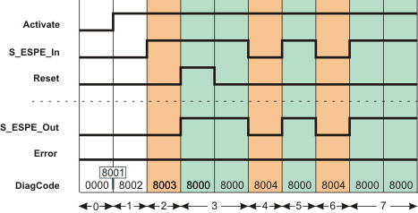

# Additional signal sequence diagrams

Temporary intermediate states are not illustrated in the signal sequence diagrams. Only typical input signal combinations are illustrated in these diagrams. Other signal combinations are possible.

The most significant areas within the signal sequence diagrams are highlighted in color.

**NOTE:**

This documentation refers to the monitored electro-sensitive protective equipment as ESPE for short.

**Further Information:**

Refer also to the diagram found in the [overview](sfespe.html#sfespe) for this function block.

**NOTE:**

The signal sequence diagrams in this documentation possibly omit particular diagnostic codes. For example, a diagnostic code is possibly not shown if the related function block state is a temporary transition state and only active for one cycle of the Safety Logic Controller.

Only typical input signal combinations are illustrated. Other signal combinations are possible.

## Monitoring a light grid: No start-up inhibit, but restart inhibit

**S\_StartReset = SAFETRUE:** No start-up inhibit after the Safety Logic Controller has been started up/the function block has been activated

**S\_AutoReset = SAFEFALSE:** Active restart inhibit after the light grid that was previously interrupted is no longer interrupted (SAFETRUE signal has returned at S\_ESPE\_In input)

|  |  |
| --- | --- |
| 0 | The function block is not yet activated (Activate = FALSE).  As a result, all outputs are FALSE or SAFEFALSE.  The light grid is not interrupted (S\_ESPE\_In = SAFETRUE). |
| 1 | Function block activated by Activate = TRUE. The S\_ESPE\_Out output becomes SAFETRUE immediately, as no start-up inhibit after start-up/function block activation has been specified with S\_StartReset. |
| 2 | Request for the safety-related function. The light grid is interrupted. The S\_ESPE\_Out output becomes SAFEFALSE. |
| 3 | The light grid is no longer interrupted and the S\_ESPE\_Out output remains SAFEFALSE at first, as the restart inhibit has been specified by S\_AutoReset once the SAFETRUE signal has returned at the S\_ESPE\_In input. |
| 4 | Positive signal edge at the Reset input resets the restart inhibit, followed by normal operation. The S\_ESPE\_Out output becomes SAFETRUE. |
| 5 | Request for the safety-related function. The light grid is interrupted. The S\_ESPE\_Out output becomes SAFEFALSE. |
| 6 | The light grid is no longer interrupted and the S\_ESPE\_Out output remains SAFEFALSE at first, as the restart inhibit has been specified by S\_AutoReset once the SAFETRUE signal has returned at the S\_ESPE\_In input. |
| 7 | Positive signal edge at the Reset input resets the restart inhibit, followed by normal operation. The S\_ESPE\_Out output becomes SAFETRUE. |

## Evaluating a light curtain: Start-up inhibit, no restart inhibit

**S\_StartReset = SAFEFALSE:** Active start-up inhibit after the Safety Logic Controller has been started up

**S\_AutoReset = SAFETRUE:** No restart inhibit once the light curtain that was previously interrupted is no longer interrupted

|  |  |
| --- | --- |
| 0 | The function block is not yet activated (Activate = FALSE).  As a result, all outputs are FALSE or SAFEFALSE.  The light curtain is already interrupted (S\_ESPE\_In = SAFEFALSE). |
| 1 | After the function block has been activated by Activate = TRUE, the start-up inhibit is active at first. |
| 2 | The light curtain that was previously interrupted is no longer interrupted (object removed from zone of operation). The S\_ESPE\_Out output remains SAFEFALSE at first, as S\_StartReset = SAFEFALSE has been used to specify a start-up inhibit after the Safety Logic Controller has been started up and after the function block has been activated. |
| 3 | Positive signal edge at the Reset input resets the start-up inhibit, followed by normal operation. The S\_ESPE\_Out output becomes SAFETRUE. |
| 4 | Request for the safety-related function. The light curtain is interrupted, the S\_ESPE\_Out output becomes SAFEFALSE. |
| 5 | The light curtain is no longer interrupted. The S\_ESPE\_Out output becomes SAFETRUE immediately, as no restart inhibit was specified with S\_AutoReset = SAFETRUE after the return of the SAFETRUE signal at the S\_ESPE\_In input. |
| 6 | Request for the safety-related function. The light curtain is interrupted, the S\_ESPE\_Out output becomes SAFEFALSE. |
| 7 | The light curtain is no longer interrupted. The S\_ESPE\_Out output becomes SAFETRUE immediately, as no restart inhibit was specified with S\_AutoReset = SAFETRUE after the return of the SAFETRUE signal at the S\_ESPE\_In input. |

EIO0000002269.01

© 2020

Schneider Electric.

All rights reserved.