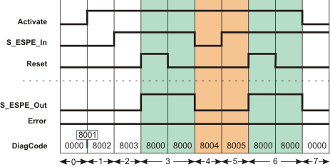
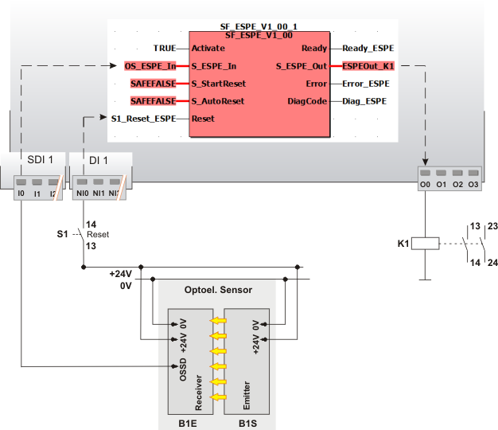

# SF\_ESPE

The following description is valid for the function block SF\_ESPE\_V1\_0z, Version 1.0z (where z = 0 to 9).

## Short description

**NOTE:**

This documentation refers to the electro-sensitive protective equipment as ESPE for short.

|  |  |
| --- | --- |
| The SF\_ESPE (Electro-Sensitive Protective Equipment) safety-related function block monitors the switching states of electro-sensitive protective equipment (such as light grids). The enable signal at the S\_ESPE\_Out output becomes SAFEFALSE when the safety equipment has triggered, i.e., the light beam of the light grid has been interrupted.  S\_StartReset can be used to specify a start-up inhibit and S\_AutoReset can be used to specify a restart inhibit.  **NOTE:**  The safety-related sensor connected to the function block must meet the requirements of ESPE (Electro-Sensitive Protective Equipment) as stipulated by IEC 61496-1. |  |

## Function block inputs

Click the corresponding hyperlinks to obtain detailed information on the items below.

| Name | Short description | Value |
| --- | --- | --- |
| [Activate](act_ESPE.html#act_ESPE) | State-controlled input for activating the function block.  Data type: BOOL  Initial value: FALSE | * **FALSE**: Function block inactive * **TRUE**: Function block activated |
| [S\_ESPE\_In](espe.html#espe) | State-controlled input for the ESPE status.  Data type: SAFEBOOL  Initial value: SAFEFALSE | * **SAFEFALSE**: ESPE has triggered (e.g., light grid/light curtain interrupted) * **SAFETRUE**: ESPE has not triggered |
| [S\_StartReset](prog_s_res_ESPE.html#prog_s_res_ESPE) | State-controlled input for specifying the start-up inhibit after the Safety Logic Controller has been started up or the function block has been activated.  An active start-up inhibit must be removed manually by means of a positive signal edge at the Reset input. A deactivated start-up inhibit causes the S\_ESPE\_Out output to switch to SAFETRUE automatically when the function block is activated and the safety-related function is not requested.  Data type: SAFEBOOL  Initial value: SAFEFALSE  Refer to the first hazard message below this table. | * **SAFEFALSE**: With start-up inhibit * **SAFETRUE**: Without start-up inhibit |
| [S\_AutoReset](prog_a_res_ESPE.html#prog_a_res_ESPE) | State-controlled input for specifying the restart inhibit after the SAFETRUE signal has returned at the S\_ESPE\_In input, i.e., after the previously triggered ESPE is no longer triggered.  An active restart inhibit must be removed manually by means of a positive signal edge at the Reset input. A deactivated restart inhibit causes the S\_ESPE\_Out output to switch to SAFETRUE automatically when the function block is activated and the safety-related function is no longer requested.  Data type: SAFEBOOL  Initial value: SAFEFALSE  Refer to the first hazard message below this table. | * **SAFEFALSE**: With restart inhibit * **SAFETRUE**: Without restart inhibit |
| [Reset](reset_ESPE.html#reset_ESPE) | Edge-triggered input for the reset signal:  * Resetting error messages when the cause of the error is no longer present. * Manual resetting of an active start-up/restart inhibit (specified by S\_StartReset and/or S\_AutoReset).  Refer to the second hazard message below this table.  Data type: BOOL  Initial value: FALSE  **NOTE:**  Resetting does not occur with a negative (falling) edge, as specified by the EN ISO 13849-1 standard, but with a positive (rising) edge. | * **FALSE**: Reset is not requested * Edge **FALSE > TRUE**: Reset is requested |

| WARNING | |
| --- | --- |
|  | **NON-CONFORMANCE TO SAFETY FUNCTION REQUIREMENTS**   * Verify the impact of a deactivated start-up inhibit (S\_StartReset = SAFETRUE) and/or restart inhibit (S\_AutoReset = SAFETRUE) on your machine or process prior to implementation. * Observe the regulations given by relevant sector standards regarding the start-up/restart inhibit. * Verify that a suitable start-up inhibit is in place at another location or using other means.   **Failure to follow these instructions can result in death, serious injury, or equipment damage.** |

Resetting the function block by means of a positive signal edge at the Reset input can cause the S\_ESPE\_Out output to switch to SAFETRUE immediately (depending on the status of the other inputs).

| WARNING | |
| --- | --- |
|  | **UNINTENDED START-UP**   * Include in your risk analysis the impact of the reset by means of a positive signal edge at the Reset input. * Make certain that appropriate procedures and measures (according to applicable sector standards) have been established to help avoid hazardous situations when resetting. * Do not enter the zone of operation when resetting. * Ensure that no other persons can access the zone of operation when resetting. * Use appropriate safety interlocks where personnel and/or equipment hazards exist.   **Failure to follow these instructions can result in death, serious injury, or equipment damage.** |

## Function block outputs

Click the corresponding hyperlinks to obtain detailed information on the items below.

| Name | Short description | Value |
| --- | --- | --- |
| [Ready](ready_ESPE.html#ready_ESPE) | Output for signaling "Function block activated/not activated".  Data type: BOOL | * **FALSE**: Function block is not activated (Activate = FALSE) and all outputs of the function block are switched to FALSE/SAFEFALSE. * **TRUE**: Function block is activated (Activate = TRUE) and the output parameters represent the state of the safety-related function. |
| [S\_ESPE\_Out](out_ESPE.html#out_ESPE) | Output for enable signal of the function block.  Data type: SAFEBOOL | * **SAFEFALSE**:    + ESPE triggered   + or the function block is not activated   + or the start-up/restart inhibit is active   + or the error message is present. * **SAFETRUE**:    + ESPE not triggered   + and the function block is activated   + and the start-up/restart inhibit is not active   + and no error message is present. |
| [Error](err_ESPE.html#err_ESPE) | Output for error message.  Data type: BOOL | * **FALSE**: No error is present. * **TRUE**: The function block has detected an error. The S\_ESPE\_Out output switches to SAFEFALSE as a result. |
| [DiagCode](diag_ESPE.html#diag_ESPE) | Output for diagnostic message.  Data type: WORD | Diagnostic message of the function block.  The possible values are listed and described in the topic "[Diagnostic codes](codes_ESPE.html#codes_ESPE)". |

## Signal sequence diagram

This diagram shows the signal curve for a typical application with an active start-up inhibit and an active restart inhibit:

* **S\_StartReset = SAFEFALSE:** Start-up inhibit after the function block has been activated and the Safety Logic Controller has started up
* **S\_AutoReset = SAFEFALSE:** Restart inhibit after the ESPE that was previously triggered is no longer triggered (SAFETRUE signal has returned at S\_ESPE\_In input)

**NOTE:**

The other [signal sequence diagram](signaldiagrams_ESPE.html#signaldiagrams_ESPE) can be taken into account.

**NOTE:**

The signal sequence diagrams in this documentation possibly omit particular diagnostic codes. For example, a diagnostic code is possibly not shown if the related function block state is a temporary transition state and only active for one cycle of the Safety Logic Controller.

Only typical input signal combinations are illustrated. Other signal combinations are possible.

|  |  |
| --- | --- |
| 0 | The function block is not yet activated (Activate = FALSE).  As a result, all outputs are FALSE or SAFEFALSE.  The ESPE has already triggered as the light curtain/light grid, for example, has been interrupted (S\_ESPE\_In = SAFEFALSE). |
| 1 | After the function block has been activated by Activate = TRUE, the start-up inhibit is active at first. |
| 2 | ESPE no longer triggered as the light curtain or light grid, for example, is no longer interrupted. The S\_ESPE\_Out output remains SAFEFALSE at first, as S\_StartReset = SAFEFALSE prevents automatic start-up. |
| 3 | Positive signal edge at the Reset input resets the start-up inhibit, followed by normal operation. The S\_ESPE\_Out output becomes SAFETRUE. |
| 4 | Request for the safety-related function. ESPE triggers. The S\_ESPE\_Out output becomes SAFEFALSE. |
| 5 | ESPE no longer triggered, the S\_ESPE\_Out output remains SAFEFALSE at first, as the restart inhibit has been specified by S\_AutoReset = SAFEFALSE. |
| 6 | Positive signal edge at the Reset input resets the restart inhibit, followed by normal operation. The S\_ESPE\_Out output becomes SAFETRUE. |
| 7 | The function block activation is removed (Activate = FALSE), S\_ESPE\_Out output = SAFEFALSE. |

## Application example

This example shows a single-channel connection between the OSSD output of the B1E receiver of an ESPE and the safety-related SF\_ESPE function block. The B1E receiver of the ESPE is connected to input terminal I0 of the safety-related input device SDI with an ID of 1.

In this example the following applies:

* The signal of the input terminal I0 of the safety-related input device SDI 1 is assigned to the global I/O variable OS\_ESPE\_In. This global I/O variable is connected to the S\_ESPE\_In input of the function block for evaluation.
* The global I/O variable ESPEOut\_K1 is connected to the S\_ESPE\_Out output of the function block. This global I/O variable has the O0 output terminal of the Safety Logic Controller as address.

The function block is perpetually activated by the TRUE constant at the Activate input.

S\_StartReset = SAFEFALSE specifies a start-up inhibit after the Safety Logic Controller has been started up or the function block has been activated. Furthermore, S\_AutoReset = SAFEFALSE specifies a restart inhibit for the function block. This is active when the ESPE that was previously triggered is no longer triggered (as the light grid or light curtain, for example, is no longer interrupted), i.e., after the SAFETRUE signal has returned at the S\_ESPE\_In input.

Both inhibits are only removed when there is a positive signal edge at the Reset input.

To this end, the S1 reset button is connected to input NI0 of the standard input device DI 1.

|  |  |
| --- | --- |
| S1 | Reset |
| B1 | ESPE |
| B1S | Emitter |
| B1E | Receiver |

**Further Information:**

The [other application example and the accompanying notes](applicationexample_ESPE.html#applicationexample_ESPE) can be taken into account.

## Detailed information

Additional information is available in the following sections:

* [Functional description](function_ESPE.html#function_ESPE)
* [Additional signal sequence diagrams](signaldiagrams_ESPE.html#signaldiagrams_ESPE)
* [Additional application example](applicationexample_ESPE.html#applicationexample_ESPE)
* [Exception avoidance](faultavoidance_ESPE.html#faultavoidance_ESPE)
* [Implementation of safety requirements from applicable standards](safetyrequirements_ESPE.html#safetyrequirements_ESPE)

EIO0000002269.01

© 2020

Schneider Electric.

All rights reserved.